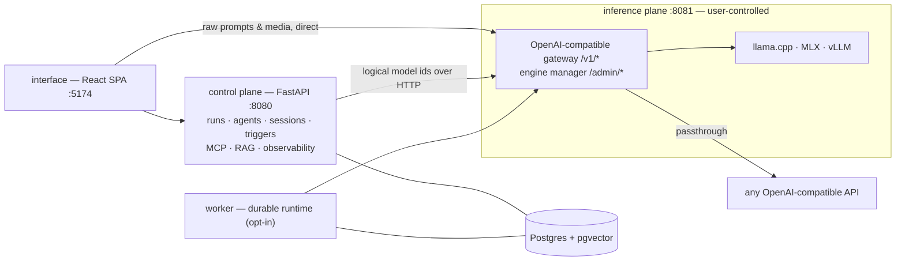

# TheYgent

**Build agents on a canvas. Run them where you point.**

TheYgent is a no-code, local-first platform for building and running AI agents. You compose
an agent visually — LLM steps, tools, MCP servers, retrieval, routers, guardrails, human
approval — and run it against models on *your* infrastructure: llama.cpp anywhere, MLX on
Apple Silicon, vLLM on NVIDIA GPUs, or any OpenAI-compatible API you register. Local and
hosted models mix freely in one graph, chosen per node and per call by a logical id.

The promise is sovereignty and anti-lock-in, stated honestly: TheYgent is never an
involuntary middleman between you and your models. Prompts, payloads, and weights are never
routed through anyone's servers — when something crosses a wire, it does so because you
sent it there.

- **Website:** https://theygent.ai
- **User docs:** https://docs.theygent.ai
- **Developer docs:** [docs/dev-docs](docs/dev-docs/README.md)

## What's in the box

- **Visual builder** — drag-and-drop canvas; the graph *is* the agent. Publishing mints an
  immutable, content-addressed version you can roll back to.
- **Multi-engine inference** — one logical model id per call; swap the engine underneath
  (Apple Silicon ↔ GPU ↔ hosted API) with a single registration change and every call
  site untouched. Chat, vision, embeddings, speech-to-text, text-to-speech, and image
  generation, served locally.
- **Tools & MCP** — built-in tools, HTTP tools, and any MCP server over stdio or HTTP,
  including servers generated in-process from an OpenAPI or GraphQL spec; a registry to
  browse and install from, with full auth including interactive OAuth.
- **RAG** — crawl a site or upload documents, embed locally into pgvector, wire a
  retrieval node into any graph.
- **Durable runs** — checkpoint every step; kill the process mid-run and it resumes from
  the last completed node. Human-approval gates, subgraphs, loops, and fan-out maps.
- **Observability** — a zoomable span waterfall for every run (per-node inputs, outputs,
  timing, token usage) stored in your Postgres, with opt-in OTLP export to your own
  OpenTelemetry collector.
- **Automation** — deploy a saved agent behind a token-authed endpoint, an HMAC-signed
  webhook, or a cron schedule.
- **Chat & bench** — a unified chat for any model or agent (thinking view, voice, vision),
  and a bench for testing and comparing models and agents side by side.

## Architecture at a glance

Two planes, three process types, one topology everywhere:



- The **inference plane** is user-controlled and holds everything heavy: engine processes,
  weights, the model registry, credentials. The **control plane** orchestrates: the graph
  runtime, versioned agent registry, sessions, triggers, MCP hosting, RAG, secrets,
  observability. The control plane never imports an engine — it reaches inference only
  over OpenAI-compatible HTTP with logical model ids.
- Agents are documents in a typed IR with a content hash over the canonical graph (layout
  is never hashed). The same IR runs on an in-process interactive runtime and on a
  journaled durable runtime.
- The full map, with the reasoning behind each boundary, is in
  [docs/dev-docs/architecture.md](docs/dev-docs/architecture.md).

## Developer documentation

The full contributor docs live in [docs/dev-docs](docs/dev-docs/README.md):

| Page | Covers |
|------|--------|
| [Architecture](docs/dev-docs/architecture.md) | The two-plane split, the three seams, process topology, design principles |
| [Control plane](docs/dev-docs/control-plane.md) | The FastAPI orchestration service: runs, agents, sessions, triggers, MCP, RAG, observability, secrets, settings |
| [Graph execution](docs/dev-docs/graph-execution.md) | How an IR graph runs: the walker, the node set, `$in` substitution, conditional dataflow |
| [Durable execution](docs/dev-docs/durable-execution.md) | Crash-safe runs: the journaled workflow, durable-only nodes, the worker process |
| [Inference plane](docs/dev-docs/inference-plane.md) | Engines and the gateway: bindings, modalities, lifecycle, catalog, credentials |
| [Interface](docs/dev-docs/interface.md) | The React SPA: the canvas/IR adapter, generated types, chat, bench, the run waterfall |
| [IR and packages](docs/dev-docs/ir-and-packages.md) | The IR document envelope, `contentHash`, validation, TS codegen, the gateway client |
| [Deployment](docs/dev-docs/deployment.md) | Bare metal, Docker Compose, Kubernetes; CI gates; the sample OTel stack |
| [Testing](docs/dev-docs/testing.md) | Test suites, fixtures, integration tests, lint gates |

Contributor rules — what must hold before a change lands — are in [AGENTS.md](AGENTS.md)
(plus a per-app AGENTS.md in each app and package directory).

## Getting started (development)

```bash
cp .env.example .env   # set DATABASE_URL (a reachable Postgres)
make engines           # local engine servers (macOS): llama.cpp, whisper.cpp, ffmpeg,
                       # mlx-lm, mlx-vlm, mlx-audio — chat, vision, embeddings,
                       # speech-to-text, text-to-speech
make up                # install deps, migrate, start inference-plane (8081) +
                       # control-plane (8080) + interface (5174)
```

`make help` lists everything else (status, logs, restart, test, lint). `/readyz` on the
inference plane reports which (engine, modality) slots this host can actually run.

## Running with Docker (the second way)

The same stack, containerized — Postgres (pgvector) included, same ports:

```bash
make docker-up         # postgres + migrations + inference-plane + control-plane + interface
make docker-down       # stop (data volumes survive; `docker compose down -v` drops them)
```

The containerized inference plane bundles a CPU llama.cpp build (chat, embeddings, vision).
MLX is Apple-Silicon-bare-metal only — to keep local MLX inference, run the inference plane
on the host and overlay `docker-compose.host-inference.yml` (see that file's header). The
standalone durable worker is opt-in: `THEYGENT_DURABLE=1 docker compose --profile worker up -d`.
JS-rendered crawling for retrieval sources (`render_js`) needs a browser baked into the
control-plane image — opt in with `WITH_JS_RENDER=1 docker compose build control-plane`
(~500MB); without it, static fetch still works and a `render_js` ingest fails with the
rebuild hint.

## Kubernetes (deploy/k8s)

Dev flow against minikube — images built locally, side-loaded, applied with kustomize:

```bash
make k8s-load          # docker compose build + minikube image load
make k8s-apply         # kubectl apply -k deploy/k8s
kubectl -n theygent port-forward svc/interface 5174:80       # then :8080 / :8081 likewise
```

The control-plane and worker carry HorizontalPodAutoscalers (scale up/down with load);
`deploy/tests/` guards the Dockerfiles, compose files, and manifests in CI.

## Contributing

Start with the developer documentation table above, then [AGENTS.md](AGENTS.md) — the
rules every change must satisfy: all tests pass (`make test` + `make lint`), user- and
developer-docs move with behavior changes, and the architectural guardrails hold.

## License

Fair-code, under the Sustainable Use License: free to use, modify, and self-host; the one
limit is repackaging TheYgent as a competing hosted service. See [LICENSE.md](LICENSE.md).
