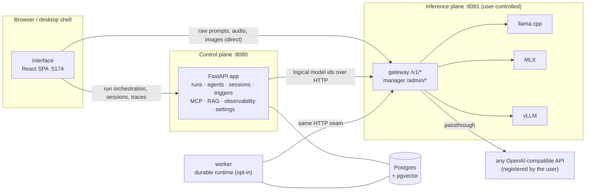
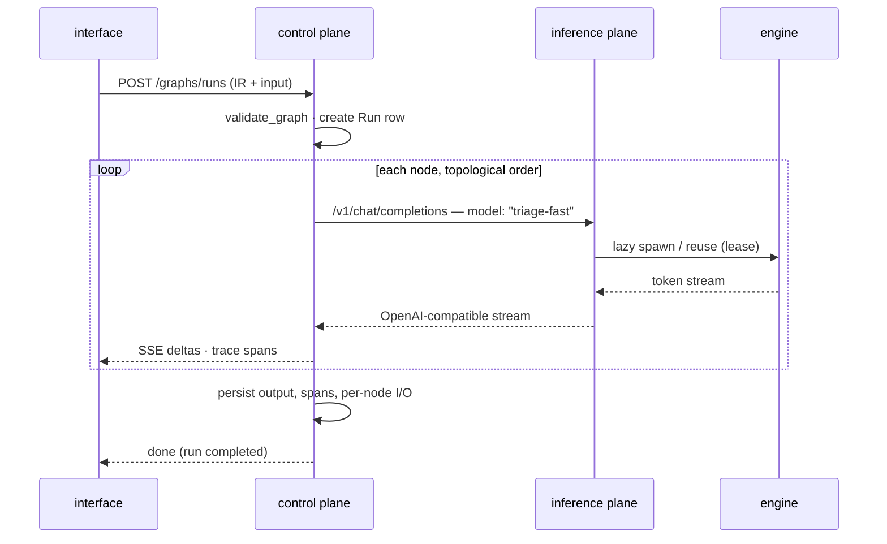

# Architecture

TheYgent is a no-code, local-first platform for building and running AI agents: a visual
builder that compiles drag-and-drop graphs into a typed intermediate representation (IR),
and a runtime that executes those graphs against models running wherever the user points —
a local engine on the same machine, a GPU box across the network, or any hosted
OpenAI-compatible API. This page is the map: what the pieces are, where the load-bearing
boundaries sit, and why they are shaped this way. Each component has its own page with the
detail.

## The two-plane split

The single most important boundary in the system is the split into two planes:

- **The inference plane** ([apps/inference-plane](../../apps/inference-plane)) runs models.
  It is user-controlled, runs wherever the user points it, and holds everything heavy:
  engine processes, model weights, the model registry, API credentials. Prompts, payloads,
  and weights live and travel entirely inside the user's trust domain.
- **The control plane** ([apps/control-plane](../../apps/control-plane)) orchestrates
  agents: the graph runtime, the agent registry and versioning, sessions and memory,
  triggers, MCP hosting, RAG, secrets, observability, settings.

The rule that keeps the split honest: **the control plane never imports an engine** — no
`mlx`, no `vllm`, no llama.cpp bindings. It depends only on the inference plane's HTTP
interface, through one shared client ([packages/gateway-client](../../packages/gateway-client)).
TheYgent-the-vendor is never an involuntary hop between a user and their model; when data
crosses a wire, it does so because the user sent it there.

## The seams

Three contracts hold the system together. All three are deliberately hard to change:

1. **The IR** ([packages/ir](../../packages/ir)) — the builder ↔ runtime contract. An agent
   *is* an IR document: nodes (each with a `kind` of `boundary`, `activity`, or
   `orchestration`), typed ports, edges, and model bindings, wrapped in a document envelope
   with a `contentHash` computed over the canonical, view-stripped, key-sorted JSON. Layout
   lives in a separate `view` block and is never hashed, so moving a node on the canvas
   never changes an agent's identity. See [ir-and-packages.md](./ir-and-packages.md).

   ```mermaid
   flowchart LR
     subgraph DOC["An agent = one IR document"]
       META["id · version · schemaVersion"]
       G["graph<br/>nodes (kind · type · config · ports)<br/>edges (handle → port)<br/>models (logical id → binding)"]
       V["view<br/>positions · icons · viewport"]
     end
     META --> C["canonical JSON<br/>defaults filled · keys sorted"]
     G --> C
     C -->|sha256| H["contentHash<br/>= the agent's version identity"]
     V -.->|never hashed| H
   ```

2. **The data plane** — OpenAI-compatible HTTP with **logical model ids**. Every model
   reference in a graph, a chat, or a bench run is a logical id like `triage-fast`; engine
   names never appear on `/v1/*` and are rejected by the control plane. Binding a logical id
   to an engine happens once, on the inference plane's management surface (`/admin/*`).
   Swapping a Mac for a GPU — or a local model for a hosted API — is one registration
   change with every call site untouched. See [inference-plane.md](./inference-plane.md).

3. **The binding enum** — `mlx | vllm | llamacpp | openai-compatible`. The first three are
   engines whose lifecycle TheYgent manages (spawn, supervise, evict); everything else in
   the world is reached as `openai-compatible` plus a URL. Orthogonal to binding:
   `source` (`hf | local-path | url`) says where weights come from, and `modality`
   (chat, embeddings, vision, speech-to-text, text-to-speech, image generation) says what
   the server does. These three axes never collapse into one.

## Process topology

Three process types, identical in every deployment mode:



Notes on the topology:

- **The SPA talks to both planes directly.** Raw inference payloads (prompts, images,
  audio) go straight from the browser to the inference plane; the control plane receives
  run orchestration, session turns, and telemetry — never proxied model traffic.
- **Export bundles are assembled in the browser.** The import/export zip has two halves —
  control-plane state (`POST /export`) and the model registry (`GET /admin/export`) — and
  registry state is inference-plane-local, so the browser is the only place they may meet;
  neither half ever transits the other plane. Bundles carry definitions only: model
  weights and secret values (connection secrets, webhook signing secrets, MCP env values,
  credential values) never appear in one — weights re-download in-plane on import, and
  credentials are re-entered on the target.
- **The control plane is a modular monolith.** One FastAPI app, internally modularized.
  FastAPI is only the API surface: no durable orchestration lives in request handlers.
- **The control plane carries the identity layer.** Every management call resolves a
  bearer — an interactive session or a personal API key, both stored hashed — to a
  principal with one of three roles (`viewer < editor < admin`), enforced per endpoint;
  a fresh install is closed until first-run setup creates the admin account, and sign-in
  can federate to any OIDC/OAuth2 provider. See
  [control-plane.md](./control-plane.md).
- **Inference is the one component that earns its own service** — it pins a GPU, holds
  multi-gigabyte weights, and is already an HTTP server.
- **The worker** hosts the durable runtime as a separate deployable for server topologies;
  on a desktop the control plane runs the identical runtime in-process and the worker
  binary is unused. Same code, two deployables — never two architectures. See
  [durable-execution.md](./durable-execution.md).

The same three process types run in every mode: `make up` on bare metal, Docker Compose,
or Kubernetes. Only the inference target and the wiring change. See
[deployment.md](./deployment.md).

## The life of a run

The seams above meet in every run. The interface streams a graph run from the control
plane while the control plane drives each model-carrying node through the inference
plane's data plane — always by logical id:



Every hop in that picture is user-owned: the engine is a local process (or an API the
user registered), and the trace lands in the user's Postgres — exported onward only if
the user turns OTLP export on. Details: [graph-execution.md](./graph-execution.md) for
the walk, [control-plane.md](./control-plane.md) for persistence and spans,
[inference-plane.md](./inference-plane.md) for the engine lifecycle.

## Monorepo layout

| Path | What it is | Toolchain |
|------|-----------|-----------|
| [apps/control-plane](../../apps/control-plane) | FastAPI orchestration API + graph runtime | Python, uv |
| [apps/inference-plane](../../apps/inference-plane) | Engine manager + OpenAI-compatible gateway | Python, uv |
| [apps/worker](../../apps/worker) | Durable-runtime host (separate deployable) | Python, uv |
| [apps/interface](../../apps/interface) | React SPA: visual builder + every operator surface | TS, pnpm, Vite |
| [apps/web](../../apps/web) | Static marketing site (theygent.ai) | plain HTML/CSS/JS |
| [packages/ir](../../packages/ir) | Pydantic IR models — the single source of truth | Python, uv |
| [packages/ir-types](../../packages/ir-types) | Generated TS mirror of the IR (never hand-edited) | TS, pnpm |
| [packages/gateway-client](../../packages/gateway-client) | The one OpenAI-compatible HTTP client | Python, uv |
| [deploy](../../deploy) | Compose/k8s manifests, OTel sample stack, contract guards | — |
| [docs/user-docs](../../docs/user-docs) | User documentation site (MkDocs, published per release) | uv (standalone) |

Python is a uv workspace, TypeScript a pnpm workspace. The IR flows one way:
`packages/ir` (Pydantic) → generated JSON Schema → `packages/ir-types` (TypeScript), with
a CI drift guard that fails if the generated output is stale.

## Design principles

- **Anti-lock-in over privacy absolutism.** The promise is *you own every hop* — never
  "no data ever leaves your machine". Users can register hosted APIs whenever they want;
  the platform just refuses to be a mandatory middleman.
- **Backend is Python because the ecosystem is.** The engines, model tooling, and durable
  runtime SDKs are all Python-native. Rust lives at the edges (tooling, the desktop shell)
  and never in the agent control loop — wall-clock time is dominated by token generation
  and I/O.
- **One capture pipeline, two consumers.** Every run produces spans and per-node I/O in
  Postgres and feeds the in-UI waterfall with zero external infrastructure; exporting to an
  OpenTelemetry collector is an opt-in second sink, never a requirement. See the
  observability sections of [control-plane.md](./control-plane.md).
- **Loud failures.** Unknown `$in` references, invalid IR, engine-name leaks, unfillable
  ports — all fail fast with named error codes, never silent pass-through.
- **Contract extensions are deliberate.** Frozen surfaces (the data-plane shape, the IR
  envelope, the binding enum) stay frozen until consciously changed; even additive
  extensions are named and tested.

## Hard-to-reverse decisions

Most choices here are reversible; these are not, and changes to them need explicit
justification:

1. The two-plane split, and the control plane's engine-import ban.
2. The OpenAI-compatible data plane with logical model ids only.
3. The four-value binding enum, with `source` and `modality` as separate axes.
4. The IR `kind` taxonomy and the `contentHash` envelope rule (canonical, view-stripped,
   key-sorted; the `view` block never hashed).
5. The license: fair-code Sustainable Use License with [LICENSE.md](../../LICENSE.md) as
   the operative document.

## See also

- [control-plane.md](./control-plane.md) — the orchestration service
- [graph-execution.md](./graph-execution.md) — the walker and the node set
- [durable-execution.md](./durable-execution.md) — crash-safe runs and the worker
- [inference-plane.md](./inference-plane.md) — engines, bindings, the gateway
- [interface.md](./interface.md) — the SPA and the canvas
- [ir-and-packages.md](./ir-and-packages.md) — the IR, codegen, gateway client
- [deployment.md](./deployment.md) — run modes, CI, operations
- [testing.md](./testing.md) — suites, fixtures, gates
- [User documentation](https://docs.theygent.ai/) — the product, for users
