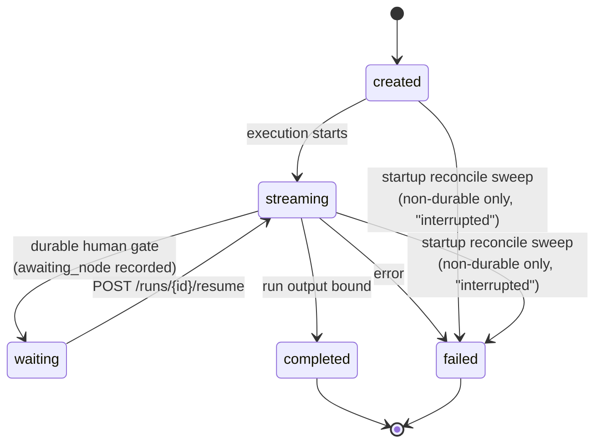
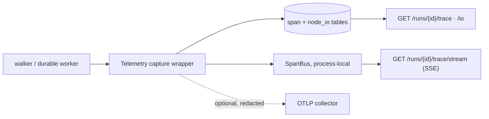

# The control plane

The control plane ([apps/control-plane](../../apps/control-plane), package
`theygent_control_plane`) is TheYgent's orchestration spine: one FastAPI service that owns
runs end to end (prompt runs, inline graph runs, saved-agent invokes, trigger fires), chat
sessions and memory, the agent registry and drafts, triggers and webhooks, connections and
encrypted secrets, RAG sources, the bench store, MCP hosting, the observability waterfall,
platform settings, and the identity layer (accounts, roles, sessions, API keys, SSO). It is a modular monolith on purpose: every subsystem shares one
Postgres and one process, but each lives behind its own injected store so the boundaries
stay visible and testable. The one thing it never does is run a model — model traffic
leaves exclusively over the inference plane's OpenAI-compatible HTTP seam (see
[architecture.md](./architecture.md) for why that split is permanent).

## Design rules

A change to this service must not break these:

- **The plane split is enforced at the door.** The control plane never imports an engine
  and forwards only *logical* model ids. Engine names (`mlx`, `vllm`, `llamacpp`) are
  rejected with `400 engine_name_not_allowed` on `/runs`, on every model-carrying graph
  node, and on RAG `embedding_model` — before any run row exists. The inference plane's
  model registry persists on the inference plane, never in this database.
- **Domain vs. persistence split.** Pydantic entities (`run.py`) are the wire/logic shape;
  SQLAlchemy rows (`models.py`) are the storage shape; `store.py` maps between them. ORM
  rows never leak out of a store, so the API contract is never welded to the schema.
- **Alembic owns the schema — never `create_all`, including in tests.** Migrations are
  hand-written and reviewed. Two deliberate exceptions live outside the chain: the durable
  runtime's own `dbos` schema (its migrator owns it) and RAG's per-dimension HNSW indexes
  (dimensions are data, so that DDL runs at ingest time).
- **The caller owns the transaction.** Stores never commit. Reads use the request-scoped
  session; writes go through the `tx()` helper — one transaction per logical operation —
  because a streaming run writes its terminal state *after* the response returns and
  cannot borrow a request-scoped session. Related writes (terminal status + session turns,
  secret + connection) land in one transaction.
- **Ordering keys are explicit columns, never timestamps**: `message.position` (dense,
  serialized by `SELECT ... FOR UPDATE` on the session row), `agent_version.seq` (latest =
  highest seq, not highest semver), `span.seq`. Clock skew across instances makes time
  unreliable as an ordering key.
- **Agent versions are immutable and content-addressed.** Identical re-publish is an
  idempotent 200; different content under the same version is `409 version_conflict`. The
  stored hash is computed by the same `theygent_ir.content_hash` the executor uses, so
  store → reload → re-hash is a fixpoint. Layout (`view`) is stored beside the IR and
  never hashed.
- **Secrets never inline.** Secret-looking connection config keys are rejected; plaintext
  exists only inside `SecretStore.resolve()` at step time; rotation keeps the same
  `secret_ref` so no referencing agent's `contentHash` moves.
- **Every request resolves to a `Principal` at one seam.** `require_auth` maps the
  presented bearer — a `tys_` session or a `tyk_` API key, both stored only as sha256
  hashes (passwords are scrypt) — to `Principal{id, role}`; `require_editor` /
  `require_admin` tighten it per route (`403 forbidden` below the floor). Roles are the
  closed ordered set `viewer < editor < admin`; an API key's effective role is the meet of
  its minted role and its owner's *current* role, so demotion bites without rotation. A
  fresh install has zero users, so every bearer fails and the API is closed until
  `POST /auth/setup` creates the first admin (a hard `409 setup_already_complete` after) —
  the lockout needs no special casing. Sign-in federation is OIDC/OAuth2 authorization
  code + PKCE resolved server-side (code exchange + userinfo, `auth.py`), with in-flight
  flow state carried in a Fernet-sealed, TTL-bound `state` parameter double-submitted with a
  browser-binding cookie (login-CSRF defense) and the callback handing the SPA a single-use,
  short-TTL code it trades at `POST /auth/oidc/exchange` — so the session bearer never rides a
  redirect URL. The last active admin can never be demoted/disabled/deleted (`409 last_admin`).
- **Unattended surfaces are deny-by-default.** `/agents/{id}/invoke` accepts the
  per-deploy `THEYGENT_INVOKE_TOKEN` (constant-time compare over bytes) or an active API
  key — never an interactive session bearer — and returns 401 with neither; webhooks
  are authed per-trigger by HMAC over the raw body.
- **Every sensitive read passes one chokepoint.** Trace, node I/O, settings, and the
  whole-install export/import surface (`transfer:export` / `transfer:import`) route through
  `governance.authorize()`, which ranks the resolved role against a per-permission floor
  (`trace:read`/`io:read` = viewer, `agent:configure` = editor, settings and transfer =
  admin). Do not add role logic elsewhere — the seam froze early precisely so enforcement
  could land here once, with zero endpoint retrofit; ownership checks (a viewer's own chat
  sessions) live at the endpoints that carry an owner column.
- **Errors use the house envelope**: every 4xx/5xx is `{"error": {"message", "code"}}` with
  stable snake_case codes, never FastAPI's `{detail}`. Pre-stream failures surface as
  clean HTTP statuses, never a 200 followed by a broken SSE stream.
- **Startup reconciliation is a whitelist sweep.** Only non-durable runs stuck in
  `created`/`streaming` are marked failed; `waiting` (human gate) and durable rows are
  excluded — the workflow engine owns their fate.
- **Telemetry never fails the run it observes.** Every capture, persist, and export path
  catches and logs; a pathological payload degrades the capture, never the run.
- **Contract extensions are deliberate and named.** Frozen surfaces (the `/runs` shape, the
  trigger contract, the durable workflow signature) stay frozen until a change is made
  consciously and recorded — even additive ones.

## Layout

All paths relative to `apps/control-plane/src/theygent_control_plane/`:

| Module | Role |
|--------|------|
| `app.py` | The `create_app` factory: every route as a closure over injected stores, the lifespan wiring, SSE helpers, the error envelope, auth dependencies, the single IR-run execution path, and the trigger `fire()` seam |
| `asgi.py`, `__main__.py` | ASGI entrypoint and CLI runner, kept separate so importing the factory has no side effects |
| `db.py` | One pooled async engine per process, `async_sessionmaker`, readiness ping |
| `models.py` | SQLAlchemy ORM rows — persistence shape only; `Base.metadata` is Alembic's target |
| `run.py` | Pydantic domain entities: `Run` (status lifecycle `created → streaming → waiting → completed \| failed`), sessions, agents, triggers, connections, bench types, id generators |
| `store.py` | The domain ↔ ORM mapping layer — stateless stores over a caller-provided session |
| `secrets.py` | `SecretStore`: Fernet-encrypted secrets behind `sec_` refs; `THEYGENT_SECRET_KEY` supports comma-separated key rotation |
| `settings.py` | The typed platform-settings catalog, env pin/cap resolution, TTL-cached `SettingsService` with live-apply hooks |
| `artifacts.py` | Local blob store for audio/image artifacts (`art_` refs); bytes are never journaled, refs are |
| `dispatcher.py` | In-process cron dispatcher over the persisted trigger registry (single-instance; durable mode replaces it) |
| `governance.py` | The `authorize(principal, permission, resource)` chokepoint — role-vs-floor per permission |
| `auth.py` | The identity layer: scrypt password hashing, opaque hashed bearers (sessions + API keys), the `AuthStore`, provider-config validation, and the sealed-state OIDC/OAuth2 code-flow helpers |
| `transfer.py` | The export/import bundle: DB-level bundle build (full rows, secret material stripped) and the id-preserving, idempotent, skip-on-exists apply behind `POST /export` / `POST /import` |
| `walker.py`, `durable/` | Graph execution — summarized below, detailed in [graph-execution.md](./graph-execution.md) and [durable-execution.md](./durable-execution.md) |
| `tools/`, `tool_resolve.py`, `gates.py` | Built-in tool registry, server-side connection/auth resolution, rate-limit/quota backends |
| `mcp/` | MCP hosting: transports, connection manager, generated OpenAPI/GraphQL servers, OAuth, hub registry client |
| `rag/` | Retrieval: chunking, document parsing, site crawling, pgvector store, ingest service, retriever |
| `observability/` | The span pipeline: capture wrapper, span/node-I/O stores, live SSE bus, optional OTLP export |
| `../../alembic/` | Async Alembic environment plus the linear migration chain `0001 → 0018` |

## HTTP surface

Wire naming is snake_case (the inference plane is camelCase — never mix them), with three
deliberate camelCase pockets: SSE frames and run-result bodies (`runId`, `toolCall`),
connection `hasSecret`, and the MCP hub models. Lists use keyset pagination
(`?limit&before`); action sub-resources use a `:verb` suffix.

| Group | Endpoints |
|-------|-----------|
| Runs | `POST /runs` (prompt run, SSE or JSON) · `GET /runs` · `GET /runs/{id}` · `POST /runs/{id}/resume` (durable human gate) |
| Graph/agent execution | `POST /graphs/runs` (inline IR) · `POST /agents/{id}/runs` · `POST /agents/{id}/invoke` (invoke token or API key) · `POST /agents/{id}/durable-runs` · `POST /hooks/{trigger_id}` (HMAC webhook) |
| Identity & access | `GET /auth/status` (unauthenticated boot probe) · `POST /auth/setup` (zero-users only) · `POST /auth/login` · `POST /auth/logout` · `GET/PATCH /auth/me` · `POST /auth/me/password` · `GET/POST /auth/api-keys` · `DELETE /auth/api-keys/{id}` · `GET/POST /users` · `PATCH/DELETE /users/{id}` · `POST /users/{id}/password` · `GET/POST /auth/providers` · `PATCH/DELETE /auth/providers/{id}` · browser legs `GET /auth/oidc/{slug}/start` · `GET /auth/oidc/callback` · `POST /auth/oidc/exchange` |
| Sessions | `GET/POST /sessions` · `GET/DELETE /sessions/{id}` · `POST /sessions/{id}/turns` |
| Agent registry | `POST/GET /agents` · `GET /agents/{id}` · `DELETE /agents/{id}` (one-transaction cascade: triggers incl. DBOS schedule drop, io-policy, versions; drafts/runs keep breadcrumbs) · `POST /agents/{id}/versions` · `GET /agents/{id}/versions/{version}` · `GET/PUT /agents/{id}/io-policy` · `GET /stats` |
| Drafts | `POST /drafts` · `PUT/GET/DELETE /drafts/{id}` · `GET /drafts` — deliberately unvalidated, unhashed working copies; only publish validates |
| Triggers | `POST/GET /triggers` · `GET/PATCH/DELETE /triggers/{id}` — kinds `http \| schedule \| webhook`, each pinning exactly one of version/content-hash |
| Connections | `POST/GET /connections` · `GET/PATCH/DELETE /connections/{id}` · connection-backed MCP ops (`/connections/{id}/mcp/tools`, `:warm`, `:close`, `mcp-oauth:start`, `mcp-oauth`) |
| MCP admin | `PUT/GET/DELETE /admin/mcp/servers/{name}` · `GET .../tools` · `:warm`/`:close` · hub browse/install (`/admin/mcp/registries`, `/admin/mcp/catalog`, `/admin/mcp/catalog/install`, `/admin/mcp/generated:preview`) · `GET /mcp/oauth/callback` |
| RAG | `POST/GET /rag/sources` · `GET/PATCH/DELETE /rag/sources/{id}` · `:ingest`/`:cancel` · document upload · `POST /rag/sources/{id}/query` |
| Observability | `GET /runs/{id}/trace` · `GET /runs/{id}/trace/stream` (SSE) · `GET /runs/{id}/nodes/{node_id}/io` |
| Bench | `POST/GET /bench/suites` · `POST/GET /bench/runs` · `GET /bench/compare` · `POST/GET/DELETE /bench/presets` |
| Settings, artifacts, health | `GET/PATCH /settings` · `POST /settings/otlp:test` · `POST /artifacts` · `GET /artifacts/{ref}` · `PUT /artifacts/{ref}` (preserve-ref restore for imports) · `GET /healthz` · `GET /readyz` (distinguishes db-down from inference-down) |
| Transfer | `POST /export` · `POST /import` — the control-plane half of the whole-install bundle, behind `transfer:export` / `transfer:import` (see [Import/export](#importexport-the-transfer-bundle)) |

## Postgres: schema, domain, stores

One database, 27 tables in the `public` schema, owned end to end by the Alembic chain
`0001 → 0019` (sessions were originally named `thread` — the chain replays history, and
the rename is itself a migration). By area:

| Area | Tables |
|------|--------|
| Runs & memory | `run`, `chat_session`, `message` (position unique per session) |
| Agents | `agent`, `agent_version` (canonical IR + view, unique `(agent_id, version)`), `agent_draft` |
| Triggers | `trigger` (kind, pin, config, `last_fired_at`) |
| Integrations | `mcp_server`, `connection`, `secret` |
| Observability | `span`, `node_io`, `agent_io_policy` |
| RAG | `rag_source`, `rag_document`, `rag_chunk` (untyped pgvector column + dim + generated tsvector) |
| Bench | `bench_suite`, `bench_case`, `bench_run`, `bench_preset` |
| Platform | `platform_setting`, `gate_counter` (fixed-window rate limits) |
| Identity | `user_account`, `auth_identity` (federated links), `auth_session`, `api_key` (both store sha256 token hashes, never bearers), `auth_provider` (client secret behind a `secret_ref`) |

The durable runtime keeps its checkpoint tables in a separate `dbos` schema in the same
database — owned by its own migrator, never by Alembic.

Conventions for new persisted resources: `TIMESTAMPTZ created_at/updated_at`, prefixed
ULID string primary keys (`con_`, `drf_`, `sec_`, `art_`, `rag_`), JSONB for opaque
config, and breadcrumb string columns instead of foreign keys where lineage must outlive
the referent (`run.trigger_id` survives trigger deletion; `run.user_id` /
`chat_session.user_id` survive account deletion, and are `NULL` on pre-identity rows).

The `run` row's status column follows one lifecycle, shared by both runtimes:



## Graph execution (summary)

An agent runs by walking its IR document: `walker.py` validates up front (unknown node
types, unfed required ports, engine names, missing MCP servers or RAG sources are all 400s
before a run row exists), then executes nodes in dependency order, binding each node's
`ok`/`err` outcome onto its out-ports and substituting `$in` references at each hop.
Durable-only node types (human, subgraph, loop, map) are rejected on interactive
initiators. The full node set, substitution rules, and conditional dataflow live in
[graph-execution.md](./graph-execution.md); the crash-safe durable mode — the same
executors journaled as workflow steps, opt-in via `THEYGENT_DURABLE`, plus the standalone
worker process — is [durable-execution.md](./durable-execution.md).

Both runtimes receive the same injected resources (retriever, connection resolver, gates,
artifacts, telemetry): the walker never opens a database session itself, which is what
keeps the two runtimes behaviorally identical.

## Integration subsystems

### MCP hosting

The `mcp/` package hosts external tool servers for the `mcp_tool` node. The official MCP
SDK is wrapped in exactly one place (`mcp/client.py`) behind an `McpClient` protocol —
the same discipline as the gateway client wrapping the OpenAI SDK. Transports: stdio
subprocesses, remote HTTP and SSE servers, and *generated* in-process servers built from a
user-supplied OpenAPI spec (one tool per operation) or GraphQL endpoint (two generic
tools: introspect the schema, run a locally-validated query).

Every transport runs on the actor pattern: one dedicated background task owns the
connection (the SDK's cancel scopes must enter and exit on the same task), callers enqueue
work, calls are served serially under a per-call timeout, and a dead actor always fails
its queued callers — nobody hangs. `McpManager` lazy-connects on first use, reuses the
connection for the process lifetime, and retries exactly once on transport failure before
binding `err`. A tool-level error is a structured outcome the run continues past; only
transport failures raise.

Server identity comes in two forms, deliberately distinct: name-keyed registrations
(`mcp_server` table, the editor's `server` picker) and connections (`con_` ids carrying
encrypted auth — the only home for generated servers and hub installs). Connection auth is
resolved server-side at step time; secret values never enter the IR, the config JSON, or a
subprocess argv. Interactive OAuth flows may start only from a user-opened `:start`
session — anywhere unattended (trigger, schedule, worker), the node binds `err` with an
instruction to authorize in the MCP page, while silent token refresh works everywhere.
The hub (`mcp/registry.py`) browses public MCP registries and plans installs without side
effects; the route layer creates the resulting connection.

### RAG on pgvector

The `rag/` package is the retrieval subsystem behind the `rag` node. Vector search lives
in the *same* Postgres (pgvector), so chunks stay transactional with their source rows —
no second storage engine. Ingest comes from two paths: site crawls (same-origin,
path-prefix-scoped, robots.txt-respecting, optional JS rendering) and document uploads
(PDF/DOCX/PPTX/XLSX/HTML converted to markdown-ish text). Both feed a pure heading-aware
chunker, then embed in batches through `GatewayClient.embed` with the source's pinned
*logical* model id — the control plane never imports an embedding library.

Each source's embedding dimension is discovered from the first response and claimed
first-writer-wins; queries filter on dimension and cast to `vector(dim)`, matching the
per-dimension partial HNSW index created at ingest time. Retrieval is one SQL statement:
cosine top-k fused with full-text search via reciprocal rank fusion. Document replacement
is atomic — old chunks are deleted only in the same transaction that inserts their
successors, so a mid-ingest failure degrades to stale content, never data loss. Graphs
reference sources by stable id, so re-ingesting content never bumps an agent's
`contentHash`.

### Observability

One instrumentation seam, two sinks. The `Telemetry` capture wrapper is shared by the
interactive walker and the durable worker; every node handler runs inside a span scope
that records timing, scalar attributes, and — separately — resolved per-port I/O.



The local span store is always on and needs zero external infrastructure — the in-UI run
waterfall reads TheYgent's own tables, never an external backend and never the durable
runtime's journal. OTLP export is the opt-in second sink: redacted spans only, never node
I/O payloads, lazily constructed, and always stoppable by the stored
`telemetry.otlp_enabled` setting even when an endpoint env var is set — telemetry egress
must remain user-stoppable.

The rules that make the waterfall trustworthy: span ids are deterministic hashes of the
run id and node id, so a crash-resumed run's spans — written by different workers — share
one trace; writes are idempotent (`ON CONFLICT DO NOTHING`, first-writer-wins), so the
worker that completed each step keeps its rows; `span.node_id` equals the IR node id
equals the canvas node id, the frozen join key between waterfall and editor. Payloads
never live in span attributes: per-port I/O goes to `node_io`, capped and
truncation-flagged, lazy-loaded on click. Effective capture is
`min(deployment ceiling, agent policy or topology default)` — hosted topology defaults to
metadata so raw payloads never default into a shared database, and capture `off` is a
hard stop: not even byte sizes are recorded.

### Import/export (the transfer bundle)

`transfer.py` builds and applies the control-plane half of the transfer bundle (the
browser assembles the actual zip — registry state is inference-plane-local and never
transits this service; see [architecture.md](./architecture.md)). Export reads the
database directly, on purpose: the public wire is lossy exactly where a faithful transfer
needs fidelity (`run.params` appears on no API response; `GET /connections` elides the
openapi `spec`). Secret hygiene is the hard invariant, with tests: no secret value,
ciphertext, `secret_ref`, webhook signing secret, or MCP env/header *value* ever enters a
bundle — keys and names only.

Import is id- and timestamp-preserving (span PKs embed `run_id`; correlation must
survive the move), idempotent, and skip-on-exists, with one `tx()` per entity so one bad
entry never aborts the rest — failures land in a flat `warnings` list. Agent versions
re-enter through the same gate as publish (`parse_document` + `validate_graph`, hash
recomputed server-side, `version_conflict` on divergent content); webhook triggers land
disabled and secretless; schedule triggers go through the same `_sync_schedule` helper as
`POST /triggers` so the DBOS mirror happens; connections land `secret_ref=NULL`; imported
artifacts restore under their original refs via `PUT /artifacts/{ref}`. Both routes pass
`governance.authorize()` with the `transfer:export` / `transfer:import` permissions.

## Configuration

| Env var | Meaning |
|---------|---------|
| `DATABASE_URL` | Postgres DSN (`postgresql+asyncpg://`), required |
| `THEYGENT_INFERENCE_PLANE_URL` | Inference-plane base URL incl. `/v1` (default `http://127.0.0.1:8081/v1`) |
| `THEYGENT_CONTROL_PLANE_HOST` / `_PORT` | Bind address (default `127.0.0.1:8080`) |
| `THEYGENT_DURABLE` | Opt into the durable runtime (see [durable-execution.md](./durable-execution.md)) |
| `THEYGENT_INVOKE_TOKEN` | Shared per-deploy bearer for unattended invokes (API keys open them too); with neither presented the surface is closed |
| `THEYGENT_OIDC_REDIRECT_URL` | Pins the `auth.oidc_redirect_url` setting — the redirect URI registered with sign-in providers (default `http://localhost:8080/auth/oidc/callback`) |
| `THEYGENT_SECRET_KEY` | Comma-separated Fernet keys (first encrypts, all decrypt); ephemeral dev key with a loud warning when unset |
| `THEYGENT_CORS_ORIGINS` | Allowed SPA origins (default the Vite dev ports) |
| `THEYGENT_ARTIFACT_DIR` | Artifact blob directory |
| `THEYGENT_TOPOLOGY` | `local \| hosted` — drives the default I/O capture level |

A second family pins or caps platform settings rather than configuring the process
directly — `OTEL_EXPORTER_OTLP_ENDPOINT`, `THEYGENT_IO_CAPTURE`,
`THEYGENT_IO_CAPTURE_MAX_BYTES`, `THEYGENT_MCP_CALL_TIMEOUT_S`,
`THEYGENT_MCP_REGISTRIES`, `THEYGENT_OAUTH_REDIRECT_URL`, `THEYGENT_OTEL_REDACT_ATTRS`.
Everything else (MCP timeouts, RAG chunking and crawl knobs, telemetry capture) is a typed
platform setting: a code-defined catalog, resolved as env pin/cap > stored > default, with
live apply and unknown keys rejected. Entry points: `uvicorn theygent_control_plane.asgi:app`,
`python -m theygent_control_plane`, and
`uv run --package theygent-control-plane alembic upgrade head` for migrations.

## Testing

The fast suite (`apps/control-plane/tests/`) runs against a **real ephemeral Postgres**
(a testcontainers pgvector image, since one migration runs `CREATE EXTENSION vector`) with
the schema applied through the **real Alembic chain** — never SQLite, never `create_all`
— and a fake-model inference plane over the real HTTP seam. It skips cleanly when Docker
is unavailable. Test fixtures (`tests/_db.py`, `test_migrations.py`) are updated in
lock-step with every new migration. Background loops (dispatcher, settings refresher) are
gated by `create_app` flags so tests drive `tick()` and refresh directly.

```sh
# fast suite (fake model, real Postgres + Alembic + HTTP seam)
uv run --package theygent-control-plane pytest apps/control-plane/tests -m "not integration"

# integration suite (real local model + real Postgres via DATABASE_URL; env-gated, serial)
uv run --package theygent-control-plane pytest apps/control-plane/tests -m integration -n0
```

Coverage worth knowing about: `test_migrations.py` (the chain itself), `test_mcp*.py`
(transports, generated servers, hub — against fixtures captured from live registries),
`test_rag.py` (chunker, hybrid query, hash-skip, a real local-site crawl, both runtimes),
`test_observability_*.py` (capture in both runtimes plus the API), `test_settings.py`
(sink swap, kill switch, probe), `test_auth.py` (setup lockout, the role-floor matrix,
API-key narrowing, last-admin guards, and the OIDC flow against a fake IdP), and
`test_reconcile.py` (the startup sweeps). The repo-wide picture is in
[testing.md](./testing.md).

## See also

- [architecture.md](./architecture.md) — the system map and the two-plane split
- [graph-execution.md](./graph-execution.md) — the walker, node set, and `$in` substitution
- [durable-execution.md](./durable-execution.md) — crash-safe runs and the worker process
- [inference-plane.md](./inference-plane.md) — the other side of the gateway seam
- [ir-and-packages.md](./ir-and-packages.md) — the IR envelope, `contentHash`, and the gateway client
- [interface.md](./interface.md) — the SPA that consumes this API
- [deployment.md](./deployment.md) — running the service in compose and Kubernetes
- [testing.md](./testing.md) — suites, fixtures, and CI gates
- [User documentation](https://docs.theygent.ai/) — for using TheYgent rather than working on it
