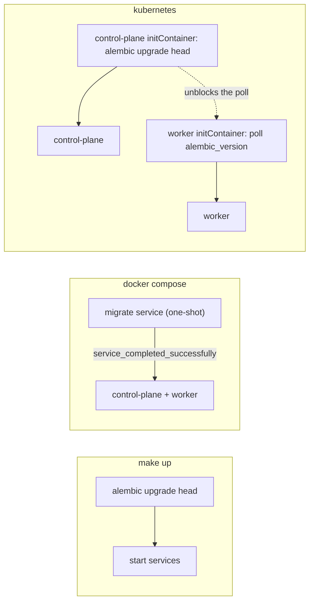

# Deployment and operations

This page covers how TheYgent is built, run, and shipped: the Makefile that brings the stack up bare-metal, the docker-compose stack (plus a host-inference overlay for Apple Silicon), the kustomize-based Kubernetes deployment for minikube, the static contract guards under `deploy/tests`, the CI gates, the sample OTel stack, and the two Cloudflare Pages publish pipelines (user docs and marketing site). The organizing idea: these are **three run modes of the same three-process topology** — control-plane API on :8080, inference plane on :8081, interface on :5174, plus the opt-in durable worker. Only the wiring changes between modes, never the architecture.

## Design rules

- **Never two architectures.** The same process types (control-plane API, inference plane, worker) run in every mode. `make up` bare-metal stays the first-class way of running the stack; compose and k8s are the second and third, and all stay supported.
- **One migrator per mode, migrations before app start.** `make up` runs `alembic upgrade head` before starting services; compose has a one-shot `migrate` service that the control-plane and worker gate on (`service_completed_successfully`); k8s runs alembic in the control-plane's initContainer while the worker's `wait-for-db` initContainer only *polls* `SELECT version_num FROM alembic_version` — it never migrates, so two pods can't race DDL. `upgrade head` on a migrated schema is a cheap no-op, so restarts and scale-ups pass straight through.
- **The inference plane never scales horizontally in-cluster.** `replicas: 1`, `strategy: Recreate`, no HPA. An instance pins model weights in memory and owns its RWO state PVC; two instances must never share a registry. Scale vertically, or run inference outside the cluster on a Metal/CUDA host and repoint `THEYGENT_INFERENCE_PLANE_URL`.
- **Port-based service identity in the Makefile.** Services are found by the port they listen on (`lsof`), never by recorded PID — `$!` captures only the uv/pnpm wrapper, not the server child. `start` skips loudly if a port is already held (never silently leaves an old process serving stale code), and `down-apps` refuses to kill Docker-owned listeners, pointing at `make docker-down` instead.
- **The host-port contract holds in every mode.** control-plane 8080, inference 8081, interface 5174 — under `make up`, `docker compose up`, and `kubectl port-forward` alike, so the SPA's baked-in `localhost` fallbacks and the default `THEYGENT_CORS_ORIGINS` work identically. Test-enforced.
- **An env name set in a deploy file must be read by first-party code.** `deploy/tests/contract_utils.py` scans `apps/*/src` and `packages/*/src` for `THEYGENT_*`/`VITE_*`/`DATABASE_URL` names; compose and k8s may only set names on that list (third-party names like `POSTGRES_*`, `HF_HOME` go in an explicit allowlist). A rename in code fails the deploy tests instead of silently configuring nothing.
- **Empty env equals unset, everywhere.** Compose interpolates `${THEYGENT_DURABLE:-0}` / `${THEYGENT_SECRET_KEY:-}` style values, and first-party code treats empty strings exactly like unset — a manifest pass-through must never crash-loop a container.
- **Base images are pinned with versioned tags.** No `:latest`, no rolling aliases (the guard requires a digit in the tag). The bundled llama.cpp server image is pinned to a specific build tag because the bare `server` tag floats with every upstream commit — bump deliberately and re-verify with a real chat.
- **Secrets and weights never bake into images.** `.dockerignore` excludes `**/.env`, `**/.env.*`, and model-weight extensions (`**/*.gguf` etc.) at every depth; real k8s deployments replace the dev `theygent-secrets` Secret.
- **Intentional contract changes update the guard in the same change.** Ports, service sets, env names, and image tags are all asserted by `deploy/tests` — changing one without updating its assertion is the drift the suite exists to catch.

## Layout

| Path | Role |
|------|------|
| `Makefile` | Run mode 1 (bare metal): install, engines, migrate, start/stop, tests, docker/k8s/otel/docs wrappers |
| `docker-compose.yml` | Run mode 2: postgres, one-shot migrate, both planes, opt-in worker (profile), nginx interface |
| `docker-compose.host-inference.yml` | Overlay: containerized inference disabled, control-plane/worker repointed at a host inference process |
| `deploy/k8s/` | Run mode 3: kustomize manifests for minikube (namespace, config, storage, postgres, planes, worker, interface) |
| `deploy/tests/` | Static contract guards over Dockerfiles, compose, and k8s manifests |
| `deploy/otel/` | Sample observability stack (collector → Tempo → Grafana), a separate compose project |
| `apps/*/Dockerfile` | Per-service images, all built from the repo-root context |
| `.dockerignore` | Build-context hygiene (nested exclusions need the `**/` prefix) |
| `.github/workflows/ci.yml` | CI: `fast` (PR gate), `frontend` (types drift + interface), `integration` (non-blocking, real engines on macOS) |
| `.github/workflows/docs.yml` | User-docs pipeline: mkdocs strict → mike versioning → Cloudflare Pages (`docs.theygent.ai`) |
| `.github/workflows/web.yml` | Marketing-site pipeline: asset check → Cloudflare Pages (`theygent.ai`), no build step |
| `.pre-commit-config.yaml` | Local hooks mirroring the CI gates, run via uv/pnpm so tool versions never drift |
| `.env.example` | The documented knob set shared by the bare-metal and compose modes |
| `docs/user-docs/` | Standalone uv project (mkdocs-material + mike) — deliberately not a workspace member |

## The three run modes

### 1. Bare metal — `make up`

`make up` = `install` (uv sync with extras + pnpm install) → `pg-up` (a dev Postgres container, `pgvector/pgvector:pg16`, volume `theygent-pgdata`, host :5432) → `migrate` (`alembic upgrade head`) → `start` (inference plane, control plane, interface as background processes; PIDs and logs under the gitignored `.run/`). `make engines` installs the local engine servers on macOS (llama.cpp, whisper.cpp, the MLX tools). The Makefile loads `.env` at parse time and exports every key, so `DATABASE_URL` and `THEYGENT_*` reach alembic, uvicorn, and vite without per-recipe sourcing. Day-to-day loop: `make restart` after backend changes (Postgres keeps running), `make status`, `make logs`.

### 2. Containers — `make docker-up`

`docker compose up` runs the same topology in containers: `postgres` (`pgvector/pgvector:pg18-trixie`, host :5433 so it never clashes with a bare-metal Postgres), the one-shot `migrate` service, `inference-plane`, `control-plane`, `interface` (nginx, :5174→80), and `worker` behind the `worker` profile — enable it with `THEYGENT_DURABLE=1 docker compose --profile worker up -d`. Compose auto-loads the repo `.env`, so the same knob file configures both run modes; in-container listen addresses and `DATABASE_URL` are fixed by compose and ignore it.

The in-container inference image is the honest container story: it bundles only a pinned CPU llama.cpp server (verified executable at build time), so llamacpp plus `openai-compatible` are what run inside Linux containers. MLX cannot — Metal is unreachable from a Linux container — which is why the **host-inference overlay** exists:

```
docker compose -f docker-compose.yml -f docker-compose.host-inference.yml up -d
```

The overlay parks the containerized inference plane under a disabled profile and repoints control-plane and worker at `http://host.docker.internal:8081/v1`, so MLX runs bare-metal on the host while everything else stays containerized. The host process must listen beyond loopback: `THEYGENT_INFERENCE_PLANE_HOST=0.0.0.0`. Same :8081 port, so the SPA URL doesn't change.

### 3. Kubernetes — `make k8s-load && make k8s-apply`

`kubectl apply -k deploy/k8s` deploys namespace `theygent`: Deployments for control-plane (HPA 1–5 @ 70% CPU), worker (HPA 1–3 @ 75% CPU), inference-plane (pinned to 1, see design rules), and interface; a Postgres StatefulSet; ConfigMap `theygent-config`; Secret `theygent-secrets`; and PVCs `theygent-data` (2Gi, shared by control-plane + worker for artifacts), `inference-data` (10Gi, registry + weights), `pgdata` (5Gi). Images are exactly the compose-built `theygent/*:dev` tags with `imagePullPolicy: IfNotPresent`, side-loaded by `make k8s-load` — which uses `docker save` + `docker load` inside minikube's own daemon, because `minikube image load` silently keeps an existing same-tag image and a rebuilt `:dev` would never reach the cluster.

Every PVC-mounting pod pins `runAsUser`/`fsGroup` to 10001, matching the numeric uid the images create — minikube's hostpath provisioner masks a mismatch, real block-storage classes do not. Probes target `/healthz` (liveness) and `/readyz` (readiness); the control-plane's `/readyz` is honest — Postgres *and* the inference plane must answer, so a pod leaves the Service while inference is down, by design. The worker has no probes (queue consumer, no HTTP surface). Dev access is `kubectl -n theygent port-forward` on 5174/8080/8081 so the SPA's baked URLs line up; a real deployment rebuilds the interface image with `VITE_CONTROL_PLANE_URL`/`VITE_INFERENCE_URL` and fronts it with an Ingress.

Note the recorded worker-scaling caveat: all worker replicas share one durable executor identity, so a new replica's launch-time recovery redundantly re-claims in-flight workflows (step checkpointing converges) — scale the worker on sustained load, not flapping.

## Migration discipline



Migrations always run from the control-plane image (the alembic config and migration tree are baked into it), always before any app process starts, and exactly one thing per mode is allowed to run them. Everything else waits.

## THEYGENT_DURABLE per mode

| Mode | Default | Why |
|------|---------|-----|
| `make up` | `0` | Single instance; the in-process cron dispatcher is fine, and durable mode is a per-invocation opt-in |
| compose | `0` (interpolated `${THEYGENT_DURABLE:-0}`) | Same reasoning; flip it when enabling the worker profile |
| k8s | `1` (in `theygent-config`) | The control-plane runs behind an HPA. The in-process cron dispatcher is single-instance by design and would double-fire schedules across replicas; only the durable runtime's schedules dedupe cluster-wide |

The k8s guard enforces both the value and that the ConfigMap actually reaches the pods via `envFrom`. The manifests carry the corollary in a comment: if this ever flips to `0`, drop the control-plane HPA in the same change.

## Ports, env vars, images

| Port | Service |
|------|---------|
| 8080 | control-plane API |
| 8081 | inference plane |
| 5174 | interface (nginx :80 in-container) |
| 5432 | bare-metal dev Postgres |
| 5433 | compose Postgres (host side) |
| 4318 / 4317 | sample OTel collector (OTLP HTTP / gRPC) |
| 3000 | sample Grafana |

Key env vars on the deploy surface (see `.env.example` for the documented set): `DATABASE_URL` (asyncpg DSN), `THEYGENT_INFERENCE_PLANE_URL` (**must include `/v1`** — the data-plane root), `THEYGENT_INFERENCE_PLANE_HOST/PORT`, `THEYGENT_CONTROL_PLANE_HOST/PORT`, `THEYGENT_CORS_ORIGINS`, `THEYGENT_DURABLE`, `THEYGENT_SECRET_KEY` (Fernet key for stored connection secrets), `THEYGENT_INVOKE_TOKEN`, `THEYGENT_MAX_RESIDENT`, `THEYGENT_ARTIFACT_DIR`, plus build-time `VITE_CONTROL_PLANE_URL`/`VITE_INFERENCE_URL` (Vite inlines them; changing where the planes are reachable means rebuilding the interface image — it is not a runtime env var).

Images are built from the **repo-root context** (`docker build -f apps/<app>/Dockerfile .`) because the uv/pnpm workspaces need the root manifests, in a two-layer pattern: a dependency layer (lockfile + every member `pyproject.toml`, `uv sync --locked --no-dev --no-install-workspace --package X`) then a source layer. Adding a Python workspace member means adding its `pyproject.toml` COPY to all three Python Dockerfiles — test-enforced. Notable build args: `WITH_MCP_LAUNCHERS` (default 1: node/npx + uvx shipped in control-plane and worker images so stdio MCP servers can launch, with `HOME=/data/home` because those servers spawn with a scrubbed environment and launcher caches derive from HOME) and `WITH_JS_RENDER` (default 0: an optional ~500MB chromium layer for JS-rendered crawling, installed outside `/data` so the volume never shadows it).

Postgres pinning details worth knowing: Postgres 18 images moved the data directory to `/var/lib/postgresql` (not `.../data`) — both compose and the k8s StatefulSet mount that path, and mounting the old one would silently strand data inside the container layer. pgvector must ship in the image because a migration runs `CREATE EXTENSION vector`. The Makefile's dev Postgres stays on the pg16 image at the classic path.

## The sample OTel stack

`make otel-up` starts a separate compose project (`theygent-otel`, never part of the app stack): an OTel collector (host :4318 OTLP/HTTP — what TheYgent's exporter speaks), Tempo for trace storage (no host ports; reachable only in-network), and Grafana on :3000 (anonymous admin, pre-provisioned with a Tempo datasource and a Traces dashboard). Point Settings → Telemetry at `http://127.0.0.1:4318/v1/traces` and use Test connection. The collector keeps a debug exporter on purpose — `make otel-logs` prints every arriving span, the honest middle checkpoint between "TheYgent says it exported" and "Grafana shows it".

## CI gates

`ci.yml` has three jobs:

- **`fast`** (the PR gate, Ubuntu): `uv sync --locked` → ruff check + format check → ty check (*non-blocking* while the type checker is in preview) → per-package fast pytest suites (IR, inference `-m 'not integration'`, control-plane against a real ephemeral Postgres via testcontainers) → `deploy/tests`.
- **`frontend`**: pnpm frozen install → regenerate `@theygent/ir-types` from the Pydantic IR and fail on any diff *or* untracked generator output (the FE/BE lockstep drift guard) → biome check → build (`tsc --noEmit` + vite) → vitest.
- **`integration`** (non-blocking, macOS): a real llama.cpp server against a small cached GGUF and a real MLX server, with Postgres built from brew (no Docker on macOS runners). Serial via `-n0` — never `-p no:xdist`, which would unregister the `-n` option the root addopts pass. A CUDA vLLM job is deliberately unwired: there is no CUDA runner, and faking it on a Mac would be a false green.

Hard gates: ruff, biome, tsc, vitest, the fast pytest suites, `deploy/tests`, and the types drift guard. Everything installs with `--locked`/`--frozen-lockfile` — a stale lockfile fails loudly, never silently re-resolves. The same gates run locally as pre-commit hooks (`make hooks` once, `make lint` for a full pass), implemented as `repo: local` hooks driven through uv/pnpm so the exact workspace-pinned tool versions apply rather than a second drifting copy.

## Publish pipelines

**User docs** (`docs.yml`, paths-filtered to `docs/user-docs/**`): PRs run `mkdocs build --strict` (broken links fail). Pushes to main deploy a `dev` version with mike; published releases deploy `<tag>` + `latest` and attach the built site tarball to the GitHub release. mike commits the version tree to `gh-pages` purely as the version store — the host is Cloudflare Pages: the whole tree is checked out and deployed to the `theygent-docs` project, serving https://docs.theygent.ai/. Before the first release the site root points at `dev` instead of 404ing. `docs/user-docs` is a standalone uv project, deliberately not a workspace member, so the docs toolchain never entangles the application dependency graph; drive it locally with `make docs-serve` / `make docs-build`.

**Marketing site** (`web.yml`): `apps/web` is plain static files with no build step, uploaded as-is to the `theygent-web` Cloudflare Pages project (https://theygent.ai/). Its entire CI is `check_web_assets.py` — every local `href`/`src`/`url()`/`srcset` reference must resolve on disk, because a dangling relative path is the one thing that breaks silently in a no-build site — plus per-branch preview deploys on PRs. Both pipelines share the `CLOUDFLARE_API_TOKEN` / `CLOUDFLARE_ACCOUNT_ID` secrets; only the Pages project differs.

## Testing

The deploy surface is guarded by a **static contract suite** under `deploy/tests` — pure YAML/Dockerfile parsing, no daemon or cluster required, which is why it runs inside the fast CI gate (the few `docker compose config` / `kubectl kustomize` sub-checks skip cleanly when the binary is absent):

- `test_dockerfiles.py` — every COPY source exists; base tags are pinned; every workspace member's `pyproject.toml` is COPYd (derived from the root workspace globs, so a new member fails here rather than at image build); CMDs are declared console scripts; EXPOSE matches app defaults; `.dockerignore` shape.
- `test_compose.py` — exact service set; host ports mirror the make stack; migrate gates the app services; restart policies; the `/v1` rule on the inference URL; the shared artifact volume; the env-name oracle; the host-inference overlay shape.
- `test_k8s.py` — kustomization lists every manifest; images are exactly the compose-built tags; requests+limits on all containers including initContainers; probes on HTTP services; the single-migrator split; `THEYGENT_DURABLE=1` and its `envFrom` reach; PVC writers pin uid 10001; the env-name oracle again.

Run them with `make test-deploy` (or `uv run --package theygent-control-plane pytest deploy/tests` — they run in the control-plane's environment because pytest and pyyaml already live there). Run them **before** touching anything under `deploy/`, the compose files, or a Dockerfile. `make test` runs the full local matrix: per-package Python suites (never a single root pytest — the apps share test-file basenames and would collide on import), interface vitest, and the deploy guards.

## See also

- [Architecture overview](./architecture.md) — the two-plane split and the three-process topology these run modes deploy
- [Control plane](./control-plane.md) — the API the migrator and probes belong to
- [Inference plane](./inference-plane.md) — why it pins state and never scales horizontally
- [Durable execution](./durable-execution.md) — the worker, durable mode, and what `THEYGENT_DURABLE` switches
- [Interface](./interface.md) — the SPA whose plane URLs are baked at image build
- [IR and shared packages](./ir-and-packages.md) — the generated-types lockstep the drift guard protects
- [Testing](./testing.md) — the full test taxonomy the CI jobs run
- [User documentation](https://docs.theygent.ai/) — the published, versioned docs this pipeline ships
