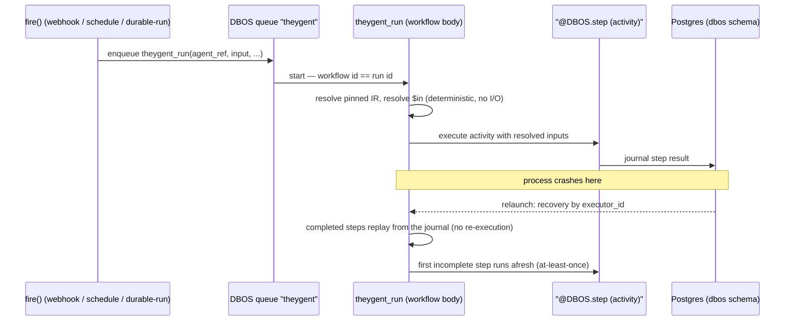

# Durable execution and the worker

TheYgent runs agent graphs on two runtimes. The interactive walker (see [control-plane.md](./control-plane.md)) is an in-process interpreter: it streams tokens live, and if the process dies mid-run the run is honestly reconciled to `failed` on the next boot. That posture is fine when a person is watching, but unattended runs — webhooks firing at 3 a.m., cron schedules, long multi-step agents waiting on a human — need a stronger guarantee: **a run survives a crash and resumes from the last completed step**, without re-doing work that already happened.

That guarantee is the durable runtime. It is built on [DBOS](https://www.dbos.dev/), chosen because it is an embedded Python library that journals workflow state into the Postgres the control plane already has — no new stateful service to deploy. DBOS system tables live in a separate `dbos` schema on the same instance, migrated at launch and deliberately kept out of Alembic's chain (Alembic owns `public`; the two never touch).

This page covers the durable layer (`apps/control-plane/src/theygent_control_plane/durable/`) and `apps/worker`, the separate deployable that hosts it in the server topology.

## Design rules

- **Exactly one registered workflow, `theygent_run`.** DBOS recovers crashed workflows by looking up their registered name, so a dynamically generated per-agent workflow would be unrecoverable. The one generic workflow takes `(agent_ref, input_value, session_id, trigger_id)`, resolves the pinned, immutable agent IR (`content_hash` > `version` > `latest`), and walks it. That signature is frozen: later additions (recursion `depth`, the enqueue timestamp) ride *inside* the opaque `agent_ref` dict rather than changing it.
- **The execution guarantee, stated honestly:** *exactly-once* for completed (journaled) steps — on resume they replay from the journal and never re-execute, so POSTs are not re-sent and tokens are not re-streamed; *at-least-once* for the step in flight at the crash and for retried steps — those re-execute, so step bodies must be read-shaped or idempotent. HTTP tools support an `Idempotency-Key` (with `{runId}`/`{nodeId}` expansion, plus per-iteration suffixes inside tool loops) so an at-least-once re-call does not duplicate a write.
- **Orchestration nodes do no I/O.** Router, transform, rule guardrails, and loop control run inline in the workflow body and must re-derive *identically* from journaled step results on replay — that determinism is what makes resume correct. All I/O lives inside `@DBOS.step` bodies. Even tool-schema construction is a journaled step, because listing an MCP server's tools is real network I/O.
- **Only serializable data crosses the workflow → step boundary.** `$in` references are resolved deterministically in the workflow body *before* the step, so each step checkpoints plain inputs and outputs. Bytes are never journaled: audio and image payloads flow as artifact *references* (`LocalArtifactStore`, fronted by `POST`/`GET /artifacts`), and secrets are resolved at step time by the connection resolver — they never appear in the IR, the journal, or spans.
- **Tokens are a side effect, not journal content.** The LLM step streams tokens to the in-process `DeltaBus`; only the assembled answer is journaled. A replayed step therefore never re-streams, and a reconnecting client renders from the persisted `run.output`. With no subscriber, publishing is a no-op.
- **Retry is single-layered.** DBOS owns step retry (3 attempts, exponential backoff); the durable path constructs its gateway client with `max_retries=0` so the OpenAI SDK never retries underneath a DBOS retry.
- **Per-role executor identity.** The API process's in-process runtime launches with `executor_id="control-plane"`; the worker launches with `executor_id="worker"`. DBOS launch-time recovery claims only pending workflows whose executor id matches — with a shared default id, a routine restart of one process would "recover" (steal and re-execute) workflows the other, healthy process is mid-step on.
- **The `dbos` import lives only under `durable/`.** The walker, the node executors, and the IR stay runtime-agnostic; the durable compiler imports the walker's executor bodies and traversal helpers, so parity between the two runtimes is structural, not copied.
- **Durable mode is opt-in per process** (`THEYGENT_DURABLE=1`). Interactive streaming surfaces stay on the in-process walker in *both* modes; only the unattended fire path and the explicit durable-run endpoint use DBOS.
- **Journal forward-compatibility:** new keys in step return values are read with `.get()`, so runs journaled before a code change resume cleanly after it.

## Layout

| Path | Role |
|------|------|
| `apps/control-plane/src/theygent_control_plane/durable/compiler.py` | The in-workflow lowering: the one `@DBOS.workflow` `theygent_run` re-runs the walker's exact traversal with every activity wrapped as a `@DBOS.step`, plus the durable-only lowerings (human, subgraph, loop, map) and the scheduled-fire workflow. |
| `apps/control-plane/src/theygent_control_plane/durable/runtime.py` | `DurableRuntime`: DBOS lifecycle (migrate the `dbos` schema, launch with a per-role executor id), the run queue, the `fire()` and `resume()` seams, and dynamic-schedule CRUD. |
| `apps/control-plane/src/theygent_control_plane/durable/bus.py` | `DeltaBus`: the in-process, non-durable token side-channel. |
| `apps/control-plane/src/theygent_control_plane/durable/config.py` | DBOS config builder: the `dbos` schema constant, DSN adaptation, optional checkpoint-DB override, fast polling for tests, executor id plumbing. |
| `apps/control-plane/src/theygent_control_plane/walker.py` | Home of the runtime-agnostic pieces the durable compiler imports: activity executor bodies, `$in` resolution, edge-liveness/skip logic, empty-output honesty. No DB access, no DBOS import. |
| `apps/worker/src/theygent_worker/app.py` | Worker bootstrap: `build_runtime()` assembles `DurableRuntime` plus every step-time seam; `run_worker()` launches DBOS and blocks until shutdown. |
| `apps/worker/src/theygent_worker/__main__.py` | Entry point: `python -m theygent_worker` / the `theygent-worker` console script. |

## The one workflow, end to end

Every unattended initiator — webhook, schedule, and the explicit durable-run endpoint — converges on the frozen `fire(trigger, input)` seam, which enqueues `theygent_run` on the DBOS queue. The workflow id *is* the run id, and Run-row creation is idempotent (`INSERT .. ON CONFLICT DO NOTHING`), so a recovered workflow never duplicates its run.



Inside the workflow body, `_durable_walk` performs the same kind-first dispatch as the interactive walker: boundary nodes map to workflow input/output, activities become journaled steps, and orchestration nodes run inline (the no-I/O rule above). Adding a node type means adding it in *both* runtimes — the shared executor body plus a dispatch branch in each — unless it is deliberately durable-only.

## Durable-only node types

Four node types exist only on the durable runtime: **human**, **subgraph**, **loop**, and **map**. The interactive run endpoints reject a graph containing them up front with `400 durable_required`; the walker's `NotImplementedError` branches are only a backstop.

Why they cannot be interactive:

- **human** must survive a process restart mid-wait. It persists run status `waiting` (plus `run.awaiting_node`), then blocks on `DBOS.recv` on the per-node topic `human:<node_id>` — a checkpoint, not an in-memory await. `waiting` runs are excluded from the startup reconcile sweep (a paused run is not a zombie). `POST /runs/{id}/resume` delivers the payload via `DBOS.send`; the per-node topic means a duplicate resume buffers inertly instead of satisfying the run's *next* human gate with a stale payload.
- **subgraph**, **loop**, and **map** compose a *saved, pinned* agent as child workflows with deterministic ids — `<run>-sg-<node>`, `<run>-loop-<node>-<i>`, `<run>-map-<node>-<i>` — so a resume re-runs only the incomplete children. Loops require `maxIterations >= 1` (no unbounded loops pass validation); map fans out one child per list element on the separate `theygent_map` queue (so a wide fan-out never starves top-level fires), with per-node `concurrency` and `onError: fail_fast | collect`.

## Schedules in durable mode

In durable mode the in-process schedule dispatcher is not started. Each enabled schedule trigger becomes a DBOS dynamic schedule named `trigger-<id>` that fires `theygent_scheduled_fire(scheduled_time, context=trigger_id)`. That workflow re-reads the trigger row (the `trigger` table stays the source of truth), stamps `last_fired_at` from the schedule's own instant *before* running (deterministic across replay; a crashed fire still advances the window — no backfill), then runs `theygent_run` as a child.

DBOS keys each tick's workflow on the schedule name and scheduled time, so two processes firing the same instant collide on the same workflow id and it runs once — schedule dedup across instances comes from the runtime, not a lock. Both the API process and the worker reconcile schedules to the enabled trigger rows at boot, so whichever boots first establishes them.

## `apps/worker`: the separate deployable

The worker is process type 2 of the architecture — and it is deliberately a thin bootstrap, not a subsystem. All durable logic lives in `theygent_control_plane.durable`, which the worker imports as a library:

- `build_runtime()` assembles `DurableRuntime` with **exactly the seams the API process wires**: a `GatewayClient` with `max_retries=0`, the MCP manager (registry rehydrated from Postgres at boot so stdio servers spawn in the worker's own trust domain), the settings service with its live-apply refresher, settings-resolved telemetry (OTLP sink included), the DB-backed connection resolver, gate backend, artifact store, and RAG retriever — under `executor_id="worker"`. Any seam wired in one process but not the other is a bug: one behavior, two deployables.
- `run_worker()` migrates the `dbos` schema (automatic at launch — there is no separate migrate step), launches DBOS, starts the settings refresher, reconciles schedules, then blocks until SIGINT and tears everything down, flushing the current telemetry sink.

On **desktop**, the worker binary is unused: the control-plane process launches the *same* `DurableRuntime` in-process (with its own executor id). On **server or air-gapped** deployments, the worker runs as a separate process against the shared Postgres. One codebase, two topologies — never two architectures. Run attribution follows the same identity: every span records which executor handled it (`worker`, `control-plane`, or `inproc` for interactive runs).

One posture difference: **no interactive OAuth at the worker.** No user is seated there, so the worker's OAuth builder refreshes tokens silently and fails fast with an actionable error whenever a browser round-trip would be required — an unattended run never parks waiting on a login page.

## `THEYGENT_DURABLE` semantics

`THEYGENT_DURABLE=1` (also `true`/`yes`/`on`, case-insensitive; anything else — including unset — is off) opts a control-plane process into durable mode. It is read at startup by both entry points (`__main__.py` and `asgi.py`) and is process-global: changing it requires a restart.

What it changes, precisely:

| Surface | Durable off (default) | Durable on |
|---------|----------------------|------------|
| `/runs`, `/graphs/runs`, `/agents/{id}/runs`, `/agents/{id}/invoke` | In-process walker | In-process walker (unchanged — byte-for-byte the same) |
| `fire()` — webhooks (`/hooks/{id}`) and schedules | In-process walker + in-process dispatcher | DBOS queue + DBOS dynamic schedules |
| `POST /agents/{id}/durable-runs` | `400 durable_required` | `202 {run_id}`, fire-and-poll |
| `POST /runs/{id}/resume` | `400 durable_required` | Delivers to the waiting human gate |
| Graphs containing human/subgraph/loop/map | Rejected (`400 durable_required`) | Run durably |

The standalone worker always runs the durable runtime — the flag is a control-plane concern.

## Surface reference

**Wire-stable DBOS names** (renaming any of these orphans in-flight state):

| Kind | Name |
|------|------|
| Workflows | `theygent_run`, `theygent_scheduled_fire` |
| Queues | `theygent` (runs), `theygent_map` (map fan-out) |
| Dynamic schedules | `trigger-<trigger_id>` |
| Recv/send topics | `human:<node_id>` |
| Child workflow ids | `<run>-sg-<node>`, `<run>-loop-<node>-<i>`, `<run>-map-<node>-<i>` |
| App name / schema | `theygent` / `dbos` |

**Environment variables:**

| Variable | Meaning |
|----------|---------|
| `THEYGENT_DURABLE` | Opt the control-plane process into durable mode (see above). |
| `DATABASE_URL` | The shared Postgres (`postgresql+asyncpg://…`); app tables in `public`, DBOS state in the `dbos` schema. Required by the worker. |
| `DBOS_SYSTEM_DATABASE_URL` | Optional override to keep DBOS checkpoint state on a different database. |
| `THEYGENT_INFERENCE_PLANE_URL` | Inference data-plane root incl. `/v1`; the same variable the control plane reads. The worker also accepts the legacy `THEYGENT_INFERENCE_PLANE_BASE_URL` as a fallback. Default `http://127.0.0.1:8081/v1`. |
| `THEYGENT_SECRET_KEY` | Comma-separated Fernet keys for connection secrets; unset means an ephemeral key and a loud warning (dev only). |
| `THEYGENT_INVOKE_TOKEN` | Bearer token gating `POST /agents/{id}/invoke`; unset closes that surface (deny by default). |

**Resume endpoint error codes:** `POST /runs/{run_id}/resume` returns `400 durable_required`, `404 run_not_found`, `409 run_not_waiting` / `awaiting_node_missing`, `410 workflow_gone` (the run is then terminalized failed), or `422 resume_schema_mismatch` (declared required input keys missing).

## Testing

The durable suites run against **real embedded DBOS** — the same runtime as production, never a mock — on a session-scoped [testcontainers](https://testcontainers-python.readthedocs.io/) Postgres (`pgvector/pgvector:pg16`) with the real Alembic chain plus the `dbos` schema migration applied. Tests skip cleanly when Docker is unavailable. Because DBOS is a process-global singleton, each durable test launches and destroys it and resets the `dbos` schema, so a workflow left pending by one test is never "recovered" by the next.

- `apps/control-plane/tests/test_durable.py` — the core proofs, driven by a *blockable* fake inference server (`tests/_durable.py`) that freezes a chosen prompt's first call to simulate a crash mid-activity: completed steps replay exactly-once (call counters prove no duplicated effect), the interrupted step re-executes (at-least-once), transient 503s are retried, schedules dedup across instances, and Alembic + `dbos` migrations coexist.
- `apps/control-plane/tests/test_lowering_nodes.py` — kill-and-resume per durable-only type: a human wait survives a crash, subgraph pins are immutable and children resume, loops re-run no completed iteration, maps resume only incomplete branches.
- `apps/control-plane/tests/test_durable_run_endpoint.py`, `test_observability_durable.py` — the durable-run endpoint and worker span attribution.
- Parity suites (e.g. `test_llm_parity.py`) run the same graphs on both runtimes and compare behavior and records — the guard on the shared-executor design.

```sh
# fast suites (default addopts: -n auto -m 'not integration')
uv run --package theygent-control-plane pytest apps/control-plane/tests/test_durable.py

# env-gated integration: real Postgres + real DBOS + real local inference
DATABASE_URL=postgresql+asyncpg://localhost/theygent \
THEYGENT_INFERENCE_PLANE_BASE_URL=http://127.0.0.1:8081/v1 \
    uv run --package theygent-control-plane pytest -m integration \
    apps/control-plane/tests/test_integration_durable.py
```

The worker has no test directory by design: `build_runtime()` (assemble, no launch) is factored apart from `run_worker()` (launch and block) precisely so control-plane tests can drive the worker's exact production wiring without the blocking loop. The hand-driven proof is the kill-the-worker demo: start a durable run, `kill` the worker mid-inference, restart it, and watch the run resume and finish without re-doing the completed step.

## See also

- [architecture.md](./architecture.md) — the two-plane split and the three process types
- [control-plane.md](./control-plane.md) — the interactive walker, run spine, and API surface
- [ir-and-packages.md](./ir-and-packages.md) — the Agent Graph IR, content hashing, and the gateway client the worker uses
- [inference-plane.md](./inference-plane.md) — the OpenAI-compatible seam every step's model call crosses
- [deployment.md](./deployment.md) — running the worker as a container / on Kubernetes
- [testing.md](./testing.md) — suite layout and conventions
- User documentation: <https://docs.theygent.ai/>
