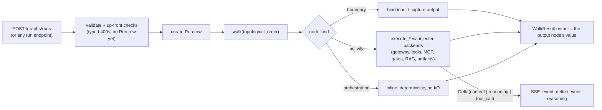
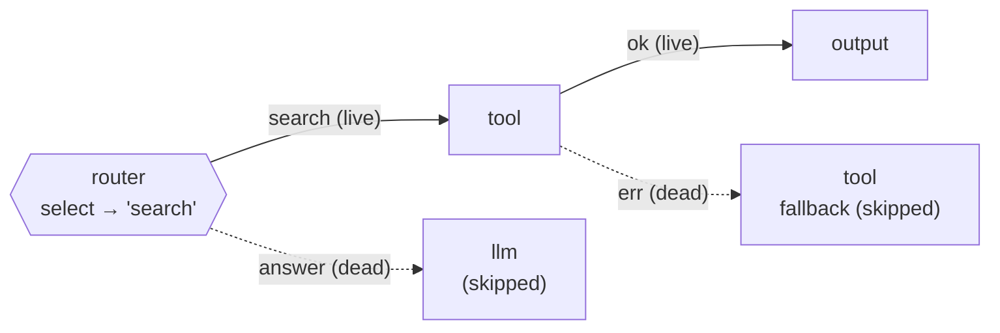

# Graph execution: the walker and the node set

This page describes how a validated Agent Graph IR actually runs inside the TheYgent control plane. The execution layer takes an `IRDocument` (see [IR and packages](./ir-and-packages.md)), traverses it in topological order, and dispatches each node to an executor — streaming model tokens out as SSE while it goes. It exists as its own layer, separate from the API surface, because the same node executors must serve two runtimes: the in-process interactive walker described here, and the durable, journaled runtime described in [Durable execution](./durable-execution.md). Everything runtime-agnostic — executor bodies, the `$in` substitution language, edge-liveness logic, traversal helpers — lives in `walker.py` and is imported by the durable compiler, so parity between the runtimes is structural, not coincidental.

## Design rules

Changes to this layer must not break these invariants:

- **The walker is a pure async function over an injected context.** `walker.py` performs no database I/O and imports no durable-runtime SDK. Every stateful backend — connections/secrets, gates, artifacts, RAG, telemetry — arrives through `WalkContext` and owns its own sessions. The durable runtime mirrors the same set as `DurableResources`.
- **Dispatch is kind-first.** A node is routed by `node.kind` (`boundary | activity | orchestration`) and then by `node.type` within that kind. The type→kind mapping is pinned in `packages/ir` (`NODE_TYPE_KIND`); a mismatch is a validation error, never a wrong lowering. `guardrail` is the one per-instance kind: the rule variant is orchestration, the model variant is activity.
- **Orchestration nodes do no I/O.** Router, transform, and rule guardrails run inline and must re-derive identically from prior results — this is the determinism guard that lets the durable runtime replay them. All I/O lives in activity executors.
- **Logical model ids only.** The `model` field on any node carries a logical id, never an engine name. `mlx`, `vllm`, and `llamacpp` are rejected up front (400 `engine_name_not_allowed`) before a run row exists.
- **The tool ok/err contract is sacred.** An exception inside a tool-shaped executor (tool, mcp_tool, rag, http, transcribe, speak, imagine) becomes a structured error bound to the node's `error`-typed out-handle, and the run continues. A non-2xx HTTP status is a normal ok value `{status, body, headers}`. Only router/transform/template errors and llm stream failures fail the run.
- **Loud failures over silent defaults.** Unknown `$in` roots, undeclared ports, missing fields on present values, and unmatched router selections raise errors naming the node, the token, and what was available. A bad token is never passed through as literal text; a route is never guessed.
- **Empty output is explained, never green-blank.** `finalize_empty_reason` (shared by both runtimes) attaches an honest reason when a run produces no output: an upstream error, no output node reached, or a token-limit truncation with an actionable "raise maxTokens" note.
- **Reasoning never folds into the answer.** Thinking tokens (a separate `reasoning_content` delta field or one leading inline `<think>` block, split by `ThinkSplitter`) stream as `event: reasoning` and persist only under the reserved observability key `__reasoning__` — reserved keys are never dataflow handles an edge can read.
- **Adding a node type is a fixed recipe.** (1) type→kind entry plus config model and validation in `packages/ir`; (2) a runtime-agnostic `execute_*` body in `walker.py`; (3) a dispatch branch in the walker *and* the mirrored branch in the durable compiler; (4) up-front membership checks in `app.py` if they depend on live state. Never implement in one runtime only, unless deliberately durable-only — then the interactive endpoints must reject up front with 400 `durable_required`.

## Layout

| Path | Role |
|---|---|
| `apps/control-plane/src/theygent_control_plane/walker.py` | The interactive interpreter: `walk()` over `topological_order(ir)`, plus every runtime-agnostic piece both runtimes share — executor bodies (`execute_llm`, `execute_tool`, `execute_mcp_tool`, `execute_http_tool`, `execute_rag`, `execute_guardrail_model`, `execute_ratelimit`, `execute_quota`, `execute_transform`, `execute_transcribe`, `execute_speak`, `execute_imagine`, …), the `$in` resolver, tool-schema builders, edge-liveness helpers, `finalize_empty_reason` |
| `apps/control-plane/src/theygent_control_plane/durable/` | The durable runtime — imports the walker's executors and traversal helpers; see [Durable execution](./durable-execution.md) |
| `apps/control-plane/src/theygent_control_plane/gates.py` | `GateBackend`: atomic fixed-window counter (`gate_counter` table) for ratelimit; token-usage summation over existing spans for quota |
| `apps/control-plane/src/theygent_control_plane/tools/registry.py` | `ToolRegistry`: in-code name → async-callable map with optional OpenAI schemas; ships `echo` and `http_fetch` |
| `apps/control-plane/src/theygent_control_plane/tool_resolve.py` | `DbConnectionResolver`: connection id → decrypted secret at step time; plaintext never enters spans or journals |
| `apps/control-plane/src/theygent_control_plane/reasoning.py` | `ThinkSplitter`: engine-agnostic separation of thinking tokens from the answer |
| `apps/control-plane/src/theygent_control_plane/governance.py` | `authorize(principal, permission, resource)` — the read-side authorization chokepoint (always-allow today; every sensitive endpoint already routes through it) |

## How a run executes

Every interactive entry point converges on one helper in `app.py` (`_execute_ir_run`): validate the IR (`parse_document` + `validate_graph`), run the cheap up-front membership checks (engine names, tool keys, MCP server names, RAG source existence, durable-only types), create the `run` row, build a `WalkContext`, and stream.



The walker yields `Delta(node_id, content, kind)` values as it goes; only `kind="content"` accumulates into the visible answer, and the SSE relay maps kinds onto `event: delta` and `event: reasoning`. The canonical run output is *not* the accumulated deltas — it is the value that reached the `output` node, returned out-of-band as `WalkResult`. The stream path primes the walker before committing to a 200 SSE response, so a pre-stream failure (bad model, unknown tool, router miss on the first node) surfaces as a clean HTTP status rather than an error mid-stream. Every gateway call carries the `x-theygent-run-id` correlation header, and each node is wrapped in the one telemetry span/capture wrapper (best-effort — telemetry never fails the run it observes).

## The node set

Types marked *durable-only* are rejected by the interactive endpoints with 400 `durable_required`; they need journaled checkpoints to survive a restart (see [Durable execution](./durable-execution.md)).

| Type | Kind | One line |
|---|---|---|
| `input` | boundary | Binds the run's input value to its out-handles; never skipped. |
| `output` | boundary | Its single in-port value *is* the run's canonical output; two output nodes executing in one run is a loud error, never last-wins. |
| `human` | boundary, durable-only | Persists status `waiting` + `run.awaiting_node`, then blocks on a per-node message topic until `POST /runs/{id}/resume`; timeout → honest fail or a configured default. |
| `subgraph` | boundary, durable-only | Runs a saved, pinned agent as a child workflow with a `maxDepth` recursion guard; a failed child binds the err handle. |
| `llm` | activity | Streaming model turn(s) with an autonomous bounded tool loop (`maxToolIterations`, default 8). |
| `tool` | activity | A builtin registry callable, or — when its binding resolves to an `http` entry in `ir.tools` — a real outbound HTTP call with connection-injected auth. |
| `mcp_tool` | activity | An external MCP server's tool, addressed by exactly one of `server` (registered name) or `connection` (connection id); every invocation passes through the single `_invoke_mcp` chokepoint. |
| `rag` | activity | Hybrid retrieval over a saved pgvector source; usable as a pipeline step or as an llm capability. |
| `guardrail` (model) | activity | A classifier judge call; passes iff the answer starts with the configured `passOn` string. |
| `guardrail` (rule) | orchestration | Deterministic predicate: regex, length, allow/deny list, required-keys JSON schema, or PII patterns (pass iff *no* match); unknown rule kinds fail closed. |
| `ratelimit` | activity | Fixed-window counter gate, scoped `<graph>:<node>:<key>`; over the limit → the `deny` handle fires. |
| `quota` | activity | Token-budget gate summing `gen_ai.usage.total_tokens` off existing spans — reads accumulated usage, never re-meters. |
| `transcribe` | activity | Audio artifact ref → text via `POST /v1/audio/transcriptions`. |
| `speak` | activity | Text → audio artifact *ref* via `POST /v1/audio/speech` (bytes stay in the artifact store). |
| `imagine` | activity | Text → image artifact ref via `POST /v1/images/generations`. |
| `router` | orchestration | Handle-name routing: `config.select` resolves to the *name* of an out-handle; only that branch lives; a miss fails the run. No expression DSL. |
| `transform` | orchestration | Deterministic JSON-template reshape whose string leaves may be `$in` refs; a bad expr fails the run (no err port). Deliberately not a query DSL or code sandbox. |
| `loop` | orchestration, durable-only | Bounded repetition (`maxIterations` ≥ 1) of a pinned body agent; previous output feeds the next input; optional stop condition. |
| `map` | orchestration, durable-only | One child workflow per list element on a dedicated fan-out queue, per-node concurrency, `onError: fail_fast \| collect`, ordered join. |

`agent`, `retriever`, `memory`, `code`, `condition`, and `iterator` are declared in the IR taxonomy but not yet executable — they validate but are rejected up front.

## `$in`: port-addressed substitution

`$in` is the one substitution token language, used by every substituting node. A node declares named in-ports (`ports.in`), each fed by at most one live `data` edge; the walker gathers `{targetHandle: value}` from live edges before executing the node. Resolution is **port-first**:

- `$in` — the default port literally named `in` (an error if no `in` port is declared)
- `$in.<port>` — that port's whole value
- `$in.<port>.<path>` — drill into the value (JSON strings are parsed while descending)
- `$$` — escapes a literal `$`

Failures are loud: an unknown token root, an undeclared port, or a missing field on a *present* value raises an error naming the node, the token, and the available ports/fields — never a silent literal. Absence is different from error: a declared-optional port that is unfed, fed by a dead branch, or fed an explicit null resolves to `None` for the whole value and any drill into it (rendered `""` inline, JSON `null` in structured arguments).

Single-value consumers (`output`, `router`, `guardrail`, the gates, `transcribe`/`speak`/`imagine`) must declare exactly one in-port — more is an ambiguity error, never a silent default pick. Multi-port composition is for value-producers (`llm`, `tool`, `mcp_tool`, `transform`). One deliberate subtlety: inside HTTP-tool and transform *bodies*, only a string that is exactly a `$in` ref resolves (and keeps its type); all other strings stay literal, so GraphQL's own `$variable` syntax survives untouched.

## Conditional dataflow and edge liveness

An edge is **live** iff its source executed *and* activated that specific source handle:

- a `router` activates exactly the selected handle;
- a tool-shaped node activates `ok` xor `err`;
- a `guardrail` activates `pass` xor `block`;
- a gate activates `allow` xor `deny`.

One run through a branching graph, with live edges solid and dead edges dotted:



A node whose inbound data edges are *all* dead is skipped (logged, with a zero-width span so the trace stays honest); `input` is never skipped. This is how a single graph expresses branching, fallbacks, and guarded paths without a conditional DSL: the upstream node chooses the branch, and liveness propagates the choice. A failed node with no declared err port still records its message internally so the final empty-output reason can name the cause.

## Tool capabilities on llm nodes

An llm node's available tools are the union of two sources:

1. **Config bindings** — `LlmConfig.tools` lists keys into `ir.tools` (`builtin`, `http`, or `mcp` bindings); the function name the model sees is the key.
2. **Capability nodes** — a `tool`, `mcp_tool`, or `rag` node wired to the llm via a `channel: "tool"` edge. The function name is the *node id* (collision-safe: two llm nodes can wire different nodes over the same builtin or server). Capability nodes are excluded from the topological walk and executed lazily inside the llm's tool loop.

The loop: stream one turn → if the model emitted tool calls, execute each through one dispatcher, append the results as `role: "tool"` messages, and call again — until the model answers or `maxToolIterations` caps it (capped-with-blank-output surfaces an honest empty reason). `toolChoice` follows the OpenAI vocabulary (`auto | none | required | named`); a forced choice applies to the first turn only, then flips to `auto` — re-sending it would force a tool call every turn and the model could never answer.

## Gates

Gates are deliberately lean policy, not billing infrastructure. `ratelimit` is one atomic fixed-window upsert on the `gate_counter` table; `quota` is a read-side SUM of `gen_ai.usage.total_tokens` over the run's existing spans (which is why usage lands on the `model.generate` phase span only, never mirrored — a mirror would double-count). Granularity is per-key (`keyExpr`: a `$in` ref or a literal bucket). Gates never hang: a denial is a clean structured `{denied: true, reason}` on the `deny` handle, and an unwired gate backend means allow (inert).

## One executor set, two runtimes

Every activity body is a plain module-level `execute_*` function taking only serializable data plus injected clients, returning an `ActivityOutcome` or `LlmActivityResult`. The interactive walker calls them directly; the durable runtime wraps each in a retried, journaled step and re-runs the *same* traversal with the *same* dispatch — the durable compiler imports the traversal helpers and executor bodies from `walker.py`, so there is exactly one implementation of node semantics. Edges and ports are never passed into an executor: the caller resolves `$in` deterministically and hands over resolved inputs, which is what makes a durable step checkpointable. How journaling, crash-resume, the durable-only nodes, and the fan-out queues work is covered in [Durable execution](./durable-execution.md).

## Surface

Run-initiating endpoints (all in `app.py`; execution delegates to this layer):

| Endpoint | What it runs |
|---|---|
| `POST /runs` | Prompt mode (no graph) |
| `POST /graphs/runs` | An inline IR document |
| `POST /agents/{agent_id}/runs` | A saved agent's pinned IR |
| `POST /agents/{agent_id}/invoke` | Same, gated by a bearer token (`THEYGENT_INVOKE_TOKEN`; unset = deny) |
| `POST /hooks/{trigger_id}` | Webhook fire, HMAC-verified (`X-TheYgent-Signature: sha256=…`) |
| `POST /agents/{agent_id}/durable-runs` | 202 `{run_id}` on the durable queue; 400 `durable_required` when the process is not in durable mode |
| `POST /runs/{run_id}/resume` | Delivers input to a waiting `human` node (durable runs only) |

Typed up-front error codes (400, before a run row exists): `engine_name_not_allowed`, `tool_not_found`, `tool_binding_mismatch`, `tool_not_self_describing`, `mcp_server_not_found`, `mcp_tool_not_found`, `rag_source_not_found`, `durable_required`, `invalid_ir`. Runtime failures: 422 `template_error` / `transform_error`; a router miss fails the run. The split is deliberate: cheap state-dependent membership checks run per-invocation before a run exists, while things that legitimately change between create and run (a connection's secret, a disconnected MCP server's tool list) resolve at execution time and bind `err` honestly.

Postgres tables this layer touches: `run` (status incl. `waiting`, `awaiting_node`, `output`, `error`, `runtime`), `span` + `node_io` (observability capture), `gate_counter`, `connection` + `secret`, `agent`/`agent_version`, `trigger`, `mcp_server`, `rag_source`/`rag_document`/`rag_chunk`.

| Env var | Effect |
|---|---|
| `THEYGENT_DURABLE=1` | Opt the process into durable mode (interactive streaming endpoints stay on the walker in both modes) |
| `DATABASE_URL` | The shared Postgres (asyncpg for the app) |
| `THEYGENT_SECRET_KEY` | Comma-separated Fernet keys for connection secrets; unset → ephemeral key + loud warning |
| `THEYGENT_INVOKE_TOKEN` | Bearer token gating `/invoke`; unset = deny-by-default |

Stream vocabulary: SSE `event: delta` `{runId, delta}` and `event: reasoning` `{runId, reasoning}`. Reserved node-io capture keys: `__reasoning__`, `__tool_calls__` (records `{name, arguments, ok, result, iteration, index}`), and the internal `__dropped_error__`.

## Testing

The fast suite runs the control plane against a real ephemeral Postgres (a testcontainers pgvector image, schema applied through the real Alembic chain — never SQLite, never `create_all`) and a fake-model inference plane over the real HTTP seam. It skips cleanly when Docker is unavailable; CI always provides it.

```sh
uv run --package theygent-control-plane pytest apps/control-plane/tests -m "not integration"
```

Suites most relevant to this layer: `test_substitution.py` (the `$in` language), `test_graph_runs.py` (the walker end to end), `test_tool_router.py` / `test_multi_input.py` (liveness, ports), `test_tool_calling.py` / `test_tool_wiring.py` (config tools and capability nodes), `test_guardrail.py`, `test_gates.py`, `test_transform.py`, `test_http_tool.py`, `test_boundary_nodes.py`, and `test_inline_think.py` / `test_reasoning_and_interrupt.py` (the think-splitter). Runtime parity is guarded directly: `test_llm_parity.py` and `test_lowering_nodes.py` run the same graphs on both the walker and the durable runtime and compare results.

Env-gated integration tests (`-m integration`) close each feature on the real surface: `test_integration_mlx.py` needs a local model server on PATH plus `THEYGENT_MLX_MODEL`; `test_integration_durable.py` needs `DATABASE_URL` and `THEYGENT_INFERENCE_PLANE_BASE_URL` (optionally `THEYGENT_LOGICAL_MODEL`). The house rule is to extend these rather than trusting fixtures — see [Testing](./testing.md).

## See also

- [Architecture overview](./architecture.md)
- [Control plane](./control-plane.md) — the API surface, persistence, and integrations around this layer
- [Durable execution](./durable-execution.md) — the journaled runtime that reuses these executors
- [IR and packages](./ir-and-packages.md) — the graph schema, `kind` taxonomy, and content hashing
- [Inference plane](./inference-plane.md) — the OpenAI-compatible seam every model call crosses
- [Interface](./interface.md) — the editor and run views downstream of this layer's streams
- [Testing](./testing.md)
- [User documentation](https://docs.theygent.ai/)
