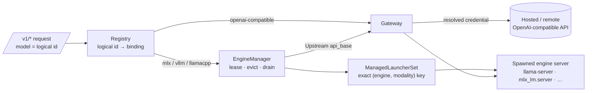
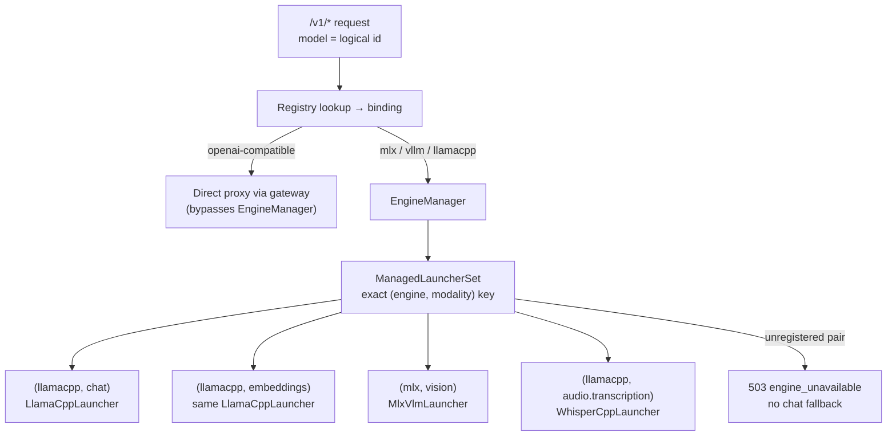

# The inference plane

The inference plane (`apps/inference-plane`, Python package `theygent_inference_plane`) is the standalone, user-controlled HTTP service that runs models. It lazily spawns and supervises local engine servers (llama.cpp, MLX, vLLM, plus their non-chat siblings), proxies OpenAI-compatible requests to them or to reachable hosted APIs, and manages the logical-model registry, credentials, settings, and Hugging Face model discovery and download — all in the user's trust domain.

It is its own process for a concrete reason: inference pins an accelerator, holds multi-GB weights, and is already an HTTP server. The hosted control plane depends only on this plane's HTTP contract and never imports engine code — the anti-lock-in plane split made concrete. TheYgent-the-vendor is never an involuntary man-in-the-middle: raw payloads, credentials, the model registry, and downloaded weights all stay here.

## Design rules

These are the invariants a change must not break:

- **Two HTTP surfaces, never conflated.** `/v1/*` is the OpenAI-compatible data plane, where `model` always carries a *logical id* (e.g. `"triage-fast"`). `/admin/*` is the TheYgent-native management plane (camelCase wire). Engine names (`mlx`/`vllm`/`llamacpp`) exist only on `/admin/*`; on `/v1/*` an engine name is simply not a registered logical id and returns `404 model_not_found` (there is a negative test — keep it green).
- **Three orthogonal axes.** The binding enum is frozen: `mlx | vllm | llamacpp` (lifecycle-managed) `| openai-compatible` (reachable passthrough — every other local server or hosted API is reached as `openai-compatible` + a URL). `source` (`hf | local-path | url`) is orthogonal to binding — Hugging Face is a weights *source*, not an engine. `modality` (`chat | vision | embeddings | audio.transcription | audio.speech | images.generation`; `rerank` reserved) is the third orthogonal axis and is *not* a binding value — a vision model on Apple Silicon is still the `mlx` engine.
- **Fail-closed (engine, modality) dispatch.** The launcher set looks up the *exact* `(engine, modality)` key with no chat fallback. An unregistered pair is rejected `503 engine_unavailable`, never silently served by the chat launcher (which would return a wrong-shaped answer with no error).
- **Never evict a busy engine.** Only engines with `inflight == 0` and not draining are offered to the eviction policy. `:evict` on a busy engine marks it draining; it tears down on idle. If nothing is evictable and there is no room, the load is refused (`503 no_capacity`) — never resolved by killing a live stream. Lease release is `asyncio.shield`'ed so a client disconnect mid-stream cannot leak the inflight count and pin an engine forever.
- **The plane boundary.** `registry.json`, `credentials.json`, `settings.json`, and `installs.json` live in the plane's own local state dir (`~/.theygent/inference`), never the control plane's Postgres. `registry.py`, `catalog.py`, and `downloader.py` import no SQLAlchemy/asyncpg/control-plane code (guarded by tests). Model weights download *here*, on the user's machine, and register locally.
- **Credentials stay in the user trust domain.** `credentialRef` (`secret://NAME`) resolves against the local credential store first, then process env — never a cloud boundary. Values are write-only over the wire: listings return names plus `hasValue`, never values. `credentials.json` is chmod `0600`. The Hugging Face token is written browser → this plane directly and must never be proxied through the control plane.
- **Seams stay seams.** The manager never calls `subprocess.Popen` (only `EngineLauncher.launch`) and never contains eviction logic (only `EvictionPolicy.select_victims`). If a new engine or modality would require changing `EngineManager` callers, the seam is wrong — stop and fix the seam.
- **Reachable bindings bypass the manager.** `openai-compatible` bindings never enter the `EngineManager`; the gateway proxies them directly with the locally resolved credential (`api_key` falls back to `"sk-noauth"`).
- **Streaming safety.** The upstream call is awaited *before* the SSE response commits, so a rejection maps to a clean error rather than a torn 200 stream. After the body starts, failures become a final OpenAI-style `{"error": …}` data frame. The lease spans the whole stream with three idempotent close paths.
- **Binaries are resolved, never bundled.** Engine binaries resolve env var → `PATH` → `python -m` fallback, once, at launcher construction. A missing binary is a per-engine not-ready in `/readyz` and a per-request `503 engine_unavailable`, never a 500. Bundling binaries is the desktop shell's concern.
- **"Written and type-checks" is not "works".** An engine or modality is claimed supported only after its real server has run green in an integration test on real hardware. vLLM is CUDA-canonical and currently unproven; no CUDA/VRAM assumption may escape `vllm_engine.py`.
- **State files are recoverable, not canonical.** A corrupt file is skipped on boot (never crashes the plane) and the next write repairs it; all state writes are atomic write-temp-then-rename.

## Layout

| Path (under `apps/inference-plane/src/theygent_inference_plane/`) | Role |
|---|---|
| `app.py` | `create_app` factory: both HTTP surfaces, all injectable seams, the launcher-set wiring, OpenAI-style error mapping, guarded SSE, CORS, the 30s reaper loop |
| `manager.py` | `EngineManager`: lazy spawn on first use, lease/inflight tracking, draining, idle reap, admission-time eviction, live ceiling enforcement; hands the gateway an `Upstream` (`api_base`, `model`, `api_key`, `needs_tool_parse`) |
| `launcher.py` | `EngineLauncher`/`EngineHandle` protocols, the shared spawn → health-poll → terminate lifecycle, the llama.cpp / MLX / MLX-VLM / whisper.cpp / audio / image launchers, `ManagedLauncherSet` dispatch keyed on exact `(engine, modality)`, per-engine capability probes |
| `vllm_engine.py` | `vllm serve` on a CUDA host — interface-only, unproven; every CUDA/VRAM assumption is confined here by rule |
| `gateway.py` | L0 gateway: LiteLLM-backed engine-agnostic dispatch (complete/stream/embed/transcribe), SSE re-encoding, param merging; speech and image generation as direct HTTP POSTs |
| `registry.py` | Logical id → binding map with atomic JSON persistence (`registry.json`); `UnknownLogicalId` is what makes an engine name invalid on `/v1/*` |
| `catalog.py` | `CatalogProvider` protocol + the Hugging Face provider: per-engine listing, pipeline-tag → modality mapping, RAM fit badges, quant labels, browse-time capability hints |
| `downloader.py` | Background in-plane weight download with bytes-on-disk progress, cancel, and register-on-complete as `source=local-path` (recording install provenance; an import's re-download registers the exported binding template instead, path rewritten) |
| `installs.py` | `InstallStore` — the `installs.json` provenance sidecar: which HF repo + variant a catalog-installed logical id came from, recorded at download completion, removed on model delete |
| `transfer.py` | `GET /admin/export` / `POST /admin/import`: strict camelCase wire models, bindings verbatim minus runtime state, credential names only, per-model import semantics (skip / register / re-download / `weights_unavailable`) |
| `eviction.py` | `EvictionPolicy` protocol + the count-ceiling, priority-then-LRU policy; `ResourceProbe` seam for a future byte-accounting policy |
| `capabilities.py` | Pure, network-free capability detectors (reasoning/tool/vision/context) shared by the live probe and the catalog |
| `binary.py` | `resolve_engine_command`: env var → `PATH` → `python -m` → not-found, resolved once at construction |
| `image_server.py` | Bundled stdlib-only OpenAI images wrapper around one-shot CLI diffusion generators, serialized behind a lock |
| `credentials.py` | `CredentialStore` (write-only over the wire, `0600`) + `resolve_credential` for `secret://` refs |
| `settings.py` | `SettingsStore` + `maxResident` resolution: env > stored > default, with env-pinning |
| `tool_parse.py` | Normalizes MLX's textual tool-call output into structured OpenAI `tool_calls`; gated, false-positive-safe, designed to be deleted |
| `clock.py` | Injectable time seam (`RealClock`/`ManualClock`) for deterministic eviction tests |
| `__main__.py` / `asgi.py` | Dev entrypoint (env parsing, state-dir resolution, uvicorn) / production ASGI module kept separate so importing `create_app` has no side effects |

Registration wire types (`ManagedBinding`, `ReachableBinding`, `Capabilities`, `Modality`, `parse_registration`) come from `packages/ir` (`theygent_ir.registration`) — the single source of truth, never redefined locally. See [IR and packages](./ir-and-packages.md).

## The two HTTP surfaces

### Data plane `/v1/*` — OpenAI-compatible, logical ids only

This is the frozen cross-plane contract. Request models use `extra="allow"` so unknown generation parameters ride through to the engine. Errors are always the OpenAI shape `{"error": {message, type, code}}` with stable machine-readable codes (`model_not_found`, `engine_unavailable`, `no_capacity`, `credential_error`, `upstream_error`, `modality_not_supported`).

| Endpoint | Notes |
|---|---|
| `GET /v1/models` | Registered logical ids |
| `POST /v1/chat/completions` | Stream + non-stream; messages accept a string or content parts (text + `image_url`) for vision |
| `POST /v1/embeddings` | |
| `POST /v1/audio/transcriptions` | Multipart form (`model` + `file`); extra fields ride as params |
| `POST /v1/audio/speech` | Returns raw audio bytes; MIME from `response_format` |
| `POST /v1/images/generations` | Returns `{data: [{b64_json}]}` |

The control plane and durable worker call only this surface, through `packages/gateway-client`, with logical ids. Swapping a Mac for a GPU box is one `/admin/models` re-registration with every call site untouched.

### Management plane `/admin/*` — TheYgent-native, camelCase

Write models are strict (`extra="forbid"`). The interface SPA calls this surface *directly from the browser* — the plane is user-controlled and reachable, deliberately not proxied through the control plane (hence the narrow dev-origin CORS default, overridable via `THEYGENT_CORS_ORIGINS`).

| Group | Endpoints |
|---|---|
| Models | `PUT /admin/models/{logical_id}` (register; body is a `ManagedBinding` or `ReachableBinding`) · `GET /admin/models` · `GET /admin/models/{id}` · `DELETE /admin/models/{id}` (evicts first) · `GET /admin/models/{id}/capabilities` · `POST /admin/models/{id}:warm` · `POST /admin/models/{id}:evict` · `GET /admin/engines` |
| Settings & diagnostics | `GET /admin/settings` · `PATCH /admin/settings` (`null` = reset; `422 env_pinned` when the env var is set) · `GET /admin/diagnostics` (state dir, model dir, HF cache, per-`(engine, modality)` binary status) |
| Credentials | `GET /admin/credentials` (names + `hasValue` only) · `PUT /admin/credentials/{name}` · `DELETE /admin/credentials/{name}` |
| Catalog | `GET /admin/catalog/models` (search/sort/size/modality/engine filters) · `GET /admin/catalog/models/{repo}` · `POST /admin/catalog/install` (202; `409 logical_id_exists`) · `GET /admin/catalog/downloads` · `GET /admin/catalog/downloads/{job_id}` · `POST /admin/catalog/downloads/{job_id}:cancel` |
| Transfer | `GET /admin/export` (bindings verbatim, runtime state stripped; install provenance; credential *names* only) · `POST /admin/import` (skip existing / register / re-download; malformed body `400 invalid_bundle`, per-model failures are warnings) |
| Health | `GET /healthz` (always ok) · `GET /readyz` (per-`(engine, modality)` breakdown; 503 only when *no* launcher is ready) |

Wire-casing gotcha: this plane's `/admin/*` surface and its state files are camelCase (`baseUrl`, `credentialRef`, `maxResident`); the control plane's own API is snake_case. Adapters must not assume one convention for the other. `/v1/*` is snake_case because OpenAI's contract is.

## Engine lifecycle

A managed model is spawned lazily on first use (or eagerly via `:warm` / `lifecycle.keepWarm`). Each request takes a lease; the lease spans the whole stream. Idle engines past `idleTimeoutSec` are reaped by a background loop. When a new load needs a slot, admission runs the eviction policy: the ceiling is `maxResident` (count-based only — no RAM/VRAM byte accounting yet), victims are chosen priority-then-LRU, and only idle, non-draining engines are candidates. Lowering `maxResident` at runtime applies immediately via ceiling enforcement — drain, don't kill — and is re-asserted whenever an engine goes idle.



### The launcher seam

Every engine implements the same `EngineLauncher` protocol: `ready` / `not_ready_reason` / `launch(binding) → EngineHandle` (`base_url`, `health()`, `capabilities()`, `terminate()`). `ManagedLauncherSet` dispatches on the exact `(engine, modality)` pair and itself implements the protocol, so the manager sees one launcher. This is why MLX, vLLM, and every non-chat modality were added with zero `EngineManager` changes. llama.cpp registers chat, embeddings, and vision keys against one launcher (same binary, different flags), while MLX chat and vision are different programs behind different keys.

Dispatch is fail-closed on the exact key — reachable bindings never reach it, and a missing pair is an error, not a chat fallback:



Adding an engine or modality = a new launcher class + one `(engine, modality)` entry in `create_app` — never a manager change. Adding an eviction strategy = a new `EvictionPolicy` — never inline manager logic.

Spawned engine stdout goes to a temp file, not a pipe (a long-lived server nobody drains would block on a full pipe buffer) and not `/dev/null` — a startup crash's traceback tail is folded into the raised error.

## Catalog, download, and capability detection

The `CatalogProvider` protocol (`list`/`get`/`install_plan`) normalizes discovery into `CatalogEntry`/`CatalogVariant`/`InstallPlan` types; providers return plans and never perform side effects — the `Downloader` executes them. The built-in Hugging Face provider:

- lists per engine library (MLX-format repos for `mlx`, GGUF for `llamacpp`; vLLM is deliberately absent until proven), filtered to engines whose launchers are actually ready — the catalog never surfaces a model that can't run here;
- maps the repo's `pipeline_tag` to a modality (e.g. `image-text-to-text` → `vision`, `text-to-speech` → `audio.speech`), because modality is a property of the *model*, not the engine — this is what makes the manager spawn the right server for an installed model with no user input;
- computes conservative RAM fit badges (`fits`/`tight`/`too-large`) sized against available memory — on Apple Silicon, unified memory RAM *is* the budget;
- surfaces browse-time capability hints (reasoning, tool calling, vision, max context) using the *same* pure detectors in `capabilities.py` as the post-install live probe, so a hint and a probe can never disagree by construction.

Downloads run in-plane and in the background, with progress observed as bytes-on-disk against the plan's total, cancellation, and automatic registration on completion (`binding=<engine>`, `source=local-path`). Gated repos authenticate with the reserved `HF_TOKEN` credential (store first, then env).

Capability probing after install is per-engine because real servers differ: llama.cpp exposes `/props` with the real context size and chat template; MLX has no `/props`, so context comes from the model's `config.json` and the report is marked `approximate`. Reachable bindings are never probed — they advertise only their declared modality.

### Registry transfer and `installs.json`

`GET /admin/export` / `POST /admin/import` (`transfer.py`) move the registry between
machines as metadata only. A catalog install registers `source=local-path` with an
absolute weights path, but the repo id and variant exist only on the in-memory download
job — so the `Downloader` records that provenance durably in `installs.json`
(`InstallStore`, a peer of `registry.json`, atomic writes, corrupt-file → empty) at the
one moment repo + variant + logical id coexist: download completion. The entry is removed
on `DELETE /admin/models/{id}` — and severed by a manual `PUT /admin/models/{id}` over
the same logical id, because a hand-registered binding no longer matches the recorded
repo/variant (export then shows `install: null` instead of lying about provenance).

Export emits every binding verbatim with runtime `state` stripped, `install`
provenance where known, and credential **names** only. Import is per-model and
non-fatal: an already-registered id is skipped; non-`local-path` bindings register
verbatim (hf-source weights fetch lazily at first spawn); a `local-path` binding *with*
provenance re-downloads through the same in-plane path as a catalog install — the
completed job registers the **exported** binding (modality/params/lifecycle/fallback
preserved, never re-derived from the HF pipeline tag) with only `model` rewritten to the
new path; a `local-path` binding *without* provenance (or on vLLM, which has no install
path) registers with a loud `weights_unavailable` warning. Two more per-model warning
codes keep import honest: `download_in_progress` (a re-run while the id's download is
still in flight skips it instead of spawning a duplicate job) and `params_path_dropped`
(machine-absolute auxiliary paths in `params`, e.g. a `mmproj` projector path from the
source machine, are stripped before registration — the launcher's file-next-to-weights
fallback re-locates them). The browser reads this surface
directly and zips it beside the control-plane bundle — registry state never transits the
control plane.

## Settings and diagnostics

`maxResident` (how many engines may be resident at once) resolves env > stored `settings.json` > coded default (2, bounds 1–16). An env-set value *pins* the knob: `PATCH /admin/settings` returns `422 env_pinned`. Changes apply live. `GET /admin/diagnostics` reports the state dir, model dir, HF cache location, persistence mode, and the resolved-or-missing status of every engine binary per `(engine, modality)` — the first place to look when a model won't start.

## Configuration reference

| Env var | Purpose | Default |
|---|---|---|
| `THEYGENT_INFERENCE_PLANE_HOST` / `_PORT` | Bind address | `127.0.0.1:8081` |
| `THEYGENT_INFERENCE_PLANE_STATE_DIR` | Local state dir (registry/credentials/settings) | `~/.theygent/inference` |
| `THEYGENT_INFERENCE_PLANE_MODEL_DIR` | Downloaded weights | `<state>/models` |
| `THEYGENT_MAX_RESIDENT` | Pins `maxResident` (1–16) | unset |
| `THEYGENT_CORS_ORIGINS` | Comma-separated browser origins; `""` disables | localhost dev ports |
| `THEYGENT_LLAMACPP_BIN`, `THEYGENT_MLX_BIN`, `THEYGENT_MLX_VLM_BIN`, `THEYGENT_VLLM_BIN`, `THEYGENT_WHISPERCPP_BIN`, `THEYGENT_MLX_AUDIO_BIN`, `THEYGENT_SDCPP_BIN`, `THEYGENT_MFLUX_BIN` | Explicit engine binary paths (otherwise `PATH`, then `python -m` where applicable) | unset |
| `HF_TOKEN` | Env fallback for the reserved Hugging Face credential | unset |
| `HUGGINGFACE_HUB_CACHE` / `HF_HOME` | Hub cache location | library default |

All env reads in the entrypoint treat an empty value exactly like an absent one, so `${VAR:-}` compose pass-throughs never crash-loop a container.

Entry points: the `theygent-inference-plane` console script or `python -m theygent_inference_plane` for development; `uvicorn theygent_inference_plane.asgi:app` in production.

## Testing

The fast suite is the default and touches no network, disk, or binaries:

```sh
uv run --package theygent-inference-plane pytest
```

The root pytest config applies `-n auto -m 'not integration'`. The suite's philosophy is "everything real except the weights": `tests/_fake_upstream.py` boots a *real* uvicorn OpenAI-compatible server on an ephemeral port, so the manager really spawns, LiteLLM really proxies HTTP, and SSE really streams — only the model is fake. `conftest.py` injects the fake launcher and a `ManualClock` and builds `create_app(enable_reaper=False, state_path=None)` so eviction and idle tests drive the reaper deterministically and all stores are in-memory.

Real-engine tests are marked `@integration` and env-gated (`THEYGENT_GGUF_PATH`, `THEYGENT_MLX_MODEL`, `THEYGENT_VLLM_CUDA`, …); they must skip cleanly when prerequisites are absent:

```sh
THEYGENT_GGUF_PATH=/path/to/model.gguf \
  uv run --package theygent-inference-plane pytest -m integration
```

Two suites guard the plane boundary specifically: `tests/test_registry_persistence.py` and `tests/test_catalog_plane.py` fail if registry/catalog/downloader code grows a database import. See [Testing](./testing.md) for the repo-wide conventions.

## See also

- [Architecture overview](./architecture.md) — the two-plane split and why it is permanent
- [Control plane](./control-plane.md) — the other side of the `/v1/*` seam
- [IR and packages](./ir-and-packages.md) — `theygent_ir.registration`, the registration wire types
- [Interface](./interface.md) — the SPA that talks to `/admin/*` directly from the browser
- [Durable execution](./durable-execution.md) — the worker, another `/v1/*`-only consumer
- [Deployment](./deployment.md) — desktop sidecar vs. cloud deployable, same code both ways
- [User docs](https://docs.theygent.ai/) — end-user guides for connecting engines and models
