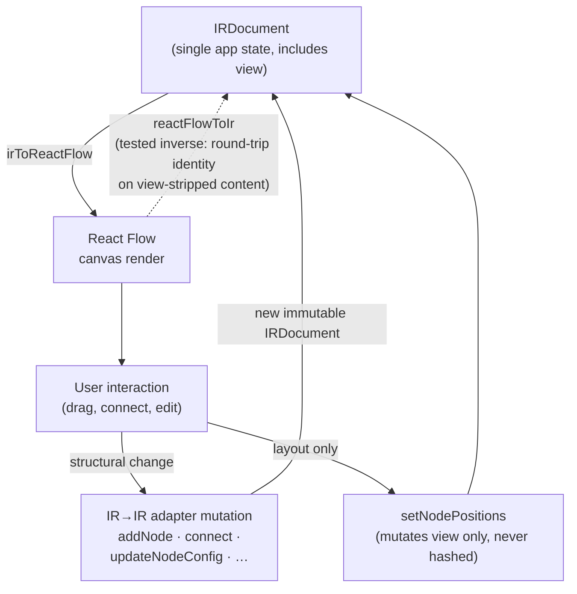
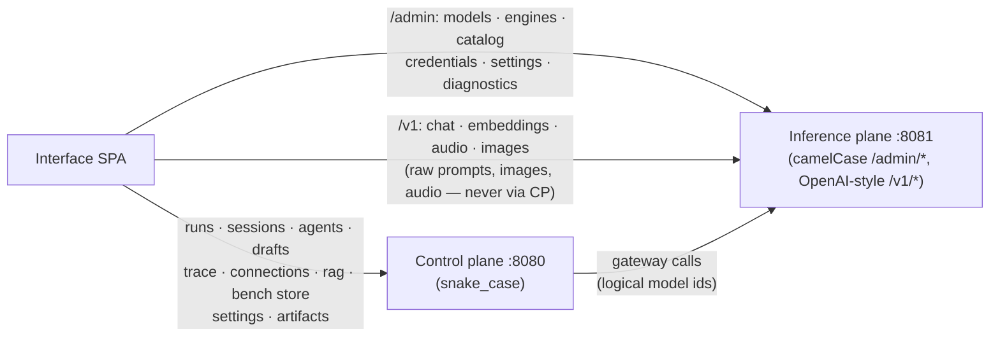

# The interface (React SPA)

`apps/interface` is TheYgent's single frontend: a Vite + React 19 SPA (TanStack Router/Query, Tailwind v4, shadcn/ui) that renders the visual agent builder — an agent's IR as a React Flow canvas — plus every operator surface: dashboard, agents grid, runs, sessions, unified chat, the bench, model registries, the MCP hub, RAG sources, and platform settings. It talks directly to **both** backend planes over HTTP — the control plane and the user-controlled inference plane — and never proxies one through the other. It consumes only generated IR types from `@theygent/ir-types`, so the frontend and the Pydantic IR stay in provable lockstep. The same bundle is intended for the browser and the desktop webview; an earlier separate cockpit app was folded into this one.

## Design rules

Invariants a change must not break:

- **The IR is the app state.** One `IRDocument` (including its `view` block) is the single source of truth in the editor. React Flow's node/edge shape exists *only* in `src/adapter/*` and the canvas components it backs. RF node data carries only `label`/`nodeType`/`ports` (plus an optional view-sourced icon) — never `kind`, `models`, or `contentHash`. `kind` is re-derived on save.
- **Hashing is server-side only.** The frontend never computes a content hash or canonicalizes for version identity. `lib/canonical.ts` is a structural-equality helper (mirroring the server's `view`/`contentHash` exclusions) used for the editor's "modified" badge and tests — nothing more.
- **The view block never affects logic.** Positions, icons, and viewport live in `view`, which is never hashed. Drag, Tidy, and icon-pick mutate `view` only; a pure layout change must leave `sameHashedContent()` true (asserted by the adapter tests). A view-less IR still renders via deterministic auto-layout.
- **IR types are generated, never hand-written.** `pnpm --filter @theygent/ir-types generate` regenerates them from the Pydantic models; CI diffs the output so frontend and backend cannot drift (see [drift guard](#generated-types-and-the-drift-guard)).
- **The palette is derived, not hardcoded.** Node types, per-type kind, config schema, default config, and default ports all come from the generated `NODE_TYPES` registry. A node type added in `packages/ir` appears on the canvas after a regenerate with zero frontend change.
- **One HTTP module.** `src/lib/api.ts` is the only module that talks HTTP to the planes (`src/bench/dataplane.ts` is the one sanctioned sibling, for raw `/v1/*` data-plane calls). Base URLs resolve *per call* via `controlPlaneUrl()` / `inferenceUrl()` — never fetch against a captured constant.
- **The plane split holds in the browser.** Raw inference payloads (prompts, images, audio) go directly to the inference plane. The control plane only ever receives run orchestration, session turn text, and bench metrics. Credentials such as the HF token PUT straight to the inference plane — proxying them through the control plane would make the vendor an involuntary middleman, which the architecture forbids.
- **Drafts are the mutable tier.** Drafts may be structurally invalid; they are never validated as a graph, never hashed, never versioned. Publish goes through the agent registry contract (`POST /agents`, add-version on conflict) and version bumping is the author's job.
- **Browser storage is never the IR store.** Persistence is the `/drafts` and registry APIs. `localStorage` holds only the dev token, theme, endpoint overrides, and UI preferences.
- **Every stream aborts on Stop/close/unmount.** The server cancels the run on disconnect; an orphaned reader would keep a local engine generating. A deliberate stop is recorded before aborting so it reads as "stopped", not a failure.
- **Hand-kept mirrors stay in sync.** `lib/durable.ts` (`DURABLE_ONLY = {human, subgraph, loop, map}`), `lib/validate.ts` (the fast client mirror of the backend's `validate_graph`), and `lib/kind.ts` (the per-instance guardrail kind derivation) each track a backend counterpart by hand. The backend stays authoritative; client validation only gates Publish and test runs, never draft saves.
- **Secrets are write-only on every wire.** Connection secrets read back as `hasSecret`, credentials as `hasValue`, OTLP header values as `{set, names}` with full-replacement writes. The UI never renders or re-sends a secret value.
- **Two wire casings coexist by design.** Control-plane routes (`/runs`, `/sessions`, `/drafts`, `/bench`, `/settings`, `/rag`) are snake_case; inference `/admin/*` and all SSE frames are camelCase (`runId`). Honor each, don't normalize.
- **Edge channel is derived from handle roles** (data↔data, control↔control, tool↔tools) — never a separate toggle — and at most one data edge may feed an in-port (mirrored client-side for an immediate red).

## Route map

| Route | Page |
|-------|------|
| `/` | Dashboard: plane liveness (each plane's `/readyz`; 503 is a state, unreachable is "offline", never a page error), resident engines, KPI tiles, latest runs/chats/agents/models. |
| `/agents` | Published-agent card grid with live graph thumbnails, a Drafts strip above, search/sort/view toggle, per-agent bench modal, infinite scroll. |
| `/chat` | New Chat: pick any model or agent and talk to it — text, thinking, vision, voice. |
| `/runs`, `/runs/$runId` | Run history (keyset-paginated) and run detail with the embedded waterfall. |
| `/sessions`, `/sessions/$sessionId` | Chat sessions list and transcript replay. |
| `/editor` | The canvas editor; `?agent&version` opens a published version, `?draft` a draft (draft wins). The only full-bleed page. |
| `/registries` | Installed models (register/warm/evict/delete, capability badges) plus catalog browse with fit badges sized against available RAM and tracked downloads. |
| `/mcp` | Unified MCP page: stdio registrations, connections (encrypted auth, OAuth), hub installs, OpenAPI/GraphQL-generated servers, per-tool runner. |
| `/rag` | Retrieval sources: upload/crawl, background ingest, per-source documents, inline query tester. |
| `/settings` | Tabbed platform settings; the Inference tab talks to the inference plane directly. |

## Layout

| Path | Role |
|------|------|
| `src/router.tsx` | TanStack Router route table; styled NotFound inside the shell; preload on intent. |
| `src/routes/Root.tsx` | App shell: collapsible sidebar (auto-collapses on `/editor`), Runs/Chats recents, theme toggle, notification center mount. |
| `src/routes/Editor.tsx` | The editor route: one `IRDocument` in a bounded undo/redo reducer; palette · canvas · inspector columns; Visual⇄Code toggle; validation panel; Test panel dock; Publish modal; leave guard; Cmd/Ctrl+S flushes the draft. |
| `src/adapter/` | **The React Flow ⇄ IR seam**: `irToReactFlow` (load, auto-layout when view is absent), `reactFlowToIr` (save, documented inverse), every IR→IR mutation the canvas uses, and deterministic layered auto-layout. |
| `src/components/GraphCanvas.tsx`, `NodeView.tsx` | The canvas view (the only components allowed to know RF): RF owns transient drag state, re-seeded only on structural change; one handle per declared port, colored by role. |
| `src/components/Palette.tsx` | Node palette derived entirely from the generated registry, grouped by kind, drag or click-to-add. |
| `src/components/Inspector.tsx` | Right panel: per-node schema-driven Wizard ⇄ per-node Code JSON, ports editing, `$in` token inputs, LLM messages/tools/params, the unified Tool node panel, guardrail/edge/trigger/graph panels. |
| `src/components/TestPanel.tsx` | In-canvas test console over `/graphs/runs` with live trace-stream node lighting. |
| `src/components/waterfall/` | The one run-trace UI reused by bench, run detail, chat, and the Test panel. |
| `src/components/ui/`, `ui.tsx` | shadcn/ui generated components (owned source) plus app wrappers (`Modal`, `ConfirmDialog`, `Page`, `ErrorBanner`, …) that encode app invariants. |
| `src/hooks/useDraftAutosave.ts` | The drafts autosave state machine (see [Drafts vs published versions](#drafts-vs-published-versions)). |
| `src/lib/api.ts` | The one HTTP module: per-call base-URL resolution, auth headers, error shaping, the typed `api` object, SSE-over-fetch helpers. |
| `src/lib/sse.ts` | One transport-agnostic SSE frame parser (`parseSSEBuffer` + `readSSE`); `[DONE]` is yielded as a normal event — the caller decides what done means. |
| `src/lib/live.ts` | In-memory registry of live runs (module singleton + `useSyncExternalStore`) so a stream survives navigating from composer to run detail — deliberately not TanStack Query. |
| `src/lib/save.ts`, `agent.ts`, `canonical.ts` | Publish flow, blank-graph starter and view re-attachment, structural-equality helper. |
| `src/lib/validate.ts`, `ir-validate.ts`, `kind.ts`, `durable.ts` | The client-side mirrors of backend validation, kind derivation, and the durable-only node set. |
| `src/lib/icons.tsx`, `iconsFull.ts` | Curated icon registry (sync) + the full ~1,700-icon set as a deliberate lazy chunk. |
| `src/lib/notify.tsx`, `theme.tsx` | Toasts with stable ids, the global notification center (download/ingest progress), Dark/Light/System theming. |
| `src/queries.ts` | TanStack Query hooks and the `keys` map: keyset-paginated infinite lists, status-aware run polling, mutations with invalidation. |
| `src/chat/` | Unified chat (see below). |
| `src/bench/` | The bench (see below). |
| `tests/` | Vitest suites (see [Testing](#testing)). |

## IR as app state and the adapter seam

React Flow is deliberately swappable: the platform's core IP is the IR and its compiler, so the renderer sits behind one adapter with a proven lossless round-trip. `irToReactFlow` and `reactFlowToIr` are documented inverses — identity on view-stripped content — and the headline test (`tests/adapter.test.ts`) asserts exactly that. Even RF theming lives in `index.css` via RF's CSS variables, not in components, so replacing the renderer touches `src/adapter/*` and two canvas components, nothing else.

The whole editing loop is one cycle around the `IRDocument`:



The canvas is *seeded, not controlled*: RF persists measured dimensions and drag state through its own change pipeline, so the canvas re-seeds from the IR only when a structural signature (nodes/edges/ports/labels/icons — not positions) changes, plus explicit reseed/resync keys for Tidy and undo/redo. Positions commit into the `view` block on drag stop. Adapter mutations return new immutable `IRDocument`s, and new nodes/ports are emitted in the exact shape `reactFlowToIr` re-emits so they round-trip byte-for-byte against server dumps.

## Generated types and the drift guard

`packages/ir-types` (workspace dependency `@theygent/ir-types`) is generated *from* the Pydantic IR in `packages/ir`: `scripts/generate.py` emits `ir.schema.json` (compiled to `ir.d.ts`) and `node-types.json` (per-type kind, config JSON Schema, default config, default ports including tool-role overrides). The package exports the types, the runtime `NODE_TYPES` registry, `NODE_TYPE_LIST`, and `kindForType()`.

The CI `frontend` job regenerates the package and fails on any diff — including newly emitted untracked files — so a change to the Pydantic IR that isn't regenerated and committed cannot merge. Regenerate locally with:

```sh
pnpm --filter @theygent/ir-types generate
```

See [./ir-and-packages.md](./ir-and-packages.md) for the generator's backend side.

## The HTTP seam and the plane split in the browser

`src/lib/api.ts` resolves base URLs **per call**, in priority order:

1. `localStorage` override — `theygent.url.control` / `theygent.url.inference`
2. Build-time env — `VITE_CONTROL_PLANE_URL` / `VITE_INFERENCE_URL`
3. Defaults — `http://localhost:8080` (control) / `http://localhost:8081` (inference)

Auth is `Authorization: Bearer <localStorage theygent.token || "dev-local">` in one function; swapping in real auth is a one-function change. Streaming rides fetch + `ReadableStream` rather than `EventSource` because the composer creates and streams from the same POST, needs custom headers, and needs programmatic abort.

The two-plane split is concrete in the browser: the SPA holds two base URLs and routes each request to the plane that owns it.



Two consequences worth internalizing: bench and direct model chat send raw payloads straight to `/v1/*` on the inference plane, and the Settings Inference tab PUTs credentials (e.g. the HF token) straight to `/admin/credentials` — neither ever transits the control plane. Session history has two write paths by design: control-plane transports pass `session_id` and the *server* appends turns; direct data-plane transports client-append the finished pair via `POST /sessions/{id}/turns`.

## Drafts vs published versions

Drafts are the autosave tier: mutable, unvalidated, unhashed, stored via `/drafts` with the IR view-stripped and the view alongside. `useDraftAutosave` compares JSON snapshots on a 1.5 s debounce with an 8 s max-defer; the first divergence POSTs a draft (the editor adopts the minted id into the URL, replace-only), later ones PUT; a mid-save 404 re-mints; a generation counter strands in-flight saves across seed changes and publish so a stale save can never hijack the next document's draft id. `pagehide` fires a keepalive PUT capped at ~60 KB (the browser's limit), existing drafts only.

Publish is the promotion boundary: it validates, POSTs to the agent registry (`POST /agents`; a 409 `agent_exists` composes into add-version; `version_conflict` is surfaced verbatim), keeps the confirm modal open as an edit lock while the POST is in flight, then deletes the draft and re-baselines. The server computes and returns the content hash — the client only displays it.

## The editor stack

Four cooperating surfaces around the one `IRDocument`:

- **Palette** — derived from the generated registry, grouped by kind (boundary/activity/orchestration), drag (`application/theygent-node-type`) or click-to-add.
- **Inspector** — per-node **Wizard** (schema-driven fields from each type's `configSchema`) ⇄ per-node **Code** (raw JSON), at full parity: port/handle editing, LLM messages (including vision content parts), tools and model params, the unified Tool node (builtin/REST/MCP), guardrail rule-vs-model checks, edge channel/condition, triggers on the input node, and a graph-level panel.
- **Code view** — the whole document as JSON in CodeMirror, linted by `lib/ir-validate.ts` against the generated schema; invalid JSON gates Publish, Run, and the mode switch.
- **Test panel** — streams the *current* document through `POST /graphs/runs` (inline IR — zero new backend), attaches the run's trace stream from the first frame, mirrors span open/close onto the canvas as node lighting, and reconciles from the persisted trace at the end. Durable-only graphs (human/subgraph/loop/map) are gated with an explanation.

## Unified chat

`src/chat/` defines one `ChatController` contract between any transport hook and the single `ChatView` shell. Two transports implement it: `useRunChat` (control-plane runs, server-appended session turns) and `useInferenceChat` (direct data-plane calls with client-appended turn pairs). On top of that:

- **Thinking** — `ThinkParser` splits one leading `<think>` block from the streamed answer into a collapsible reasoning block; anything after visible answer text is treated as literal.
- **Vision** — image attachments (upload or camera capture) become `image_url` content parts on the chat message.
- **Voice** — mic capture via `MediaRecorder`; audio bytes move through control-plane `/artifacts` refs for agent runs, and the speak node's output ref is downloaded into a playable bubble.

## The bench

`src/bench/` tests any model or agent. `dataplane.ts` makes raw `/v1/*` calls straight to the inference plane; `metrics.ts` is pure math (TTFT, tokens/s, RTF, TTFB) over timed samples — TTFT samples the ThinkParser-split answer, not the raw delta, so inline `<think>` streaming can't fake an early first token. Panels are capability-routed by modality (chat, embeddings, transcription, speech; vision rides chat), so a new modality is a data addition, not a new if/else tree. `AgentBench` pins a version, runs (or runs durably), overlays the waterfall on the agent's canvas, resumes waiting human nodes, and can apply a param preset — as *literal* values, never a reference, so a published agent can't silently change when a preset does.

## The run waterfall

`src/components/waterfall/` is the one run-trace UI for every surface. `RunWaterfall` renders a zoomable shared time axis over the span tree (`parent_span_id`), with gap bands, worker attribution, and hover→canvas flash on node spans. `useRunSpans` polls `GET /runs/{id}/trace` at 1 s while live and overlays the `/trace/stream` SSE, merged by deterministic span id with closed persisted spans authoritative — replay can never double-count. `SpanDetail` shows the stat strip and gated node I/O (`/runs/{id}/nodes/{nodeId}/io`); a gated payload is a *reason*, never an error. The trace comes from TheYgent's own span store — never an external trace backend — and `span.node_id == canvas node id` makes the canvas overlay a free join.

## shadcn/ui and theme tokens

- All new UI composes shadcn components from `src/components/ui/` (add missing ones with `pnpm dlx shadcn@latest add <name>`; `dialog`, `sonner`, and `slider` carry deliberate local edits — answer No to overwriting them). Prefer the `ui.tsx` wrappers where they exist; they encode invariants the raw primitives do not.
- Style with semantic tokens (`text-muted-foreground`, `bg-card`, `border-border`, `text-destructive`); do not add new `slate-*` color classes — the light theme works by inverting the slate ramp once in `index.css`, and semantic tokens keep that trick invisible. Blue is the one accent/link color.
- Every content page wraps the shared `Page` container (fixed sidebar, single main scroll); the Editor is the sole full-bleed exception.
- Errors and progress go through `lib/notify` with stable toast ids that replace rather than stack; long-lived progress (downloads, RAG ingest) lives in the global notification center.

## Commands and configuration

| Command | What it does |
|---------|--------------|
| `pnpm --filter @theygent/interface dev` | Vite dev server on `:5174` (`PORT` overrides). |
| `pnpm --filter @theygent/interface build` | `tsc --noEmit && vite build`. |
| `pnpm --filter @theygent/interface check` | Biome lint/format check (Biome is not a type checker). |
| `pnpm --filter @theygent/interface test` | Vitest, single run (`test:watch` for watch mode). |
| `pnpm --filter @theygent/ir-types generate` | Regenerate the IR types from the Pydantic models. |

| Env var (build-time) | Default | Meaning |
|----------------------|---------|---------|
| `VITE_CONTROL_PLANE_URL` | `http://localhost:8080` | Control-plane base URL baked into the bundle. |
| `VITE_INFERENCE_URL` | `http://localhost:8081` | Inference-plane base URL baked into the bundle. |

`localStorage` keys: `theygent.token` (dev bearer), `theygent.url.control` / `theygent.url.inference` (per-browser endpoint overrides that beat the env vars), `theygent.theme`, and UI prefs (`theygent.ui.navCollapsed`, `theygent.ui.runsOpen`, `theygent.ui.chatsOpen`, `theygent.view.<page>`). The `@/` import alias maps to `src/`.

## Testing

Vitest with jsdom, Testing Library, and user-event; suites live in `apps/interface/tests/*.test.ts(x)`, with `tests/setup.ts` polyfilling `ResizeObserver` for the canvas and `tests/fixtures.ts` building stored-version-shaped IRs (every optional field default-filled, matching the server's dump) so round-trips are field-for-field identical.

- **The headline test** is `tests/adapter.test.ts`: the IR → RF → IR round-trip identity on view-stripped content, plus view isolation (a pure layout change keeps `sameHashedContent()` true). Keep it green before trusting anything built on the seam.
- **Unit suites** cover save/publish, the registry envelopes, both validators, SSE parsing, think-splitting, chat replay, and durable detection.
- **Component suites** (RTL) cover the editor, test panel, draft autosave, drafts strip, dashboard, registries, MCP pages, settings, model params, guardrail and loop panels, the waterfall, bench, and infinite scroll.
- **Radix/RTL gotchas**: open menus with `userEvent.click` (not `fireEvent.click`); step sliders with `fireEvent.keyDown(ArrowRight)`; single-select toggle groups expose `role="radio"`.

Run locally with `pnpm --filter @theygent/interface test`. CI's `frontend` job runs the ir-types regenerate + drift guard, `tsc`, Biome, the build, and Vitest — see [./testing.md](./testing.md) for the full CI picture.

## See also

- [./architecture.md](./architecture.md) — the two-plane split this UI makes concrete
- [./control-plane.md](./control-plane.md) — the API surface the SPA consumes
- [./inference-plane.md](./inference-plane.md) — the management and data planes it calls directly
- [./ir-and-packages.md](./ir-and-packages.md) — the IR models and the ir-types generator
- [./durable-execution.md](./durable-execution.md) — why some node types are durable-only
- [./deployment.md](./deployment.md) — serving the SPA in each topology
- [./testing.md](./testing.md) — repo-wide test and CI conventions
- User documentation: https://docs.theygent.ai/
