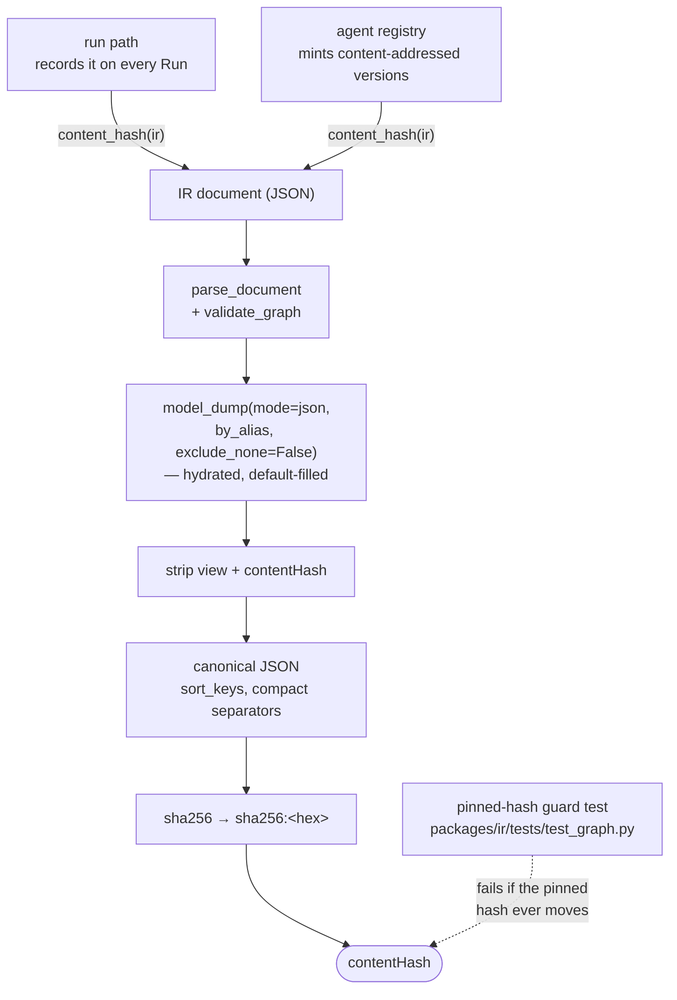
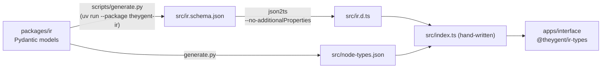

# The IR and shared packages

Three small packages carry every contract that crosses a process boundary in TheYgent. `packages/ir` (`theygent_ir`) is the pure-Pydantic single source of truth for the Agent Graph IR — the builder ↔ runtime seam — and for the inference-plane registration payload. `packages/ir-types` is the generated TypeScript mirror of the IR that keeps the frontend and backend in lockstep, enforced by a CI drift guard. `packages/gateway-client` is the one OpenAI-compatible HTTP client through which the control plane and worker reach the inference plane.

They exist as separate packages because the things they define are the hard-to-reverse decisions: graph identity (the `contentHash` rule), the node `kind` taxonomy, the binding enum, and the shape of the inference seam. Keeping them small, dependency-light, and consumed-by-everyone means no two components can drift into disagreeing about what a graph *is* or how a model is reached.

## Design rules

- **`packages/ir` stays pure.** Pydantic models and static graph algorithms only. It never imports an engine SDK, the gateway client, a database driver, or HTTP. Its dependency list is the rule made concrete: `pydantic>=2.6` and nothing else. Execution belongs to the control-plane runtimes.
- **`content_hash` is one function.** The graph walker (which records the hash on every run) and the agent registry (which content-addresses versions) both call `theygent_ir.content_hash`. Because there is exactly one implementation, they can never disagree about identity.
- **Layout is never hashed.** All React Flow layout (positions, zoom, collapsed state) lives in the opaque top-level `view` block, which is stripped before hashing. Dragging a node must never mint a new agent version.
- **Dispatch is by `kind`, never by `type`.** `kind ∈ activity | orchestration | boundary` is the determinism class the runtime lowers on; `type` (`llm`, `tool`, `router`, …) selects the handler *within* a kind. `NODE_TYPE_KIND` pins the one correct kind per type, and `validate_graph` turns a mismatch into a validation error instead of a wrong lowering.
- **The binding enum is frozen at four values:** `mlx | vllm | llamacpp | openai-compatible`. `source` (`hf | local-path | url`) is a weights-source axis, never an engine. `modality` is a third orthogonal axis that exists **only** on the registration payload, never on the graph's `ModelBinding` — a test guards its absence, because adding it would silently shift every saved agent's `contentHash`.
- **Contract extensions are deliberate and named, even additive ones.** New fields get defaults that keep old payloads parsing unchanged *and*, for hashed models, keep existing hashes unmoved. The pinned-hash guard test must be consciously updated on any real envelope change.
- **Wire casing is uniform.** Every wire model inherits a base with `alias_generator=to_camel`, `populate_by_name=True`, and `extra="forbid"`: camelCase on the wire, snake_case in Python, and an IR typo fails loudly instead of being silently dropped.
- **Generated files are never hand-edited.** In `packages/ir-types/src`, only `index.ts` is hand-written; `ir.d.ts`, `ir.schema.json`, and `node-types.json` are generator output, committed, and drift-guarded in CI.
- **The gateway client is transport-only.** No run identity in its signatures (callers pass opaque `extra_headers`), no error policy (it lets `openai.APIStatusError` surface), no model resolution. New OpenAI-protocol features are added as named kwargs, never buried in a params dict.

## Layout

| Path | Role |
|---|---|
| `packages/ir/src/theygent_ir/graph.py` | The Agent Graph IR: `NODE_TYPE_KIND`, `EXECUTABLE_TYPES`, the document envelope, `ModelBinding`, tool bindings, all per-type config models, `parse_document`, `validate_graph`, `topological_order` |
| `packages/ir/src/theygent_ir/contenthash.py` | `content_hash(ir)` — the one identity function |
| `packages/ir/src/theygent_ir/registration.py` | The inference-plane registration payload: `ManagedBinding`, `ReachableBinding`, `parse_registration`, the frozen `MODALITIES` vocabulary, `Capabilities` |
| `packages/ir/tests/` | Pure-unit guards for both contracts (no DB, no HTTP) |
| `packages/ir-types/scripts/generate.py` | One-way codegen: imports from `theygent_ir`, emits `ir.schema.json` and `node-types.json` |
| `packages/ir-types/src/index.ts` | The only hand-written file: re-exports generated types, wraps `node-types.json` as `NODE_TYPES` / `kindForType(type)` |
| `packages/ir-types/src/{ir.d.ts, ir.schema.json, node-types.json}` | Generated output — committed, never edited |
| `packages/gateway-client/src/theygent_gateway_client/client.py` | `GatewayClient` — the stateless OpenAI-compatible transport |
| `packages/gateway-client/tests/test_chat_params.py` | Pins the standard-kwargs / `extra_body` parameter split |

## The document envelope and `contentHash`

An IR document is:

```
{ schemaVersion, id, name, version, contentHash?,
  models: {key → ModelBinding},
  tools:  {key → BuiltinTool | HttpTool | McpTool},
  nodes:  [Node], edges: [Edge],
  view?, metadata? }
```

`content_hash(ir)` returns `sha256:<hex>` over the canonical JSON of the **validated** document:

- **What is hashed:** `ir.model_dump(mode="json", by_alias=True, exclude_none=False)` — the hydrated, default-filled, canonical camelCase wire form. Every field with a schema default appears at its effective value, so a graph that omits `Port.required: true` hashes identically to one that writes it. Two semantically identical agents can never mint two registry versions.
- **What is stripped:** the top-level `view` block (layout), and `contentHash` itself (hashing it would be circular).
- **Canonicalization:** `json.dumps(..., sort_keys=True, separators=(",", ":"), ensure_ascii=False)` encoded as UTF-8 — key order and whitespace never affect identity.

The hash runs over the hydrated model, *not* source bytes, so formatting differences never fork identity. The flip side is that adding a defaulted field to any hashed model shifts every existing `contentHash`. The **pinned-hash guard test** in `packages/ir/tests/test_graph.py` asserts the exact hash of a trivial representative graph (`sha256:7e8f9d83…`); any change that moves it fails the suite, forcing hash-moving changes to be deliberate, named decisions. Past additive fields (port roles, LLM tool declarations, the multimodal message-content union) were engineered so existing hashes stayed unmoved without a `schemaVersion` bump.

End to end, the pipeline and its two callers:



The `contentHash` is what makes composition immutable: a `subgraph`/`loop`/`map` node pins exactly one of `version` or `contentHash` for its child, and that pin is part of the parent's hashed config — a child publishing a new version can never silently change a deployed parent.

## The `kind` taxonomy and `NODE_TYPE_KIND`

Every node carries both a `type` and a `kind`:

| `kind` | Meaning | Types |
|---|---|---|
| `boundary` | Graph entry/exit, human wait, sub-graph call | `input`, `output`, `human`, `subgraph` |
| `activity` | Non-deterministic side effects (model / tool / retrieval / I/O) | `agent`, `llm`, `tool`, `mcp_tool`, `rag`, `retriever`, `memory`, `code`, `transcribe`, `speak`, `imagine`, `ratelimit`, `quota` |
| `orchestration` | Deterministic control flow | `router`, `condition`, `loop`, `iterator`, `map`, `transform` |

`NODE_TYPE_KIND` is the authoritative table. `guardrail` is the one **per-instance** kind: its expected kind is derived from the instance's `check.type` (`rule` ⇒ `orchestration`, `model` ⇒ `activity`), with `orchestration` as the table default; `validate_graph` enforces the derived value.

`EXECUTABLE_TYPES` (18 types) is the subset the runtimes actually execute. `human`, `subgraph`, `loop`, and `map` run only on the durable runtime (see [durable-execution.md](./durable-execution.md)). Known-but-unimplemented types (`agent`, `retriever`, `memory`, `code`, `condition`, `iterator`) are valid IR shapes whose dispatcher branch raises `NotImplementedError` — implementing one later is an additive handler, not a refactor. Adding an executable type means: a config model in `_CONFIG_MODELS`, an entry in `NODE_TYPE_KIND`, membership in `EXECUTABLE_TYPES`, a runtime handler, and a regenerated `ir-types` (default ports come from the generator's port tables, or fall back to plain `in`/`out`).

## `validate_graph`

`validate_graph(ir)` is static, execution-independent, and runs *before* any run is created — a `GraphValidationError` maps to a 400 with nothing persisted, and its messages quote the offending node/edge ids and the rule violated. The checks:

1. every node id is unique;
2. every `type` is known and carries its one correct `kind` (per-instance derivation for `guardrail`);
3. every per-type `config` validates against its model;
4. every model reference (`llm`, `transcribe`, `speak`, `imagine`, model-backed `guardrail`) names a declared key in `ir.models`;
5. every edge references existing nodes *and* declared port handles;
6. no in-port is fed by more than one `data` edge (an ambiguous multi-input binding: which upstream value would `$in.<port>` mean?);
7. every *required* in-port is fed by a `data` edge — per-port, not per-node (capability tool nodes and `input` are exempt);
8. tool-channel edges connect only a `tool` / `mcp_tool` / `rag` node to an LLM's tool-role port — a capability wire means the model *may* call the node; the node is a capability **or** a step, never both;
9. `subgraph` / `loop` / `map` pin exactly one of `version` / `contentHash`, with `maxDepth >= 1`; `loop` requires `maxIterations >= 1` (no unbounded loops);
10. an `llm` node's declared tools exist and are deduplicated, and a named `toolChoice` must be among them;
11. a model-callable HTTP tool must self-describe: `description` + `parameterSchema`, with its `$in` slots equivalent to the schema's properties;
12. no cycle among `data` edges (`loop` / `map` provide iteration, and only on the durable runtime).

`topological_order` (Kahn's algorithm over data and control edges, tool-channel edges excluded) gives the runtimes their execution order.

## `ModelBinding` vs the registration payload

Two same-named-looking shapes serve two different contracts, and they hash differently by design:

| | `graph.ModelBinding` (hashed) | `registration.ManagedBinding` / `ReachableBinding` (never hashed) |
|---|---|---|
| Lives in | `ir.models` — part of the agent's `contentHash` | The inference plane's local `registry.json` |
| `binding` | `mlx \| vllm \| llamacpp \| openai-compatible` | Managed: `mlx \| vllm \| llamacpp`; reachable: `openai-compatible` |
| `model` | The **logical id** forwarded over the data plane | The engine-facing model id |
| `source` | Optional (`hf \| local-path \| url`) | Required on the managed arm |
| `modality` | **Absent — test-guarded** | Present; third orthogonal axis, default `"chat"` |
| Extras | `params` | `lifecycle` (keep-warm, idle timeout, priority), optional `fallback`; reachable adds `baseUrl` + optional `credentialRef` |

`modality` lives only on registration because it answers a serving-time question (*which task does this engine serve?*), not a graph-authoring one — and because adding any field to the hashed `ModelBinding` would shift every saved agent's hash. The frozen vocabulary is `chat`, `vision`, `embeddings`, `audio.transcription`, `audio.speech`, `images.generation`; `vision` is a sub-capability of `chat` (it runs on `/v1/chat/completions`), while image generation is its own task. A reachable upstream is never probed, so its *declared* modality is the only routing signal surfaces have. `Capabilities` (tool calling, structured output, vision, reasoning, max context, modalities) rides alongside registration and derives `modalities` from its flags when left empty.

## `packages/ir-types`: the generated TypeScript mirror

The frontend must agree with the backend about the IR without ever re-declaring it. The pipeline is one-way, from Python to TypeScript:



- `ir.schema.json` is `IRDocument.model_json_schema()` dumped verbatim.
- `node-types.json` is the node-type registry the canvas palette *derives from*: per executable type it carries the `kind`, the config JSON Schema, a shaped-but-empty default config, and default ports (error ports typed `error`, the LLM `tools` in-port role `tool`/optional, capability out-ports role `tool`, guardrail `pass`/`block`, gate nodes `allow`/`deny`). A new node type added in Python appears on the canvas without any frontend hardcoding; canvas nodes never carry `kind` — they look it up via `kindForType`.
- `index.ts` is the only hand-written file: `export type * from "./ir"` plus the typed wrappers around `node-types.json`.

Commands: `pnpm --filter @theygent/ir-types generate` (runs the Python generator via uv, then json2ts) and `pnpm --filter @theygent/ir-types typecheck`. The package exports `"."`, `"./node-types"`, and `"./schema"`.

**The CI drift guard** (`frontend (ir-types drift + interface)` job in `.github/workflows/ci.yml`) regenerates the package from `packages/ir` and fails on `git diff --exit-code -- packages/ir-types/src`, plus a check for untracked generator output (a new emitted file nobody committed would otherwise false-pass forever). Any change to `packages/ir` models therefore requires regenerating and committing `ir-types` in the same change.

## `packages/gateway-client`: the one transport

`GatewayClient` is a stateless async wrapper over the official `openai` SDK pointed at one inference base URL — which **must include the `/v1` suffix** (the data-plane root, e.g. `http://127.0.0.1:8081/v1`). Wrapping the official SDK is deliberate: using it from the control plane is the end-to-end proof that the inference seam really is OpenAI-compatible, and streaming plus types come free. Its dependencies are `openai>=1.40` and `httpx>=0.27` only. It is the *only* HTTP path from the control plane and worker to the inference plane; the `model` argument always carries a logical id, never an engine name.

| Method | Endpoint | Notes |
|---|---|---|
| `open_stream`, `complete` | `POST /v1/chat/completions` | Streaming and non-streaming chat |
| `embed` | `POST /v1/embeddings` | |
| `transcribe` | `POST /v1/audio/transcriptions` | |
| `speak` | `POST /v1/audio/speech` | Returns bytes |
| `generate_image` | `POST /v1/images/generations` | Forces `response_format=b64_json` — decoded bytes, never a URL into another trust domain; 1200 s timeout (local diffusion loads weights per request), vs. the chat-tuned 60 s default |
| `models` | `GET /v1/models` | Backs the control plane's readiness probe |

Two mechanics worth knowing:

- **The parameter split.** The SDK's typed `create()` rejects unknown kwargs, so OpenAI-standard parameters stay named kwargs while engine knobs (e.g. `chat_template_kwargs`, which toggles hidden reasoning on servers that gate it in the chat template) ride `extra_body`. Caller-supplied `extra_body` merges and wins; reserved keys (`model`, `messages`, `stream`, `extra_headers`) are dropped. Tool-calling fields (`tools`, `tool_choice`) are forwarded only when set.
- **Failures surface early.** A non-200 raises `openai.APIStatusError` at the initial `await`, *before* any chunk is yielded, so callers can map it to a clean status code before committing to a streaming response.

**Retry policy differs by execution path.** The constructor's `max_retries` defaults to `None`, which leaves the OpenAI SDK's own retry behavior in place — that is what the control-plane API path uses. Both durable-runtime constructions — the worker's `build_runtime()` and the control plane's in-process durable runtime — pass `max_retries=0`: DBOS owns retry on the durable path, and an SDK provider-side retry stacked on top of a DBOS step retry is a double-retry hazard. Run identity rides only in opaque `extra_headers` (the control plane sets `x-theygent-run-id`); nothing run-shaped appears in the client's signatures.

## Testing

All suites here are fast, pure-unit, and run from the repo root:

| Suite | Command | What it pins |
|---|---|---|
| IR | `uv run --package theygent-ir pytest packages/ir/tests` | The pinned representative `contentHash`; view-strip / key-order / default-fill hash invariance; type/kind mismatch rejection; per-type config validation; multi-input rules (duplicate data edge, unfed required port); tool-channel capability rules; per-instance guardrail kind; cycle rejection; the guard that `graph.ModelBinding` has no `modality` field |
| Registration | (same command — `test_registration.py`) | Additive back-compat (omitted modality ⇒ `"chat"` on both arms); the frozen vocabulary rejects unknowns; modality is not a `binding` value; the `model_dump(by_alias=True)` `registry.json` round-trip |
| Gateway client | `uv run --package theygent-gateway-client pytest packages/gateway-client/tests` | The standard-kwargs / `extra_body` split, merge precedence, reserved-key stripping (pytest-asyncio) |
| ir-types | `pnpm --filter @theygent/ir-types typecheck` + the CI drift guard | Generated output matches the committed files; no untracked generator output |

The IR suite runs in the backend CI job; the ir-types drift guard runs in the frontend job. Test names state the invariant they pin (e.g. `test_content_hash_strips_view_dragging_a_node_is_not_a_new_version`), with a `_guard` suffix for pins of load-bearing lines. See [testing.md](./testing.md) for the full CI picture.

## See also

- [architecture.md](./architecture.md) — the two-plane split and where these seams sit
- [control-plane.md](./control-plane.md) — the walker and registry, the two consumers of `content_hash`
- [inference-plane.md](./inference-plane.md) — the server side of the gateway seam; where registration payloads land
- [interface.md](./interface.md) — the canvas that consumes `@theygent/ir-types`
- [durable-execution.md](./durable-execution.md) — the durable runtime and the worker process that hosts it
- [deployment.md](./deployment.md) — the two topologies these packages serve unchanged
- [testing.md](./testing.md) — suites and CI jobs across the repo
- User documentation: <https://docs.theygent.ai/>
