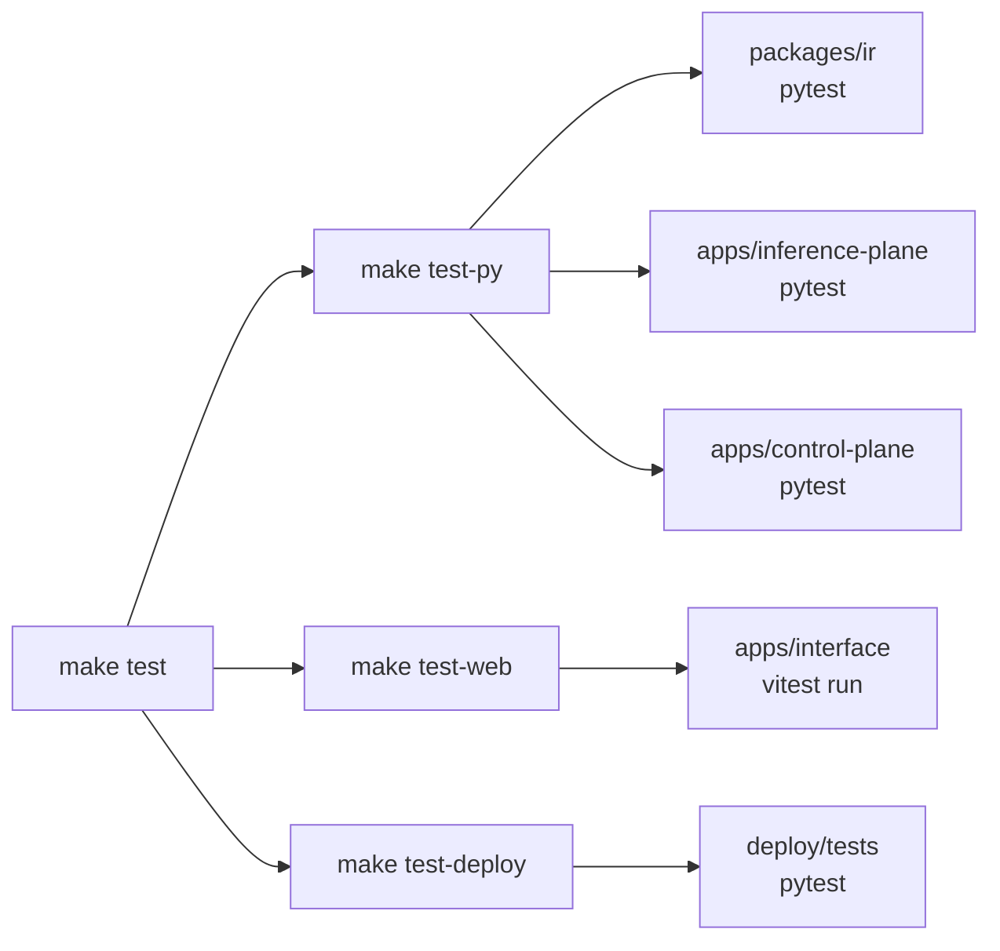

# Testing

TheYgent's test strategy follows one idea: **everything real except the expensive part**.
Suites run against a real Postgres with the real migration chain, a real HTTP hop across the
plane seam, real stdio subprocesses for MCP — and only the model weights, the upstream
content, or the network fetch are faked. That keeps the fast suites deterministic and
laptop-friendly while still exercising the actual wire contracts, and it reserves the
`integration` marker for the one thing a fake cannot prove: that a real engine binary
serves a real model. This page maps the suites, their fixtures, how to run each tier, and
the lint gates that guard every commit.

## Design rules

- **Every behavior change lands with a test.** A bug fix pins the regression; a new
  endpoint, node type, or config knob ships with coverage in the same change. Frozen
  surfaces (the run contract, the trigger shape, the deploy ports) stay frozen until a test
  is deliberately updated alongside the change — the guard suites exist precisely so that
  an unintentional contract change fails loudly.
- **Real servers, never mocks.** Test doubles are genuine processes: the fake inference
  plane is a real uvicorn server on an ephemeral port, the fake MCP server is a real stdio
  subprocess speaking JSON-RPC, the fake HTTP upstream is a real recording server. The
  code under test crosses the same sockets and pipes it crosses in production.
- **Real Postgres, real migrations — never `create_all`.** The control-plane suite applies
  the schema via `alembic upgrade head` against a throwaway container, so the migration
  chain itself is exercised on every run. `tests/test_migrations.py` must be updated in
  lock-step with every new migration.
- **Integration is opt-in and skips clean.** The root pytest config excludes
  `-m integration` by default. Integration tests gate on env vars and real binaries, and a
  missing prerequisite produces a skip with a clear reason — never a failure.
- **"Written and type-checks" is not "works".** An engine or modality is claimed supported
  only after its real server has run green in an integration test on real hardware.
- **Python suites run per-package, each with its own rootdir.** The apps share test-file
  basenames (`test_fast_suite.py`, `test_integration_mlx.py`) with no package `__init__`,
  so a single root `pytest` collides on import. Never run one pytest over the whole repo.
- **Generated types never drift.** The interface's IR types are regenerated from the
  Pydantic source of truth and diffed in CI and in a pre-commit hook; a backend IR change
  must ship the regenerated frontend types in the same commit.
- **Hard gates are hard; the one advisory check is explicit.** Ruff, Biome, `tsc`, the
  fast pytest suites, Vitest, and the deploy guards all block. Only `ty` runs non-blocking
  (it is still in preview), and dropping that hedge later is a one-line change.
- **Locked installs everywhere.** CI and hooks use `uv sync --locked` and
  `pnpm install --frozen-lockfile`; a stale lockfile fails loudly instead of silently
  re-resolving.

## Layout

| Path | Role |
|------|------|
| `packages/ir/tests/` | Pure-unit IR contract: content-hash determinism, the `type`/`kind` taxonomy, per-type config validation, edge/port integrity, cycle rejection. No DB, no HTTP. |
| `packages/gateway-client/tests/` | Unit tests for the chat-param split (standard fields as kwargs, engine knobs via `extra_body`). |
| `apps/inference-plane/tests/` | Fast suite (fake upstream, manual clock) + `integration`-marked real-engine tests. |
| `apps/control-plane/tests/` | Fast suite (ephemeral Postgres, fake inference plane, fake MCP/HTTP servers) + `integration`-marked cross-process tests. |
| `apps/interface/tests/` | Vitest unit/component tests (`*.test.ts(x)`) plus `smoke/hand_drive.py`, a hand-drive smoke against a live stack. |
| `deploy/tests/` | Static containerization contract guards (Dockerfiles, compose, k8s manifests). |
| `.pre-commit-config.yaml` | Local hooks mirroring the CI gates, run with the workspace-pinned tool versions. |
| `.github/workflows/ci.yml` | The three CI jobs: `fast` (PR gate), `frontend` (drift guard + interface), `integration` (non-blocking, real engines). |

## The test map

`make test` fans out into three targets:



- `make test-py` runs pytest in each of `packages/ir`, `apps/inference-plane`, and
  `apps/control-plane`, each from its own directory (the rootdir rule above). Pass extra
  pytest arguments with `make test-py ARGS='-k something'`.
- `make test-web` runs `pnpm --filter @theygent/interface test` (Vitest, single run).
- `make test-deploy` runs `uv run --package theygent-control-plane pytest deploy/tests`
  — the guards borrow the control-plane's environment because pytest and pyyaml already
  live there.

The gateway-client suite is small and runs directly:
`uv run --package theygent-gateway-client pytest packages/gateway-client/tests`.

The root `pyproject.toml` sets the shared pytest defaults:
`addopts = "-n auto -m 'not integration'"` (parallel via pytest-xdist, integration
excluded) and `asyncio_mode = "auto"`.

## Per-package suites and their fixtures

### `packages/ir` — pure unit

No fixtures at all: `test_graph.py` and `test_registration.py` pin the static IR contract
that everything downstream depends on. The end-to-end exercise of the same graphs happens
through the control-plane suite.

### `apps/inference-plane` — everything real except the model weights

`tests/conftest.py` builds the app with the injectable seams the production entrypoint
also uses:

- **`_fake_upstream.FakeUpstreamLauncher`** — the injected `EngineLauncher`. It boots a
  *real* in-process OpenAI-compatible uvicorn server on an ephemeral port with
  deterministic outputs (the `"hello world"` chunked completion, a fixed embeddings
  vector, transcript, and audio bytes), so the manager really tracks a port, the gateway
  really proxies over HTTP, and SSE really streams.
- **`ManualClock`** — time is advanced by the test, and `create_app(enable_reaper=False)`
  disables the background idle reaper so eviction tests drive `manager.reap()`
  deterministically.
- **`state_path=None`** keeps every store (registry, credentials, settings) in memory; the
  persistence tests exercise the real files separately.

Two tests double as plane-boundary guards: `test_registry_persistence.py` and
`test_catalog_plane.py` assert that the registry/catalog/download modules import no
SQLAlchemy, asyncpg, or control-plane code — model state stays on this plane by
construction.

### `apps/control-plane` — real seam, fake model

`tests/conftest.py` assembles the full production shape around the app:

- **Ephemeral Postgres** — one testcontainers `pgvector/pgvector:pg16` container per
  session (the RAG migration runs `CREATE EXTENSION vector`, which stock Postgres cannot
  satisfy), schema applied via `alembic upgrade head`, the durable runtime's `dbos` schema
  migrated alongside against the same throwaway DB, and tables truncated between tests
  (`tests/_db.py`). The fixture skips clean with a clear message when Docker is
  unavailable; CI always provides it.
- **`_fake_inference.FakeInference`** — a threaded, genuinely-HTTP fake inference plane,
  so the gateway client crosses the real seam. Its selectable `mode` drives the
  control-plane's error paths: `normal`, `error_503`, `error_404`, `drop_midstream`,
  `reasoning`, `empty_length`, the `inline_think*` family (thinking tags split across
  chunk boundaries), and `tool_call_reasoning`. An optional `response` override makes
  LLM-driven routing deterministic.
- **`_fake_mcp_server.py`** — a real stdio MCP subprocess with three tools: `echo`
  (dispatch + arg templating), `boom` (tool-level error propagation), and `pid` (proves
  connection reuse and reconnection across a killed process).
- **`_fake_http.py`** — a real recording HTTP server for the http-tool and connection
  tests; it captures each request so a test can assert the injected auth header reached
  the wire while the secret never entered the IR.

Background loops are gated by `create_app` flags (`start_dispatcher`,
`dispatcher_interval_s`, `settings_refresh_s`), so the fast suite drives the schedule
dispatcher's `tick()` and settings refresh directly instead of sleeping.

## Unit vs integration

Everything above is the fast tier: no network, no model weights, no engine binaries, safe
to run on every commit. The `integration` marker covers what fakes cannot: real engine
processes serving real models. These tests are excluded by default (root `addopts`) and
each gates on its prerequisites, skipping clean when they are absent:

| Gate | Enables |
|------|---------|
| `THEYGENT_GGUF_PATH` + `llama-server` on PATH | Real llama.cpp chat loop |
| `THEYGENT_MLX_MODEL` + `mlx_lm.server` on PATH | Real MLX chat (Apple Silicon) |
| `THEYGENT_VLLM_CUDA=1` (or `nvidia-smi`) + `THEYGENT_VLLM_MODEL` | vLLM on a real CUDA host (still unverified — no CUDA runner) |
| `DATABASE_URL` | Control-plane integration (real Postgres, no testcontainers) |

Run them serially — they spawn real engine processes against a shared HF cache and real
unified memory, so parallelizing races engine spawns, not test code:

```sh
# Inference plane, real engines (each test skips clean if its gate is absent)
THEYGENT_GGUF_PATH=/path/to/tiny.gguf \
uv run --package theygent-inference-plane pytest apps/inference-plane/tests -m integration -n0

# Control plane -> real inference plane subprocess -> real MLX, cross-process
THEYGENT_MLX_MODEL=mlx-community/Qwen2.5-0.5B-Instruct-4bit \
DATABASE_URL=postgresql+asyncpg://... \
uv run --package theygent-control-plane pytest apps/control-plane/tests -m integration -n0
```

Use `-n0`, never `-p no:xdist`: disabling the plugin unregisters the `-n` option that the
root `addopts` still passes, and pytest aborts with "unrecognized arguments: -n".

In CI, the integration job runs on macOS (Apple Silicon, so both llama.cpp and MLX run)
with a cached tiny GGUF and is deliberately non-blocking — a slow model fetch never blocks
a merge, but the results keep the "proven on real hardware" claims honest.

## Interface tests (Vitest)

Vitest is configured in `apps/interface/vite.config.ts` (`test` block): globals on, `jsdom`
environment, and `tests/setup.ts` as the setup file — it loads the jest-dom matchers and
polyfills `ResizeObserver`, which jsdom lacks and the canvas renderer requires to mount.
Tests use Testing Library (`@testing-library/react` + `user-event`) and live in
`tests/*.test.ts(x)`.

The headline test is `tests/adapter.test.ts`: the round-trip identity (IR → canvas → IR on
view-stripped content) and the view-isolation assertion (a pure layout change leaves the
hashed content untouched). Keep it green before trusting anything built on the adapter
seam. `tests/fixtures.ts` shapes fixtures like *stored* versions — every optional field
default-filled to match the server's dumps — so round-trips compare field-for-field.

Run with `make test-web`, or `pnpm --filter @theygent/interface test`
(`test:watch` for watch mode). Two ecosystem gotchas: open Radix menus with
`userEvent.click` (not `fireEvent.click`), and step sliders with
`fireEvent.keyDown(..., { key: "ArrowRight" })`.

Beyond unit tests, `make smoke-interface` runs `apps/interface/tests/smoke/hand_drive.py`
against a *live* stack (`make up` first): it proves end-to-end that dragging nodes does not
change the content hash, content edits do, and runs behave unchanged.

## Deploy contract guards

`deploy/tests/` (`test_compose.py`, `test_dockerfiles.py`, `test_k8s.py`, with shared
helpers in `contract_utils.py`) are *static* checks — they parse the Dockerfiles, compose
files, and k8s manifests and need no daemon or cluster, which is why they run in the fast
CI gate. The few `docker`/`kubectl` sub-checks skip cleanly when the binary is absent.
They pin, among others:

- the host-port contract (8080/8081/5174) across all run modes
  (`test_compose.py::test_ports_mirror_the_make_stack`);
- the env-name oracle: a deploy file may only set `THEYGENT_*`/`VITE_*`/`DATABASE_URL`
  names that first-party source actually reads (`contract_utils.scan_known_env_names`),
  with third-party names in `EXTERNAL_ENV_ALLOWLIST` — an env-var rename in code fails
  the suite instead of silently configuring nothing;
- `THEYGENT_INFERENCE_PLANE_URL` including the `/v1` suffix in every mode;
- the image-tag contract between compose-built images and the k8s manifests, pinned base
  tags (no `:latest`), the workspace-member `COPY` completeness in the three Python
  Dockerfiles, the uid/gid 10001 lockstep for PVC writers, and the shared artifact volume
  between API and worker.

Run `make test-deploy` before touching anything under `deploy/`, the compose files, or a
Dockerfile. An intentional contract change (a port, an env name, an image tag) must update
the corresponding assertion in the same change — that is the point of the suite.

## Lint gates and pre-commit

| Gate | Tool | Blocking? |
|------|------|-----------|
| Python lint + format | `ruff check` / `ruff format --check` | Yes |
| Python type check | `ty check` | No — advisory while in preview |
| TS lint + format (interface) | `biome check` | Yes |
| TS type check | `tsc --noEmit` (Biome is not a type checker) | Yes |
| IR type lockstep | ir-types drift guard: regenerate, `git diff --exit-code -- packages/ir-types/src`, plus an untracked-file check | Yes |

The pre-commit hooks (`.pre-commit-config.yaml`) mirror these gates one-for-one and are
all *local* hooks run via `uv run --frozen` / `pnpm` on purpose: they use the exact
workspace-pinned tool versions rather than a second copy that could drift. Install once
with `make hooks` (`uvx pre-commit install`); run everything locally with `make lint`
(`uvx pre-commit run --all-files`). The drift-guard hook needs both toolchains (uv + pnpm)
because it regenerates the TypeScript types from the Pydantic IR; on failure it leaves the
regenerated files in the working tree ready to commit.

In CI (`.github/workflows/ci.yml`), the `fast` job is the PR gate: Ruff, `ty`
(non-blocking), the three fast pytest suites, and the deploy guards. The `frontend` job
runs the drift guard, Biome, `tsc` + build, and Vitest. The `integration` job is the
non-blocking real-engine tier described above.

## See also

- [Architecture](./architecture.md) — the system map and the two-plane split the fixtures mirror
- [Control plane](./control-plane.md) — the app the ephemeral-Postgres suite exercises
- [Inference plane](./inference-plane.md) — the launcher/clock seams the fake upstream plugs into
- [Interface](./interface.md) — the adapter seam behind the round-trip test
- [IR and packages](./ir-and-packages.md) — the generated types the drift guard protects
- [Deployment](./deployment.md) — the run modes the deploy guards keep in contract
- [Durable execution](./durable-execution.md) — the worker paths covered by the durable tests
- [User docs](https://docs.theygent.ai/) — end-user documentation
