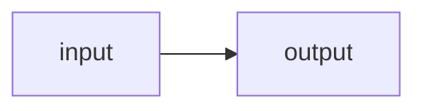
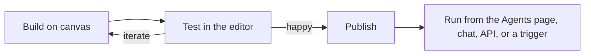

# The editor

The editor is where you build an agent visually: drag node types onto a canvas, wire their ports together, and configure each one in a form — no code required. It is a three-column workspace over a single agent document, with a raw-JSON view for anything the forms don't expose. This page is a tour of every panel and interaction; the individual node types have their own [reference pages](nodes/index.md).

If you have never built an agent, walk through [your first agent](../getting-started/first-agent.md) first — it uses this editor end to end.

## Opening the editor

The editor lives at `/editor`. You reach it from the **Agents** page (in the sidebar, at `/agents`):

- **New agent** opens a blank graph.
- Clicking any agent card opens that agent's latest published version for editing.
- Opening a **draft** (from the Drafts strip, a card's amber `draft` badge, or a `?draft=` URL) resumes that work-in-progress exactly where it left off.

A blank graph is not empty. It arrives pre-seeded with an `input` node wired straight to an `output` node, named *Untitled agent*, version `0.1.0`. That starter graph already passes validation and runs — it simply echoes whatever you send it — so you can test and publish immediately, then build outward.

When you open an existing agent, the sidebar collapses to icons to give the canvas room. Opening an agent that has no published versions shows an error rather than a blank canvas.

As soon as you make a real edit, the editor starts **autosaving a draft** in the background — see [Drafts & publishing](saving-agents.md#drafts-the-automatic-tier). You never lose work to a reload again.

## The three columns

The workspace is three resizable columns:

| Column | Default width | What it holds |
|---|---|---|
| **Palette** (left) | 280 px | The node types you can add, grouped by category. |
| **Canvas** (center) | fills | The graph itself — nodes and the edges between them. |
| **Inspector** (right) | 450 px | Configuration for whatever you have selected. |

Drag the splitter between columns to resize (palette 150–420 px, inspector 260–620 px); double-click a splitter to reset it. Either side panel collapses to a thin labeled rail — selecting a node or edge auto-expands a collapsed inspector so you never lose the form.

The toolbar across the top carries the agent's **id**, **name**, and **version** fields, a **visual / code** toggle, the published content hash (display only), a validation indicator, the draft-save status (*Draft saved just now*, *Saving draft…*), **Revert**, **Test**, and **Publish**. Those last few are covered under [Validation](#validation), [Testing on the canvas](#testing-on-the-canvas), and [Drafts & publishing](saving-agents.md).

## The palette

The palette lists every node type you can drop onto the canvas, under a header labeled **Nodes** with a search box ("Search nodes…") and category filter chips. The categories map onto a node's *kind*:

| Category chip | Kind | Contains |
|---|---|---|
| **I/O & Human** | boundary | `human`, `input`, `output`, `subgraph` |
| **Compute & Tools** | activity | `imagine`, `llm`, `quota`, `ratelimit`, `speak`, `tool`, `transcribe` |
| **Control flow** | orchestration | `guardrail`, `loop`, `map`, `router`, `transform` |

Groups are collapsible and show an item count. Types are sorted alphabetically within each category.

!!! note "Where is the MCP node?"
    There is no separate MCP node in the palette. An MCP tool is one of the three *kinds* of the single **tool** node — you pick "MCP" in the inspector after dropping a tool node. A graph you import that already contains an `mcp_tool` node still renders fine. See [MCP tools](nodes/mcp.md).

## The canvas

The canvas is a pannable, zoomable surface. Kind colors are consistent everywhere: boundary nodes are green, activity blue, orchestration amber — the same tones appear on the node border, its kind dot, and the palette chips.

### Adding nodes

- **Drag** a palette item onto the canvas to drop a node exactly where you release it.
- **Click** a palette item to add it at a cascading default position.

New nodes get generated ids like `n_llm_1`. A freshly dropped `llm` node is pre-seeded with one user message containing `$in` so it is wired up to receive its input.

### Connecting ports

Nodes carry small handles you drag between to make an edge. Handles come in three channels, and you can only connect like to like:

| Channel | Handle look | Meaning |
|---|---|---|
| **data** | round, on the node sides (in on the left, out on the right) | Passes a value along the edge. Required in-ports are blue, optional gray; error out-ports red, normal green. |
| **control** | amber squares, top and bottom | Pure sequencing — "run after this", no value passed. Control edges animate on the canvas. |
| **tool** | violet squares (an `llm`'s `tools` port on the bottom; a tool node's `use` port on top) | A capability wire — "the model may call this tool". |

Trying to cross channels is rejected with a toast: *cannot connect a `<role>` handle to a `<role>` handle — connect like-to-like*. Feeding a second data edge into an in-port that already has one is also rejected — an in-port takes at most one data edge, because two would be an ambiguous input. (Control edges have no such limit.)

Wiring a tool node's violet `use` handle into an `llm`'s `tools` port does more than draw a line: it registers that tool as a callable capability, and the tool node's id becomes the function name the model sees. See [tools](nodes/tools.md).

#### Adding and editing handles

The handles a node starts with come from its type, but they are yours to change — that is how a node takes several inputs, or how a router grows one branch per outcome. Select the node and open **Ports** in the inspector:

- **+ data**, **+ control** and (on an `llm`) **+ tool** add a handle to that side. New handles get a fresh id you then rename.
- Each row lets you **rename** the handle — every edge already on it is rewired, so wiring survives the rename — **delete** it, mark an in-port **required**, or flag an out-port as the **error branch** (where a step's failures route).
- The panel opens automatically for a router, and for any node whose handles already differ from its type's defaults — those were authored deliberately, so they are worth seeing.

A node that reads several inputs gives each one its own named in-port and addresses them as `$in.<port>`; see [referencing inputs](input-references.md).

### Moving, deleting, duplicating

- **Left-drag on empty canvas** draws a box (marquee) select; dragging any selected node moves the whole selection together.
- **Middle-drag, right-drag, or hold Space and drag** to pan; **scroll** to zoom.
- **Right-click** a node or edge for a context menu: **Duplicate node** (a fresh copy with a new id, its label suffixed " copy", offset slightly, with *no* edges carried over) and **Delete node** / **Delete edge**.
- Selecting something and pressing ++delete++ or ++backspace++ deletes it.

### Canvas controls

The bottom-left controls offer **Tidy layout** (a wand that auto-arranges the nodes by longest path — a layout-only change), plus **Undo** and **Redo**. A **minimap** shows the whole graph, and a **?** button in the top-left reveals an interaction legend. A hand-written or imported graph with no saved positions is laid out automatically the first time it renders, so it is never a pile of overlapping boxes.

## The inspector

What the inspector shows depends on your selection.

### A node is selected

The header shows the node's kind badge, its type, and its id, with a per-node **Wizard / Code** toggle:

- **Wizard** is the form. A combined **Label + icon** row comes first (the label placeholder is the node id), then one field per config key. Field labels are humanized from the camelCase keys — `maxToolIterations` becomes "max tool iterations". Required keys get a `*`. Enums render as dropdowns, nullable strings and numbers as inputs, and objects or arrays as a guarded JSON box that shows a parse error inline instead of silently dropping bad input.
- **Code** is that one node's exact JSON in an editor — the escape hatch for anything the form doesn't surface. This is how you pin a child agent by `contentHash` instead of by version. Invalid JSON shows *✗ invalid — not applied* and is never committed. Renaming the node id in the JSON keeps it selected.

Several node types get purpose-built panels instead of the generic form — the `llm` model and message editors, the tool **Kind** picker, the guardrail **Check** picker, the pinned-body pickers for `subgraph`/`loop`/`map`, the transcribe/speak/imagine parameter forms, and the **input fields** builder on the `input` and `human` nodes. Each is documented on that node's [reference page](nodes/index.md).

!!! tip "Everything the shipped samples use is buildable in the Wizard"
    All twelve [sample agents](../samples/index.md) — every node, every config field, every named port and every edge — can be built from the forms and the canvas alone. The Code view is an escape hatch, not a requirement. The one exception is pinning a child agent by content hash rather than by version, which no sample uses.

!!! warning "Durable-only nodes"
    Adding a `human`, `subgraph`, `loop`, or `map` node shows a banner: these run only on the durable runtime. Publish the agent, then use **Run durably** (which needs the server's durable mode) or deploy it behind a trigger. Neither the in-editor Test panel nor the plain interactive **Run** path can execute them. See [durable runs](../running/durable.md).

#### The label and icon picker

The leading icon button in the label row opens an inline icon picker: a grid of suggested icons, a **Search all icons…** box over the full icon set (results capped, so keep typing to narrow), and **Reset to default**. Each node type has a sensible default icon, and any type the editor doesn't have a specific icon for falls back to a gear.

An icon is a display choice only. It is stored in the graph's layout block, which is never part of the content hash — **changing an icon never creates a new agent version.** The same is true of dragging nodes and zooming.

### An edge is selected

The edge panel shows the edge id, a **Delete edge** button, and its `source.handle → target.handle` readout. A **Channel** toggle switches a data edge ("passes a value along the edge") to control ("pure sequencing — no value passed"). A tool edge's channel is read-only — to change it, delete and re-wire. There is also a *Condition (router-driven, optional)* field; routing in practice is done with the [router node](nodes/router.md)'s `select`, and this field is reserved.

### Nothing is selected

With an empty selection, the inspector shows the whole-graph panel:

- **Model bindings** — a read-only list of the logical models this agent declares (each as `binding · model`). Bindings are declared for you when you pick an inference model on an `llm` node; see [models and engines](../concepts/models-and-engines.md).
- **Tools** — a read-only registry derived from the tool nodes you have wired to an `llm`.
- **Connections (tool / MCP auth)** — an editable list of saved connections, plus a **New connection** form. A connection has a **Name**, a **Kind** (`http_auth` or `mcp_server`), a non-secret **Config** JSON, and a write-only **Secret** field. The secret is encrypted on the server and never shown again — the connection stores only a reference, so rotating the secret never changes any agent's content hash. Connections are how [HTTP tools](nodes/tools.md) and [MCP servers](nodes/mcp.md) authenticate.

## Model parameters (the llm node)

When an `llm` node is selected, its inspector includes a **Model parameters** section that edits the parameters stored on that model *binding* — literal values shared by every `llm` node that uses the same binding, and part of the agent's hashed content. A note under the form spells this out: *every llm node using this binding shares them. Empty fields send nothing (engine defaults apply).*

The chat parameters, each with a **?** tooltip explaining it in plain language:

| Parameter | Control | Range / values |
|---|---|---|
| Temperature | slider | 0–2 |
| Top-p | slider | 0–1 |
| Max tokens | number | — |
| Stop | text | comma-separated stop strings |
| Presence penalty | slider | −2 to 2 |
| Frequency penalty | slider | −2 to 2 |
| Seed | number | — |
| **Reasoning** | select | on / off |
| **Reasoning effort** | select | low / medium / high |

Two more fields appear only when the model advertises the capability: **Tool choice** (auto / none / required — needs tool-calling support) and **JSON / structured output** (text / json_object — needs structured-output support).

### The reasoning toggle

The **Reasoning** select turns a model's hidden thinking phase on or off. Choosing "on" or "off" sends the model's `chat_template_kwargs` with `{"enable_thinking": true}` or `{"enable_thinking": false}`; leaving it unset uses the model's own default, and a model without a thinking switch simply ignores it. This is the same reasoning control offered in [the Bench](../running/bench.md) and referenced from [chat](../chat/index.md) — a model's thinking is always kept separate from its answer and out of the run output.

### Presets

If you have saved parameter presets (from the Bench), a **Load a preset…** dropdown and a **Load** button appear. Loading a preset **copies** its values into the form — the preset's name never lands in the agent, and later edits to the preset do not follow the agent. The section is hidden when there are no presets for the modality.

## The code view

The toolbar's **visual / code** toggle swaps the whole canvas for the full agent document as JSON — including the layout block — in an editor with syntax highlighting, line numbers, a fold gutter, **Fold all** / **Unfold all** / **Format** / **Copy** buttons, and find (++cmd+f++ / ++ctrl+f++). It autocompletes node types, kinds (`boundary` / `activity` / `orchestration`), channels (`data` / `control` / `tool`), bindings (`mlx` / `vllm` / `llamacpp` / `openai-compatible`), sources (`hf` / `local-path` / `url`), and common property names.

Two linters run: JSON syntax and the structural graph checks. The status reads *✓ applied* or *✗ invalid JSON — not applied*. **Invalid JSON blocks switching back to Visual, publishing, and test runs** — fix it first. Unparsed text also never reaches the draft (the draft holds the last valid state), so leaving while the JSON is broken warns you that the typed text would be discarded.

## Validation

The editor validates continuously and mirrors the server's own checks, so what passes here is what the control plane will run. The toolbar indicator reads **valid** (green), **N warnings** (amber), or **N issues** (red), and toggles a floating **Issues** panel over the top-right of the canvas — hovering an issue flashes the offending node or edge, clicking it selects it.

**Errors block Publish and test runs — never the draft.** While any exist, the Publish and Test-panel Run buttons are disabled with *Fix N validation error(s)…*, but the graph keeps autosaving as a draft (a work in progress is allowed to be broken). You will see errors like:

| Situation | Message you see |
|---|---|
| Two nodes share an id | duplicate node id |
| A type isn't a real node type | unknown node type |
| A node's `kind` is wrong for its `type` | `type 'X' must have kind 'Y', got 'Z'` |
| A required config field is empty | `config '<key>' is required` |
| A config value has the wrong shape | e.g. `config/foo must be string` |
| An `llm` or guardrail names a model that isn't declared | `references undeclared model '<m>' (declare it in Model bindings)` |
| A guardrail is half-configured | "a rule guardrail needs a rule"; "pick a judge model"; "add a judge prompt" |
| A `subgraph`/`loop`/`map` isn't pinned to one body | `must pin EXACTLY ONE of 'version' or 'contentHash'` |
| A loop has no bound | `loop maxIterations must be a whole number ≥ 1` |
| An edge points at a handle that doesn't exist | `'<n>' has no out-port '<h>'` |
| An in-port is fed twice | `in-port '
' on '<n>' is fed by >1 data edge (ambiguous)` |
| A required in-port is unwired | `required in-port '
' is not connected` |
| A tool node is wired as both a capability and a step | "a tool node is either a capability (wired to an llm) or a step, not both" |
| The graph forms a cycle | "graph has a cycle (not allowed)" |

`input` nodes and tool nodes used purely as model capabilities are exempt from the "required in-port not connected" rule. Tool (capability) edges are excluded from cycle detection.

**Warnings do not block Publish** — they flag things worth a second look:

- graph has no nodes;
- a `human` node whose `onTimeout` is `default` but with no default value set (a timeout would flow `null`);
- the graph contains durable-only node types — run it with **Run durably**;
- more than one `output` node — make sure at most one executes per run (two live outputs fail the run).

The code view runs the same structural graph checks as the visual canvas, so the same warnings and errors surface there too.

## Testing on the canvas

You don't have to publish — or even finish — an agent to try it. The toolbar's **Test** button docks a test console under the canvas that runs the document **exactly as it sits on the canvas**, draft or not:

1. Give it an input and click **Run** — or press ++enter++ in the input field. The control **follows your input node's `modality`**: a text box for `text`, a validated JSON editor for `json`, a microphone and file attach for `audio`, image attach plus camera for `image`, a file picker for `video`/`file`. Retype the modality on the input node and the control changes immediately — no publish, no round trip. A **JSON** option stays in the mode dropdown whatever the boundary declares, for the multi-input graphs no single modality describes. See [what the modality changes](nodes/input-output.md#what-the-modality-changes).
2. **Watch the graph execute.** As each node runs it pulses on the canvas, then keeps its outcome: a green ring for success, red for an error, dimmed for a branch that was skipped. The answer streams into the panel as it is generated, with a model's thinking shown separately.
3. **Inspect the details.** Once a run exists, the panel grows two tabs — **Output** (the streamed answer) and **Trace**, an embedded run waterfall showing every node's timing; hovering a waterfall row flashes that node on the canvas. The run id next to the tabs links to the full run page. An `audio` or `image` answer plays or shows in the panel rather than printing its artifact reference.
4. **Stop** aborts a run mid-stream; closing the panel does too.

A few rules, all mirrored from the server:

- **Validation errors disable Run** (the same errors that block Publish) — the graph must be structurally sound to execute, even as a draft.
- **Durable-only graphs can't test-run.** A graph containing `human`, `subgraph`, `loop`, or `map` needs the durable runtime — publish it and use **Run durably**.
- **Test runs are real runs.** Each one is recorded under **Runs** like any other, so your test history is inspectable later.
- Drag the panel's top edge to resize it; double-click to reset.

Published agents also run from the **Agents** page: every agent card has a **Run** button that opens a bench modal. It is a split button — **Run** streams the agent interactively, and the caret menu offers **Run durably** (checkpointed; needs the server's durable mode). A durable-only agent shows a single **Run durably** button, because its nodes can't execute on the interactive path.

For the full publish flow — ids, versions, and conflicts — see [drafts & publishing](saving-agents.md). For run output, statuses, and durable execution, see [running agents](../running/index.md) and [durable runs](../running/durable.md).

## Keyboard and mouse reference

| Input | Action |
|---|---|
| ++cmd+s++ / ++ctrl+s++ | Save the draft now (no validation gate — drafts may be broken) |
| ++cmd+z++ / ++ctrl+z++ | Undo (history of 100 steps, including drags) |
| ++cmd+shift+z++ / ++ctrl+y++ | Redo |
| ++esc++ | Deselect |
| ++delete++ / ++backspace++ | Delete the selection |
| Left-drag empty canvas | Box (marquee) select |
| Middle / right / ++space++-drag | Pan |
| Scroll | Zoom |
| Right-click a node or edge | Context menu (duplicate / delete) |

Undo restores node positions too, so a mistaken drag is one keystroke away. Text fields keep their native undo while you are typing in them.

!!! note "Leaving with unsaved work"
    Because drafts autosave, leaving the editor is almost always safe. The *Leave with unsaved changes?* prompt appears only when the very latest edits haven't reached the draft yet (they're still inside the autosave window, or a save failed) — and it offers **Save draft & leave** so one click does both. Closing or reloading the tab in that window triggers the browser's own warning, and the editor still fires a last-moment draft save on the way out.

## Related pages

- [Referencing inputs](input-references.md) — the `$in` token language you use in message and tool fields
- [Drafts & publishing](saving-agents.md) — autosaved drafts, ids, immutable versions, and running what you publish
- [Node reference](nodes/index.md) — every node type, its ports, and its configuration
- [Nodes, ports and edges](../concepts/nodes-ports-edges.md) — the underlying graph model
- [Models and engines](../concepts/models-and-engines.md) — logical model ids and bindings
