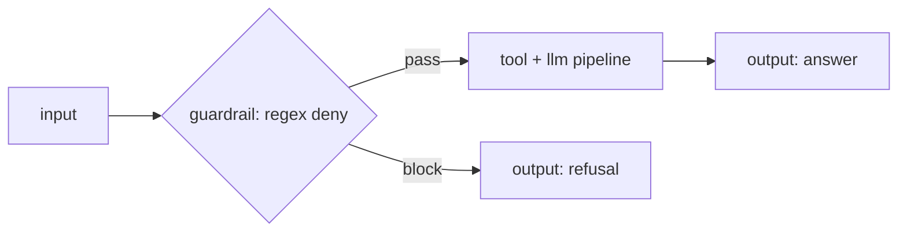

# Guardrail node

The **guardrail** node is a check that runs *before* expensive work and splits the graph two ways: input that passes flows out `pass`; input that fails flows out `block`. Wire `block` to an `output` to refuse a request before any model or tool runs.

A guardrail comes in two flavours, chosen by its **check type**:

- **Rule** — a deterministic, inline check (a regex, a length bound, an allow/deny list, a PII scan). No model call, so the node is a **control-flow** (`orchestration`) node.
- **Model** — an LLM judge decides pass or block. That is a real inference call, so the node is a **compute** (`activity`) node.

The editor stamps the right `kind` for you when you pick the check type; you never set it by hand.

## Ports

| Port | Direction | Required | Description |
|---|---|---|---|
| `in` | in | yes | The value to check. |
| `pass` | out | — | Carries the input **through unchanged** when the check passes. |
| `block` | out | — | Carries the `onBlock` payload (or, if none is set, the original input) when the check fails. |

Exactly one of `pass` / `block` activates per run; the other branch's edges are dead and everything downstream of it is skipped.

## Configuration

| Field | Type | Default | Description |
|---|---|---|---|
| `check` | object (required) | `null` | The check to run. Must be set — an unconfigured guardrail is a validation error. Its shape depends on the check type (below). |
| `onBlock` | object | `{}` | The payload sent out the `block` port when the check fails. Leave it empty to pass the original input through instead. |

### Rule checks (`check.type: "rule"`)

`check.rule` has a `kind` and a `spec`:

| Rule `kind` | `spec` keys | Passes when |
|---|---|---|
| `regex` | `pattern`, `mode` (`allow` \| `deny`, default `allow`) | `allow`: the pattern matches. `deny`: the pattern does **not** match. |
| `length` | `min`, `max` (either optional) | The text length is within the bounds. |
| `allow` | `values` (list) | The value is one of `values`. |
| `deny` | `values` (list) | The value is **not** in `values`. |
| `json_schema` | `required` (list of keys) | The value is an object that has all the `required` keys. (A minimal shape check — nothing else about the value is validated.) |
| `pii` | `patterns` (optional list) | **No** pattern matches. With no `patterns`, built-in email, US-SSN, and card-number-like patterns are used, so a value containing PII is blocked. |

Non-string values are stringified before a string-shaped rule (regex, length, allow/deny, pii) runs.

### Model checks (`check.type: "model"`)

`check.model` describes an LLM judge:

| Field | Type | Default | Description |
|---|---|---|---|
| `model` | string (required) | — | A declared model binding (same picker and auto-declare behavior as the [llm node](llm.md)). An engine name here is rejected up front. |
| `prompt` | string (required) | — | The judge question. Keep it a terse yes/no, e.g. "Is this request about booking a table? Answer yes or no." |
| `passOn` | string | `"yes"` | The answer that means **pass**. Anything else routes to `block`. |

The judge answer is compared case- and whitespace-insensitively: the check **passes when the answer starts with `passOn`**.

## Behavior notes

- **`pass` carries the input through untouched.** Downstream nodes see exactly what went into the guardrail.
- **`block` carries `onBlock`.** If `onBlock` is left empty, `block` instead carries the original input, so you always have something to return.
- **Exactly one branch runs.** This is the standard exclusive-branch pattern that keeps at most one `output` node live per run — one output on the `pass` path, one on the `block` path, and only the taken one executes.
- **A model check spends tokens.** The judge call is a normal model turn; its token usage counts toward any downstream [quota gate](ratelimit-quota.md) just like any other model call.
- **Unknown rule kinds fail closed.** If a rule's `kind` is one the runtime doesn't recognise, the guardrail blocks rather than letting the value through. (The editor validates known kinds before you can save.)

### What a blocked run looks like

A block is a normal, successful outcome — not an error. The run stays `completed`; the `block` branch simply activates instead of `pass`. If you wire `block` to its own `output`, the run's output is your refusal payload. In the [run waterfall](../../running/observability.md) the guardrail's `block` handle shows as the live path and the `pass` branch as skipped.

If you leave `block` unwired and the check fails, the taken branch reaches no output node — the run completes with an honest empty-output note explaining that no output ran. Wire `block` to something so a blocked caller gets a clear answer.

## Worked example

Refuse database questions with a rule check before touching any tool or model.



The guardrail's config, using a deny-mode regex so the value **passes only when it does not match**:

```json
{
  "check": {
    "type": "rule",
    "rule": {
      "kind": "regex",
      "spec": {
        "mode": "deny",
        "pattern": "(?i)(postgres|mysql|mongodb|redis|sqlite|database)"
      }
    }
  },
  "onBlock": { "message": "I am not allowed to provide that information" }
}
```

A prompt mentioning a database matches the pattern, so in `deny` mode the check fails and the `block` output returns the `onBlock` message. Any other prompt passes through to the real pipeline.

## Works well with

- [Rate limit and quota nodes](ratelimit-quota.md) — the other pre-work gates: cap request rate and token spend.
- [Router node](router.md) — branch on a value that is already a decision, rather than a pass/block check.
- [LLM node](llm.md) — a model guardrail reuses the same model bindings.
- [Observability](../../running/observability.md) — see which branch a run took.
- [Input references](../input-references.md) — how the checked value is addressed.
