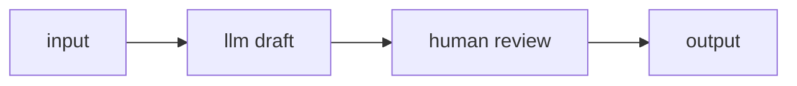

# Human node

The `human` node pauses a run and waits for a person to supply input before the graph continues. Use it for approvals, manual review, or any step where an agent should hand control to you and resume once you respond.

It is a **boundary** node, and it is **durable-only**: it runs only on the durable runtime, because a run that waits for a human may sit paused for minutes, hours, or days — and must survive a restart in the meantime. See [Durable runs](../../running/durable.md) for why, and [Human in the loop](../../running/human-in-the-loop.md) for the end-to-end approval workflow.

## Ports

| Port | Direction | Required | Description |
|---|---|---|---|
| `in` | in | yes | The value that reaches the gate. It is advisory context — captured in the trace and available to describe what needs review — not what flows out. |
| `out` | out | — | Carries the value **the person delivered on resume**, once input arrives. |

The node's incoming value is *not* passed straight through. When you resume the run, the value you deliver is what flows out of `out` into the downstream nodes.

## Configuration

| Field | Type | Default | Description |
|---|---|---|---|
| `prompt` | string | `null` | Advisory text describing the input you expect (shown as context; does not change execution). |
| `inputSchema` | JSON object | `null` | Advisory schema for the expected input. Only its `required` keys are enforced on resume. |
| `timeout` | number (seconds) | `null` | How long to wait. `null` waits indefinitely. |
| `onTimeout` | enum `fail` \| `default` | `fail` | On timeout: `fail` fails the run; `default` binds `default` and continues. |
| `default` | any | `null` | The value used when `onTimeout` is `default` and the timeout elapses. |

## Behavior

- **The run pauses as `waiting`.** When the walker reaches a `human` node, the run's status becomes `waiting` and its `awaiting_node` field records the node id. A waiting run is excluded from the crash-recovery sweep, so it can stay paused across restarts.
- **You resume by delivering input.** Once input arrives, the run flips back to `streaming`, the delivered value flows out of `out`, and execution continues. A graph may contain more than one `human` node — the run pauses at each in turn.
- **The resume input is validated against `inputSchema.required`.** If your input is an object missing a required key, the resume is rejected (`resume_schema_mismatch`) and the run stays paused.
- **A duplicate resume is harmless.** Delivery is keyed per node, so a double-click or client retry cannot accidentally satisfy the *next* human gate — the extra message is discarded.
- **On timeout.** With `onTimeout: "fail"` (the default) the run fails with a message naming the node and the elapsed time. With `onTimeout: "default"` the value in `default` is bound and the run continues. If you set `onTimeout: "default"` but leave `default` empty, the editor warns you, and a timeout flows `null`.

## Resuming a paused run

There are two ways to deliver input.

**From the interface.** A waiting run shows a resume panel — on the run detail page (under **Runs**) and in the agent's bench modal. The panel reads *"Paused — awaiting input at `<node>`"* with a **Text**/**JSON** mode toggle, an input box, and a **Resume** button. JSON mode is parsed before it is sent, so a malformed object is caught in the tab rather than at run time; an empty JSON box means "no input" (`null`).

**Over the API.** Post the input to the run:

```bash
curl -X POST http://localhost:8080/runs/<run_id>/resume \
  -H 'Content-Type: application/json' \
  -d '{"input": {"approve": true}}'
```

The `input` field is the value delivered to the gate. A successful resume returns **202** with `{runId, status: "resuming", awaitingNode}`. This surface uses the ordinary interactive authentication, not the token-invoke bearer.

The common error responses:

| Status / code | Meaning |
|---|---|
| 400 `durable_required` | The control plane is not running in durable mode. |
| 404 `run_not_found` | No run with that id. |
| 409 `run_not_waiting` | The run is not currently paused at a human gate. |
| 409 `awaiting_node_missing` | The run is waiting but records no target node to resume. |
| 422 `resume_schema_mismatch` | The input object is missing a key required by `inputSchema`. |
| 410 `workflow_gone` | The durable workflow no longer exists; the run is marked `failed`. |

## Running a graph that contains a human node

Because the node is durable-only, the plain interactive **Run** path refuses it up front with `durable_required`. Run it durably instead:

- **From the interface:** publish the agent, then on the Agents page use **Run durably**. An agent that contains any durable-only node shows a single **Run durably** button. This needs the control plane started with `THEYGENT_DURABLE=1`; otherwise you get a note explaining how to enable durable mode.
- **Over the API:** `POST /agents/{id}/durable-runs`, then poll `GET /runs/{id}` and resume when it reports `waiting`.

## Example: approve a draft before it ships

An agent drafts a message, pauses for you to approve or edit it, then returns whatever you delivered.



The `human` node's configuration:

```json
{
  "type": "human",
  "kind": "boundary",
  "config": {
    "prompt": "Review the draft. Reply with the approved text.",
    "inputSchema": { "required": ["text"] },
    "timeout": 3600,
    "onTimeout": "fail"
  }
}
```

When this run reaches the gate it pauses as `waiting`. You resume with, for example, `{"text": "Approved copy goes here."}` — the `inputSchema` requires a `text` key, so an object without it is rejected — and that value flows out `out` to the `output` node.

## Works well with

- [Human in the loop](../../running/human-in-the-loop.md) — the full waiting/resume/approval workflow.
- [Durable runs](../../running/durable.md) — why this node needs durable mode, and how to enable it.
- [Guardrail node](guardrail.md) — gate *automatically* before deciding whether a human even needs to see the request.
- [Orchestration nodes](orchestration.md) — the other durable-only nodes (`subgraph`, `loop`, `map`).
