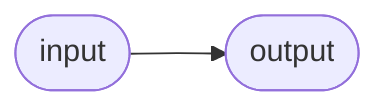
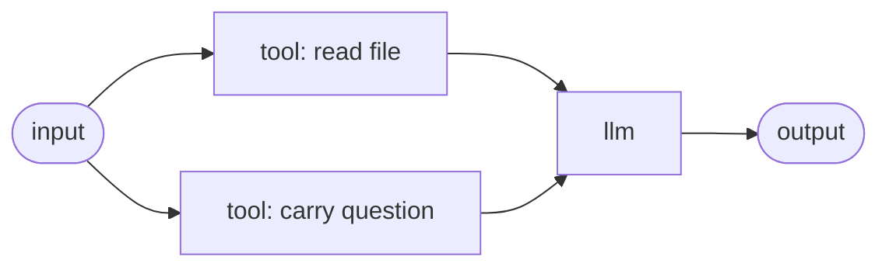
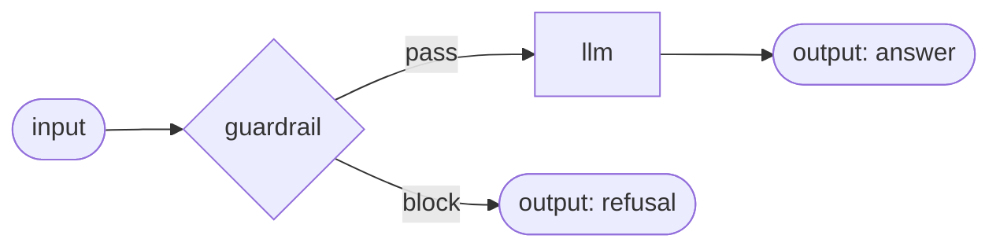

# Input & output nodes

Every agent begins at an **input** node and ends at an **output** node. The input node carries whatever you pass to a run into the graph; the output node's value is what the run returns. Both are `boundary` nodes — they mark the edges of the graph and perform no work of their own. A fresh graph in the editor already contains one of each, wired together, so it passes validation and runs (echoing its input) from the start.



---

## The `input` node

The single entry point of the agent. The value you pass when you run the agent appears on its `out` port, ready for downstream nodes to read with [`$in`](../input-references.md). It is a `boundary` node and is **never skipped** — it has no inbound edges, so it always runs first.

### Ports

| Port | Direction | Required | Description |
|---|---|---|---|
| `out` | out | — | Carries the entire run input to whatever is wired downstream. |

An input node has no in-ports.

### Configuration

| Field | Type | Default | Description |
|---|---|---|---|
| `modality` | enum | `text` | The expected shape of the input: `text`, `audio`, `image`, `video`, `json`, or `file`. |
| `schema` | JSON Schema | `null` | An optional description of the input's structure. |

The inspector edits `schema` as an **input fields** list — one row per field with a name, a type, a **req** checkbox and an optional description — rather than hand-written JSON Schema. Those names are exactly what a caller sends and what the graph reads with `$in.in.<name>`. A schema that says more than a field list can (an array payload, a nested object) keeps the JSON editor, and a **JSON** link switches to it deliberately at any time.

Both fields are **declarative** at run time: the value on `out` is exactly what was passed in, whatever the modality says. What `modality` *does* drive is every place you run the agent from — see [What the modality changes](#what-the-modality-changes) below — and how a trigger maps its incoming payload.

Leaving `modality` unset is the same as `text`; that is the default the graph is validated with. In the editor, the modality dropdown's blank option (`— default (text)`) clears the field back to that default.

### What the modality changes {: #what-the-modality-changes }

Every surface that runs an agent reads the input node's modality and offers the matching control — the canvas **Test** panel, the **Run** dialog on the Agents page, **New Chat**, and a reopened session all behave identically:

| `modality` | What you get | What the run receives |
|---|---|---|
| `text` | A text box | the string |
| `json` | A validated JSON editor (malformed JSON is refused before the run starts) | the parsed object |
| `image` | Image attach + camera, plus an optional question | `{"image": "<data URI>", "text": "…"}` |
| `audio` | Microphone record + audio file attach | `{"ref": "art_…", "contentType": "audio/wav"}` |
| `video`, `file` | A file picker | `{"ref": "art_…", "contentType": "…"}` |

Non-text payloads that are not images ride as an **artifact reference**: the bytes are uploaded once and the run carries only the handle, so multi-megabyte blobs are never journaled through a run's steps. An image is the exception — it goes inline as a data URI, because the [llm](llm.md) node substitutes the value straight into an `image_url` content part without fetching anything.

Every one of those surfaces also keeps a **JSON** escape hatch in its input-mode dropdown, whatever the boundary declares: a multi-input agent whose payload no single modality describes can always be exercised by hand.

### Behavior notes

- **The whole input lands on `out`.** Downstream nodes read it with the bare `$in` token (the default in-port). To pull a field out of a structured input, drill into it — `$in.in.<field>` — from a node that reads it. See [Referencing inputs](../input-references.md).
- **Composing several inputs.** The input node has a single `out` port; it does not split values for you. When an agent needs to combine several upstream values — say a document *and* a question — you give the **consuming** node (typically an [llm](llm.md)) more than one named in-port and wire a separate edge into each. That node then addresses them distinctly as `$in.<port>`. This is how multi-input agents work: a run input like `{"path": "...", "question": "..."}` fans out to nodes whose named ports each pick up their piece.
- **Triggers live here, not as nodes.** When you select the input node, the inspector shows a read-only **Triggers** panel listing how this agent can be invoked (schedule, webhook, token). Triggers are added *after* publishing the agent, not as graph nodes — see [Triggers and webhooks](../../running/triggers.md).

### Example

An input node feeding two downstream readers that each take a slice of a structured input:



```json
{
  "id": "n_in",
  "type": "input",
  "kind": "boundary",
  "config": { "modality": "json" },
  "ports": { "in": [], "out": [{ "id": "out" }] }
}
```

### Works well with

- [The llm node](llm.md) — the usual first consumer of the input
- [Referencing inputs](../input-references.md) — `$in`, `$in.<port>`, and field drilling
- [Runs and sessions](../../concepts/runs-and-sessions.md) — what a "run input" is

---

## The `output` node

The exit point. Whatever value reaches its `in` port is the run's **canonical output** — the value returned by the run and stored against it. It is a `boundary` node and performs no side effect; it just marks where the answer comes from.

### Ports

| Port | Direction | Required | Description |
|---|---|---|---|
| `in` | in | yes | The value that becomes the run's output. |

An output node has no out-ports.

### Configuration

| Field | Type | Default | Description |
|---|---|---|---|
| `modality` | enum | `text` | The shape of the result: `text`, `audio`, `image`, or `json`. |
| `schema` | JSON Schema | `null` | An optional description of the output's structure. |

For an `audio` or `image` result the value is a **reference** to a produced artifact, not the raw bytes — see [Audio & images](media.md). Every run surface reads that reference back and plays or shows the result instead of printing the handle.

A graph may declare several output nodes with **different** modalities — a spoken answer plus a text error branch is the usual shape. What a given run returns is therefore decided from the value it actually produced, not from what the boundary declared: a voice agent whose transcription failed hands back prose on its error branch, and that renders as prose.

### Behavior notes

The output node has two rules worth knowing, because both surface as loud failures rather than silent surprises:

- **Exactly one in-port.** An output node is a single-value consumer: it takes the value from one in-port. Declaring more than one in-port is a validation error — the editor will not let you publish it, because which value is "the output" would be ambiguous.
- **At most one output may run per run.** A graph is allowed to contain **several** output nodes — for example, a happy-path output and a refusal output on the two branches of a [guardrail](guardrail.md). But no more than one may actually execute in a single run. If two output nodes both go live, the run fails with a clear message: *a second output node executed — the run output would be ambiguous.* Route exclusive branches (with a [router](router.md) or a guardrail) so that exactly one output is reachable.
- **Empty output is honest.** If the output node's in-port is fed only by a branch that was not taken — for example an upstream tool bound its `err` port and its success path was skipped — the run does not report a green empty success. It carries an honest error note explaining the upstream cause.

### Example

A guardrail that routes to one of two outputs — a valid two-output pattern, because only one is ever live:



```json
{
  "id": "n_out",
  "type": "output",
  "kind": "boundary",
  "config": { "modality": "text" },
  "ports": { "in": [{ "id": "in" }], "out": [] }
}
```

### Works well with

- [The guardrail node](guardrail.md) — refuse on a separate `block` output before expensive work
- [The router node](router.md) — send the run down exactly one branch
- [Runs and sessions](../../concepts/runs-and-sessions.md) — where the run output is stored and read back
