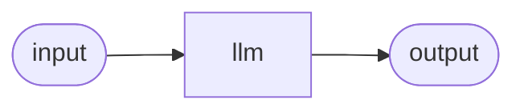

# The LLM node

The `llm` node calls a language model. You point it at a model, give it a list of chat messages (with your input templated in), and it streams back a reply. It is the workhorse of most agents. On top of a plain completion it can also drive **autonomous tool-calling**, accept **images** for vision models, replay **session memory**, and surface a model's **reasoning** as a separate stream.

It is an `activity` node — it does real work with a side effect (the model call).



## Ports

| Port | Direction | Required | Description |
|---|---|---|---|
| `in` | in | yes | The input the messages template against with `$in`. |
| `tools` | in | no | A **tool channel** port. Wire tool nodes here to let the model call them. |
| `out` | out | — | The model's answer. |

The `tools` in-port is a violet **tool handle** on the bottom of the node — it carries capabilities, not data. Wiring it is covered under [Tools the model can call](#tools-the-model-can-call).

## Configuration

These are the keys on the node itself (camelCase, as the editor and IR store them):

| Field | Type | Default | Description |
|---|---|---|---|
| `model` | string | — (required) | The **binding key** — the local alias of one entry in the graph's `models` map (not the inference-plane logical id, which is that binding's own `model` field). See [agents and graphs](../../concepts/agents-and-graphs.md). |
| `messages` | list | — (required) | The chat turns. Each is `{ "role": ..., "content": ... }`. A new node is seeded with one user turn containing `$in`. |
| `toolChoice` | enum / object | `"auto"` | Whether the model may call tools: `auto`, `none`, `required`, or a named-function object. Only meaningful when tools are wired. |
| `maxToolIterations` | integer | `8` | The maximum number of model-then-tool rounds before the loop stops. Must be at least 1. |
| `tools` | list of strings | `[]` | A legacy way to attach tools by key. Prefer wiring the `tools` port instead. |

Generation parameters — temperature, max tokens, and so on — are **not** on the node. They live on the model binding and are shared by every llm node that uses it, described next.

## Model binding and parameters

### Picking a model

In the inspector, the **model** field is a searchable picker over two sets combined: the model bindings already declared in this graph, and the live logical model ids the inference plane currently offers. Picking a model that is not yet a graph binding **auto-declares** one for you (an entry in the graph's `models` map). You can also type a name freely — useful when authoring offline — and the validator will flag it later if it stays undeclared.

A binding always names a **logical id** (like `triage-fast`), never an engine name. Which engine or endpoint actually serves that id is a registration detail you can change without touching the agent. See [Models and engines](../../concepts/models-and-engines.md) and [Installing local models](../../models/installing.md).

### Tuning parameters

The **Model parameters** section edits the generation params stored on the binding (`ir.models[<key>].params`). Because they live on the binding, **every llm node that uses the same binding shares them**. Empty fields send nothing, so the engine's own defaults apply.

| Parameter | Range / values | What it does |
|---|---|---|
| Temperature | 0–2 | Sampling randomness. Lower is focused and repeatable; higher is more varied. |
| Top-p | 0–1 | Nucleus sampling. Tune this *or* temperature, not both. |
| Max tokens | ≥ 1 | Hard cap on generated tokens. Set it generously for reasoning models (see below). |
| Stop | comma-separated | Sequences that end generation immediately. |
| Presence penalty | −2–2 | Nudges the model toward new topics. |
| Frequency penalty | −2–2 | Reduces word-for-word repetition. |
| Seed | integer | Best-effort determinism for reproducible runs. |
| Reasoning | on / off | Turns the model's hidden thinking phase on or off. Leave unset for the model's default. |
| Reasoning effort | low / medium / high | How much a reasoning model thinks before answering. |
| Tool choice | auto / none / required | Shown only if the model advertises tool-calling. |
| JSON / structured output | text / json_object | Shown only if the model advertises structured output. `json_object` asks for valid JSON. |

Each field has a **?** help tooltip. The last two are **capability-gated** — the editor hides them unless the model reports it supports them, so you never set a switch the model will ignore.

The stored keys are the OpenAI-style names (`temperature`, `top_p`, `max_tokens`, `presence_penalty`, `frequency_penalty`, `seed`, `stop`, `tool_choice`, `response_format`). The **Reasoning** switch is stored as `chat_template_kwargs` (`{ "enable_thinking": true }` or `false`) and **Reasoning effort** as `reasoning_effort`.

```json
"models": {
  "default": {
    "binding": "mlx",
    "model": "triage-fast",
    "params": { "temperature": 0.2, "max_tokens": 2048 }
  }
}
```

!!! tip "Presets"
    A **Load a preset…** dropdown appears when you have saved parameter presets on [the Bench](../../running/bench.md). Loading one **copies** its literal values onto the binding — the preset name never lands in the agent, so later edits to the preset do not follow it.

## Messages and templating

The **Messages** panel is a no-code chat-turn list. Each turn has a **role** — `system`, `user`, or `assistant` — and a text box. You can add, remove, reorder, and insert your input with an **Insert input ($in)** helper. System turns automatically float to the top. A freshly dropped node starts with a single user turn containing `$in`.

Message text is templated with the shared `$in` grammar:

- `$in` — the whole value on the default in-port (`in`).
- `$in.<port>` — the whole value on a named in-port.
- `$in.<port>.<field>` — drill into a field of that port's value.

An unknown token, port, or field is a **loud error** at run time, never a silent pass-through — a wrong reference fails the run with a message naming the node and the available fields. The full grammar, including how absent optional ports render, is in [Referencing inputs](../input-references.md).

```json
"messages": [
  { "role": "system", "content": "You are a concise assistant." },
  { "role": "user",   "content": "Summarize this:\n\n$in" }
]
```

To compose several upstream values in one prompt, give the node multiple named in-ports and address each one — for example a document on a `file` port and a question on a `question` port:

```json
"messages": [
  { "role": "user",
    "content": "Using only this file:\n\n$in.file\n\nAnswer: $in.question" }
]
```

## Multimodal content (images)

For a vision model, a message's `content` can be a **list of parts** instead of a plain string — text parts and image parts mixed:

```json
{
  "role": "user",
  "content": [
    { "type": "text", "text": "What is in this picture?" },
    { "type": "image_url",
      "imageUrl": { "url": "$in.image", "detail": "auto" } }
  ]
}
```

- The image `url` may be an `http(s)` URL or a `data:` URI, and it is **`$in`-templatable** — so a graph can pass an image through at run time (`$in.image`).
- `detail` is optional (`low`, `high`, or `auto`).
- In the editor, a message that uses this rich form falls back to a per-turn JSON box labelled "content (text + image parts)", so it is never lost when you switch between wizard and code.

The model must be a vision model for image parts to mean anything. See [Vision and images](../../chat/vision-and-images.md) and [Installing local models](../../models/installing.md) for finding one.

## Sessions and memory

An llm node holds no memory of its own — a single run is stateless. Conversational memory comes from a **session**: when a run belongs to a session, the control plane loads the session's earlier turns and the node **replays them verbatim before its own messages**, so the model sees the prior conversation, then this turn's rendered prompt.

Only the model's `content` accumulates into the run's output, and that answer is appended to the session as a new turn — ready to be replayed on the next run. Reasoning is never folded into the stored answer. See [Runs and sessions](../../concepts/runs-and-sessions.md).

## Tools the model can call

Wiring a tool node into the `tools` port turns it into a **capability**: the model may call it on its own, decide the arguments, read the result, and continue. This is autonomous tool-calling, and it is entirely visual.

1. Drop a [tool](tools.md), [MCP tool](mcp.md), or [rag](rag.md) node onto the canvas and configure it.
2. Drag its violet **`use`** handle (on top of the tool node) into this llm node's violet **`tools`** port (on the bottom).
3. The **Tools the model can call** panel now lists that tool, with a kind badge (builtin / http / mcp / rag).

A few things follow from wiring a capability:

- **The tool node's id becomes the function name** the model sees and calls. Name your tool nodes meaningfully.
- When at least one tool is wired, the panel exposes **tool choice** (auto — the model decides / required — it must call a tool / none — it never calls) and **max tool iterations** (the round limit, default 8).
- The model runs a **bounded loop**: it answers or calls a tool; each tool result is fed back; it calls again until it answers or hits the iteration limit.
- There is deliberately no compile-time capability check. A model that does not support tool-calling simply returns a plain answer and ignores the tools.

A tool node is *either* a capability (wired to an llm's `tools` port, the model supplies its arguments) *or* a plain pipeline step (wired with data edges, you template its arguments) — never both. See [Tools](tools.md).

## Streaming and reasoning output

The llm node **streams**. As the model generates, tokens arrive incrementally, so a long answer appears as it is written rather than all at once — you see this live in [chat](../../chat/index.md), on [the Bench](../../running/bench.md), and in the [run waterfall](../../running/observability.md).

Reasoning models emit a hidden **thinking** phase before their answer. TheYgent keeps the two apart:

- **Reasoning** is streamed as its own frame — visible progress during a long think — but is **never** merged into the answer.
- Only the final **content** becomes the run's output and the session turn.

Use the **Reasoning** parameter to turn thinking on or off where the model supports it.

!!! warning "Reasoning and the token cap"
    A reasoning model spends tokens thinking *before* it answers. If **Max tokens** is too low, the model can use its whole budget on hidden reasoning and return an empty visible answer. When that happens the run does not pretend to succeed — it finishes with an honest note pointing at the cause and the fix (raise max tokens). Set the cap generously for these models.

## Behavior notes

- **Undeclared model.** Referencing a model that is not in the graph's bindings is a validation error (*references undeclared model '…'*) — declare it in the model picker or the bindings list before saving.
- **Loud templating.** Any bad `$in` reference in a message fails the run with a clear reason; it never silently emits a literal `$in`.
- **No side effects to undo.** The node reads a model and returns text; retrying it is safe.

## Full example

A single-shot summarizer:

```json
{
  "id": "n_llm",
  "type": "llm",
  "kind": "activity",
  "config": {
    "model": "default",
    "messages": [
      { "role": "system", "content": "You summarize in one sentence." },
      { "role": "user",   "content": "$in" }
    ],
    "toolChoice": "auto",
    "maxToolIterations": 8
  },
  "ports": {
    "in": [
      { "id": "in" },
      { "id": "tools", "role": "tool", "required": false }
    ],
    "out": [{ "id": "out" }]
  }
}
```

## Works well with

- [Tools](tools.md) and [MCP tools](mcp.md) — give the model capabilities to call
- [Referencing inputs](../input-references.md) — the `$in` grammar used in every message
- [Models and engines](../../concepts/models-and-engines.md) — logical ids and where inference runs
- [Guardrail](guardrail.md) — check a prompt or a model answer before or after the call
- [Runs and sessions](../../concepts/runs-and-sessions.md) — conversational memory across runs
