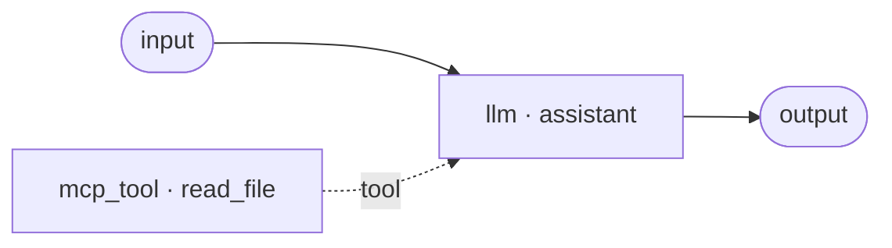

# MCP tools

An **mcp_tool** node calls one tool on an external MCP server. MCP — the Model Context Protocol — is an open standard for exposing tools (a filesystem browser, a database client, a computer-vision model, a company API) to an agent. Where a [built-in or REST tool](tools.md) is defined inside TheYgent, an MCP tool lives in a separate server process that you register once and then reference from any agent. It is an **activity** node.

## Where the node comes from

`mcp_tool` is not a separate item in the node palette. To add one, drop a **Tool** node onto the canvas and choose **MCP** in the inspector's **Kind** picker. (Agents you import that already contain `mcp_tool` nodes still render normally.)

## Ports

Same shape as the other tool nodes.

| Port | Direction | Required | Description |
|---|---|---|---|
| `in` | in | yes* | The node's input, used when the tool runs as a step. *Left unfed when the node is a capability (exempt from the required-port check). |
| `out` | out | — | The tool's return value on success. |
| `err` | out | — | The error message when the call fails. Its port type is `error`. |
| `use` | out | — | The violet capability handle. Wire it into an llm's `tools` port to let the model call the tool. |

## Configuration

| Field | Type | Default | Description |
|---|---|---|---|
| `tool` | string | *(required)* | The tool name the server exposes. In the inspector this is a **searchable picker** over the tools the chosen server actually reports; it degrades to a free-text field when the server can't be reached, so authoring is never blocked. |
| `server` | string | `null` | A name-keyed MCP server's name (registered through the admin API). Set **this or** `connection`, never both. |
| `connection` | string | `null` | The id of an `mcp_server` connection — anything created on the [MCP page](../../mcp/index.md): hub installs, remote servers with auth, OpenAPI/GraphQL servers, stdio servers with secret env. Set **this or** `server`, never both. |
| `args` | object | `{}` | Arguments for the tool in step mode. `$in` references are allowed. In capability mode the model supplies them. |
| `description` | string | `null` | An optional "use this when…" hint for the model in capability mode. MCP tools already describe themselves through the server, so this is a nudge, not a requirement. |

You must set **exactly one** of `server` or `connection`. The inspector shows both pickers and picking one clears the other automatically; the tool picker works the same against either target.

## The MCP page

Servers are set up and managed on the **MCP** page in the sidebar, which has [its own section in these docs](../../mcp/index.md). The short version: **Browse hubs** installs a published server from an MCP registry, and **Add server** defines one by hand — a local **stdio** subprocess, a **remote** HTTP/SSE endpoint, or a generated server derived from an **OpenAPI** spec or a **GraphQL** endpoint. Everything lands in one list with transport and connected badges and per-row **Tools** / **Warm** / **Close** / **Delete** actions (plus **Connect** for OAuth sign-in).

Below the list, the **tool tester** runs a single tool through a throwaway one-node graph so you can check it works before wiring it into an agent. When a tool returns image detections (bounding boxes with labels and scores), they are drawn over the image — handy for computer-vision servers.

Everything the MCP page creates is an `mcp_server` **connection**, referenced from an `mcp_tool` node via `connection`. The `server` field remains for name-keyed registrations made through the [admin API](../../reference/api.md) — plain stdio or remote servers that carry no secret.

## How tools are discovered

You do not list a server's tools by hand — the server reports them. When a server first connects (on first use, or when you press **Warm** or **Tools**), TheYgent calls the server's tool-listing method and caches the result for the connection's lifetime.

That cache also drives validation. When you reference a tool in an `mcp_tool` node:

- If the server is currently connected, the tool name is checked against its reported tools up front — an unknown name is rejected before the agent runs (`mcp_tool_not_found`).
- If the server is not connected, the agent is accepted and the check happens lazily at run time — a missing tool binds the node's `err` port instead of failing the run.

An unregistered server name is always rejected up front (`mcp_server_not_found`).

## Secrets in server config

MCP servers run in your trust domain — the same posture as your inference engines. How a credential reaches the server depends on the transport:

- **stdio servers** receive secrets through their environment: the Add server form's **Secret env** lines are stored encrypted and injected into the subprocess at launch (non-secret **Env** lines are stored plainly). Neither is ever echoed back or logged with its values.
- **Remote and generated servers** get their authentication built server-side from the connection's encrypted secret — a bearer token, an API-key header, basic credentials, a whole header map, OAuth2 client credentials, or interactively-minted OAuth tokens. The secret never appears in the agent document.

The [MCP page](../../mcp/index.md) is the normal place to set all of this up. A connection can also be created from the [editor](../editor.md): click empty canvas so nothing is selected and use the **Connections (tool / MCP auth)** panel, with the credential in the write-only **Secret** field.

## Calling MCP tools from an llm

Like any tool node, an `mcp_tool` can be a **step** (wired with data edges, arguments templated with `$in`) or a **capability** the model calls itself. To make it a capability, wire its violet `use` handle into an [llm node's](llm.md) `tools` port with a **tool** edge.

Two things make MCP capabilities especially convenient:

- **The node's id becomes the function name** the model calls — rename the node to give the model a clear name.
- **MCP tools self-describe.** The server already provides each tool's schema, so — unlike a REST capability — you do not write a `parameterSchema`. An optional `description` on the node nudges the model on when to use it.

## Behavior notes

- **Error contract.** A tool-level error the server reports, an unknown tool name, or a connection failure all bind the node's `err` port; the run continues. A tool error is structured output, not a run failure.
- **Reconnect once, then fail honestly.** On a transport failure the manager retries the connection once; if it still fails, the node binds `err`.
- **Lazy connect and reuse.** A server connects on first use and stays connected for the control plane's lifetime (there is no idle-timeout teardown — server processes are cheap). **Warm** pre-connects; **Close** tears the connection down but keeps the registration.
- **Per-call timeout.** A single tool call is capped at 120 seconds by default, tunable with `THEYGENT_MCP_CALL_TIMEOUT_S` (see the [environment reference](../../reference/environment.md)).
- **Wrong node type.** A plain `tool` node pointing at an MCP binding is rejected up front (`tool_binding_mismatch`) — use an `mcp_tool` node instead.

## Worked example — a filesystem tool as a capability

Give an assistant read access to files through a filesystem MCP server, and let it decide when to read.



Add a `filesystem` server on the MCP page (**Add server → Stdio**: command `npx`, args `-y @modelcontextprotocol/server-filesystem /tmp`), then add a Tool node, choose **MCP**, pick the server, and pick `read_file` from the tool list:

```json
{
  "id": "read_file",
  "type": "mcp_tool",
  "kind": "activity",
  "config": { "tool": "read_file", "connection": "con_01hzy…" }
}
```

(A name-keyed server registered through the admin API is referenced with `"server": "filesystem"` instead.)

Wiring its `use` handle into the llm's `tools` port exposes it as a `read_file` function the model can call. To use the same node as a **step** instead — reading one fixed file each run — feed its `in` port and template the path, for example `"args": { "path": "$in.in.path" }` when the run input is an object like `{"path": …, "question": …}`. See [Input references](../input-references.md) for the `$in` grammar.

## Works well with

- [MCP servers](../../mcp/index.md) — the MCP page: browse hubs, the four ways to add a server, OAuth sign-in.
- [The llm node](llm.md) — the `tools` port that turns an MCP tool into a model capability.
- [Tool nodes](tools.md) — built-in and REST tools, wired the same two ways.
- [Input references](../input-references.md) — the `$in` grammar for templating arguments in step mode.
- [Nodes, ports, and edges](../../concepts/nodes-ports-edges.md) — how tool-channel edges differ from data edges.
