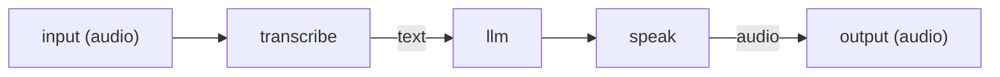

# Media nodes: transcribe, speak, imagine

These three **activity** nodes call multimodal models: `transcribe` turns speech into text, `speak` turns text into speech, and `imagine` generates an image from a text prompt. They are the building blocks of voice agents and image-generating agents.

They pass audio and image data **by reference**, never as inline blobs. A `transcribe` node reads an audio *reference*; `speak` and `imagine` produce an audio or image *reference*. The bytes themselves are stored as local artifact files — they are never written into run history or session turns, and a resumed durable run replays the reference rather than the media.

## Artifacts, in brief

An **artifact** is a blob of media (audio or image) stored on your machine and addressed by an id like `art_...`. Generated bytes live on the local filesystem under `THEYGENT_ARTIFACT_DIR` (default: a `theygent-artifacts` folder in the system temp directory). To turn a reference back into playable/viewable media, the chat client downloads it from `GET /artifacts/{ref}`, which serves only stored `art_...` ids — it cannot read arbitrary files.

See [Voice input/output](../../chat/voice.md) and [Image input and generation](../../chat/vision-and-images.md) for how these nodes show up in chat.

## Models these nodes need

Each media node references a model by its **logical id** — the same way an [llm node](llm.md) does — and each needs a model registered with a matching **modality**:

| Node | Required modality | Local engine that serves it |
|---|---|---|
| `transcribe` | `audio.transcription` | whisper.cpp (`whisper-server`) |
| `speak` | `audio.speech` | the MLX audio server (`mlx_audio.server`) on Apple Silicon |
| `imagine` | `images.generation` | stable-diffusion.cpp (`sd-cli`) via the llama.cpp binding, or FLUX (`mflux`) on Apple Silicon via the MLX binding |

If a node's model binding names an engine instead of a logical id, the run is rejected up front (`engine_name_not_allowed`). See [Installing models](../../models/installing.md) and [the engines](../../models/engines.md) for how to register each kind.

---

## transcribe — speech to text

Reads audio and returns its transcript.

### Ports

| Port | Direction | Required | Description |
|---|---|---|---|
| `audio` | in | yes | An audio reference: a stored artifact id, an `http(s)` URL, or a local file path. |
| `text` | out | — | The transcript text. |
| `err` | out | — | An `error`-typed handle carrying a fetch or transport failure. |

### Configuration

| Field | Type | Default | Description |
|---|---|---|---|
| `model` | string | — (required) | A logical model id with the `audio.transcription` modality. |
| `params` | JSON object | `{}` | Passed through to transcription. Common keys: `language`, `prompt`, `temperature`, `response_format` (`json` \| `text` \| `verbose_json`). |

### Behavior

The node fetches the audio bytes from the reference and streams them to the inference plane's transcription endpoint — the transcription *model call* goes straight to your inference plane, not through a control-plane inference route. (The audio itself is stored as a control-plane [artifact](../../chat/voice.md); it is the model call, not the storage, that bypasses the control plane.) On a fetch or transport failure the error binds to `err` and the run continues; wire `err` to handle it. The inspector gives this node a dedicated parameter panel with per-field help.

---

## speak — text to speech

Turns text into an audio artifact.

### Ports

| Port | Direction | Required | Description |
|---|---|---|---|
| `text` | in | yes | The text to synthesize. |
| `audio` | out | — | A reference to the produced audio artifact. |
| `err` | out | — | An `error`-typed handle carrying a synthesis failure. |

### Configuration

| Field | Type | Default | Description |
|---|---|---|---|
| `model` | string | — (required) | A logical model id with the `audio.speech` modality. |
| `params` | JSON object | `{}` | Voice controls: `voice` (omitted → the engine's own default), `speed`, `format` (`mp3` \| `wav` \| `opus` \| `flac` \| `aac` \| `pcm`). |

### Behavior

The node calls the inference speech endpoint, stores the returned audio as a new artifact, and emits the reference on `audio`. On the wire, the node's `format` key becomes the request's `response_format`, and it sets the artifact's MIME type. When `params` omits it, `format` defaults to `mp3`.

!!! tip "Only set a voice your engine actually has"
    **`voice` has no default** — when you leave it out, no voice is sent and the engine synthesizes with its own. That is deliberate: voice vocabularies are engine-specific, so a name from one engine is not a voice on another. A hosted-API name like `alloy`, for instance, does not exist on a local kokoro build.

    Getting this wrong is worth recognising, because the symptom does not look like a bad parameter: a speech server asked for a voice it does not have accepts the request, answers `200`, and then aborts the response body with no message. The run reports *the speech engine aborted mid-synthesis* and names the voice it asked for. If **every** input fails, it is the voice (or an unloadable model), not the text.

    The trade-off runs the other way for a **hosted** TTS API, where `voice` is a required request field: leave it out and the provider rejects the call with its own error, relayed verbatim. Name a voice that provider offers when you point a `speak` node at one. TheYgent does not guess on your behalf in either direction — a guess is what breaks the local case silently.

---

## imagine — text to image

Generates an image from a text prompt.

### Ports

| Port | Direction | Required | Description |
|---|---|---|---|
| `in` | in | yes | The text prompt describing the image. |
| `out` | out | — | A reference to the produced image artifact. |

### Configuration

| Field | Type | Default | Description |
|---|---|---|---|
| `model` | string | — (required) | A logical model id with the `images.generation` modality. |
| `params` | JSON object | `{}` | Generation controls: `size` (`WxH`, snapped to multiples of 64, default `512x512`), `n` (clamped 1–4), `steps`. |

### Behavior

The node sends the prompt to the inference image endpoint, stores the produced bytes as an image artifact, and emits the reference on `out`. Image generation loads weights per request and is serialized on the inference plane (one render at a time), so it can be slow — the run stream sends keepalives during the wait so the connection is not mistaken for a dead one.

Unlike `transcribe` and `speak`, `imagine` has **no `err` port**. If generation fails, the node emits nothing, and the run surfaces an honest empty-output reason naming the cause (the run stays `completed` with a note rather than a hard failure). In the inspector this node uses the generic form — a plain `model` field plus a raw JSON `params` box.

---

## Example: a voice agent

An audio-in / audio-out agent transcribes your speech, answers with a language model, and speaks the answer back. This is exactly the shape [chat's voice agents](../../chat/voice.md) run.

- The `input` boundary node declares `modality: "audio"`, so chat gives it a microphone composer; the recorded clip is uploaded as an artifact and the run input becomes that reference.
- `transcribe` reads the reference and produces text on `text`.
- The `llm` node answers (see [the llm node](llm.md)).
- `speak` synthesizes the answer and emits an audio reference.
- The `output` boundary node declares `modality: "audio"`, so the run's output is the audio reference, which chat downloads into a playable bubble.

An image-generating agent follows the same idea with `imagine` feeding an `output` node whose `modality` is `image`.

## Works well with

- [Input and output nodes](input-output.md) — the boundary `modality` that turns an agent into a voice or image agent.
- [Voice input/output](../../chat/voice.md) and [Image input and generation](../../chat/vision-and-images.md) — how these nodes appear in chat.
- [Installing models](../../models/installing.md) and [The engines](../../models/engines.md) — registering the transcription, speech, and image models.
- [The Bench](../../running/bench.md) — test a speech, transcription, or image model on its own before wiring it in.
