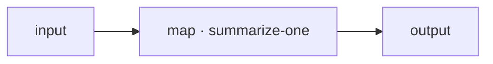

# Orchestration nodes: subgraph, loop, map

These three nodes compose *other saved agents* into a larger one: `subgraph` runs another agent once, `loop` runs one repeatedly, and `map` runs one across every item in a list. They are how you build agents out of smaller, reusable agents instead of one giant graph.

All three are **durable-only** — they run only on the durable runtime. The reason is practical: each of them drives one or more child runs, which can take real time, and the durable runtime journals every completed step so a crash resumes from where it left off instead of restarting the whole thing. A bounded loop halfway through its iterations, or a fan-out with some branches still running, must survive a restart without redoing finished work. See [Durable runs](../../running/durable.md) for the full picture, and [Agents and graphs](../../concepts/agents-and-graphs.md) for what "a saved agent" means.

!!! note "How you pin the child agent"
    Every one of these nodes runs a **saved agent version**, pinned so composition is immutable. In the inspector you pick the child **agent** and then a **body version** (newest first). Pinning by content hash instead of version is available through the node's **Code** view. You must pin exactly one of `version` or `contentHash` — the editor flags it as an error otherwise. Publishing a new version of the child later does *not* change what a pinned node runs.

---

## subgraph — run another agent once

Runs a saved agent as a single step and returns its output. A **boundary** node.

### Ports

| Port | Direction | Required | Description |
|---|---|---|---|
| `in` | in | yes | The input passed to the child agent. |
| `out` | out | — | The child agent's output. |
| `err` | out | — | Carries the failure if the child run fails (`error`-typed handle). |

### Configuration

| Field | Type | Default | Description |
|---|---|---|---|
| `agent` | string | — (required) | The saved agent id to run. |
| `version` | string | `null` | The child version to pin. Pin exactly one of `version` / `contentHash`. |
| `contentHash` | string | `null` | Pin the child by content hash instead (set via the Code view). |
| `maxDepth` | integer | `8` | Maximum nesting depth. A subgraph that nests deeper than this fails honestly rather than recursing without bound. |

### Behavior

- The child agent runs to completion; its output flows out `out`.
- If the child run fails, the failure is bound to `err` — wire `err` to an `output` (or a recovery branch) to handle it instead of failing the parent.
- The pin is folded into the parent's own content — composing a child version is itself immutable. Exceeding `maxDepth` (for example, a subgraph that transitively includes itself) is a clean failure, not a hang.

---

## loop — run an agent repeatedly

Runs a saved agent in sequence, feeding each iteration's output into the next, up to a bounded number of iterations. An **orchestration** node.

### Ports

| Port | Direction | Required | Description |
|---|---|---|---|
| `in` | in | yes | The input to the first iteration. |
| `out` | out | — | The final iteration's output. |

### Configuration

| Field | Type | Default | Description |
|---|---|---|---|
| `agent` | string | — (required) | The saved agent to run each iteration. |
| `maxIterations` | integer | — (required, ≥ 1) | The hard cap on iterations. There are no unbounded loops; the default of `0` is invalid and must be raised to at least 1. |
| `condition` | string | `null` | An optional `$in` reference over the iteration's output; the loop stops early when it resolves truthy. |
| `version` / `contentHash` | string | `null` | Pin exactly one. |
| `maxDepth` | integer | `8` | Maximum nesting depth. |

### Behavior

- Each iteration's output becomes the next iteration's input.
- The loop stops at whichever comes first: `maxIterations` reached, or `condition` resolving truthy on an iteration's output. The last output flows out `out`.
- Completed iterations are journaled — on a crash-resume they are never re-run.

`condition` uses the same [input-reference grammar](../input-references.md) as everywhere else. For example, `$in.done` stops the loop as soon as an iteration returns an object with a truthy `done` field.

---

## map — fan out across a list

Runs a saved agent once per element of a list — the fan-out primitive. An **orchestration** node.

### Ports

| Port | Direction | Required | Description |
|---|---|---|---|
| `in` | in | yes | Must be a **list**. One child run is started per element. |
| `out` | out | — | The collected results (one per element). |

### Configuration

| Field | Type | Default | Description |
|---|---|---|---|
| `agent` | string | — (required) | The saved agent to run for each element. |
| `concurrency` | integer | `null` | Maximum child runs in flight at once. `null` means unbounded. |
| `onError` | enum `fail_fast` \| `collect` | `fail_fast` | `fail_fast` stops on the first failing element; `collect` gathers successes alongside per-element errors. |
| `version` / `contentHash` | string | `null` | Pin exactly one. |
| `maxDepth` | integer | `8` | Maximum nesting depth. |

### Behavior

- The input must be a list; each element becomes the input to one child run.
- `concurrency` bounds how many run at the same time; leave it `null` to let them all run at once.
- With `onError: "fail_fast"` the map fails as soon as any element fails. With `onError: "collect"` it finishes and returns every success plus a per-element error for the ones that failed.
- On a crash, only the incomplete branches resume — finished elements are not re-run.

---

## Example: summarize each document in a batch

A parent agent takes a list of documents and maps a saved `summarize-one` agent over them.



The `map` node's configuration:

```json
{
  "type": "map",
  "kind": "orchestration",
  "config": {
    "agent": "summarize-one",
    "version": "1.2.0",
    "concurrency": 4,
    "onError": "collect"
  }
}
```

Give this agent a list as input (a multi-input agent drills in with `$in.in.<field>` — see [input references](../input-references.md)); it runs up to four summaries at a time and collects the results, recording per-element errors instead of failing the whole batch.

## Running an agent that uses these nodes

Because all three are durable-only, run them the durable way:

- **From the interface:** publish the agent, then use **Run durably** on the Agents page (a single **Run durably** button appears for any agent containing a durable-only node). This needs the control plane started with `THEYGENT_DURABLE=1`.
- **Unattended:** deploy the agent behind a [schedule or webhook trigger](../../running/triggers.md) — in durable mode, triggered runs are durable automatically.

## Works well with

- [Drafts & publishing](../saving-agents.md) — the child agents these nodes compose must be published and versioned first.
- [Versioning](../../concepts/versioning.md) — why pinning a child by version or content hash keeps composition immutable.
- [Durable runs](../../running/durable.md) — the runtime these nodes require, and how to enable it.
- [Human node](human.md) — the fourth durable-only node, for pausing on human input.
