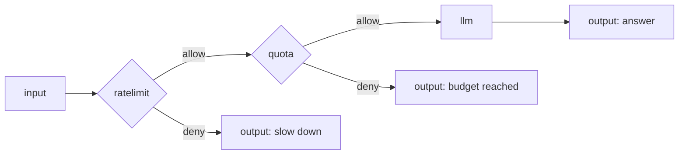

# Rate limit and quota nodes

Both of these are **gate** nodes: they sit in front of expensive work and split the run into `allow` and `deny`. They are **compute** (`activity`) nodes. The difference is what they count:

| | **ratelimit** | **quota** |
|---|---|---|
| Counts | **requests** — one hit each time the node runs | **tokens** — model usage already recorded on the run's spans |
| Trips when | the hit count in the window passes `limit` | recorded usage reaches `budgetTokens` |
| Backed by | a fixed-window counter in Postgres | a read of the agent's usage spans (never re-metered) |
| Typical use | "no more than 30 calls a minute per user" | "no more than 100k tokens an hour for this agent" |

Both keep the input value on `allow` and emit a clean deny result on `deny` — they never hang or error.

## Shared ports

| Port | Direction | Required | Description |
|---|---|---|---|
| `in` | in | yes | The value passing through the gate. |
| `allow` | out | — | Carries the input through **unchanged** when the gate lets it pass. |
| `deny` | out | — | Carries `{ "denied": true, "reason": "…" }` when the gate trips. |

Exactly one of `allow` / `deny` activates per run; the other branch is dead and everything downstream of it is skipped.

## The key: `keyExpr`

**Only `ratelimit` counts per key.** Its request counter is bucketed by `keyExpr`, so different callers get separate request budgets. `keyExpr` decides the key:

- An [input reference](../input-references.md) such as `$in.in.userId` resolves a per-caller key from the input — each distinct value gets its own bucket.
- Any other string is used **as a literal** — a single shared bucket for everyone. (An `$in` reference that can't be resolved falls back to the literal string, so a bad reference never crashes the run.)

For unattended runs, the natural key comes from the [trigger](../../running/triggers.md) that fired the agent — resolve it from the input the trigger delivers.

**`quota` ignores `keyExpr` today.** The token budget is summed per *agent*, not per key — every caller draws from the same budget no matter what `keyExpr` is set to. The field is still required by the schema, but it has no effect on a quota gate (per-user token attribution is not yet available).

## ratelimit

Denies once too many requests hit the same key inside a fixed time window.

### Configuration

| Field | Type | Default | Description |
|---|---|---|---|
| `keyExpr` | string (required) | `""` | The per-caller key (see [above](#the-key-keyexpr)). |
| `limit` | integer (required) | `0` | Requests allowed per key per window. Set a real positive value. |
| `windowSeconds` | integer (required) | `0` | The window length in seconds. Set a real positive value. |
| `policy` | `deny` \| `wait` | `deny` | Leave at `deny`, which emits the `deny` port. `wait` (a bounded suspend) is named in the schema but **not yet implemented** — use `deny`. |

### What counts and when it trips

Each time a run reaches the node, it records **one hit** against `<agent>:<node>:<key>` for the current window and then denies once the count is **greater than** `limit` — so `limit` requests pass and the next one denies. The deny reason reads `rate limit exceeded (<limit>/<windowSeconds>s)`.

!!! note "Fixed windows, not sliding"
    The window is `floor(now / windowSeconds)`; the count resets to zero at each boundary. This is a simple fixed window — a burst straddling a boundary can briefly exceed the nominal rate. It is a lightweight throttle, not a precise sliding-window limiter.

## quota

Denies once the agent has already spent its token budget in the window. It **reads** usage that model calls recorded; it does not re-measure anything.

### Configuration

| Field | Type | Default | Description |
|---|---|---|---|
| `keyExpr` | string (required) | `""` | Required by the schema but **inert** for quota — the budget is summed per agent, not per key (see [above](#the-key-keyexpr)). |
| `budgetTokens` | integer (required) | `0` | Token budget per window. Set a real positive value. |
| `windowSeconds` | integer (required) | `0` | The window length in seconds. Set a real positive value. |
| `source` | constant | `"spans"` | Fixed. Usage is read from existing spans; there is no other source. |

### What counts and when it trips

The gate sums `gen_ai.usage.total_tokens` across the **agent's** model calls within the last `windowSeconds` and denies once that total is **at or above** `budgetTokens`. The deny reason reads `token budget exceeded (<budgetTokens>/<windowSeconds>s)`.

- Every model call in the agent contributes — including a [model guardrail's](guardrail.md) judge call.
- Scope is **per agent** today: the total is summed across all of the agent's model calls, regardless of `keyExpr` (per-user attribution is not yet available).
- If no usage was recorded — for example an upstream that reports none — the sum is `0` and the gate allows.

## Shared behavior notes

- **Deny is a clean result, not an error.** A tripped gate keeps the run `completed` and sends `{ "denied": true, "reason": "…" }` out `deny`. The run never hangs and never returns a 500.
- **Wire the `deny` port.** If you leave `deny` unwired, the deny branch reaches no output and the run finishes with an honest empty-output note. Route `deny` to its own `output` (a "try again later" message) so a throttled caller gets a clear answer.
- **`allow` passes the input straight through** to the protected pipeline.
- **Gates are soft policy.** On a durable resume, a re-run step can re-count a rate-limit hit, and quota reads whatever usage has been journaled so far. Treat these as guardrails against runaway cost, not exact financial controls.

## Worked example

Throttle a public agent to 30 requests per user per minute (keyed per caller), then cap the whole agent at 50k tokens per hour, before the model runs.



The two gate configs:

```json
{ "keyExpr": "$in.in.userId", "limit": 30, "windowSeconds": 60, "policy": "deny" }
```

```json
{ "keyExpr": "$in.in.userId", "budgetTokens": 50000, "windowSeconds": 3600, "source": "spans" }
```

Each `deny` branch ends at its own `output`, so a throttled or over-budget caller gets a specific message and the model is never reached.

## Works well with

- [Guardrail node](guardrail.md) — the content check that pairs with these spend checks.
- [Triggers](../../running/triggers.md) — where the per-caller key comes from on unattended runs.
- [Observability](../../running/observability.md) — the token usage quota reads is recorded here.
- [Input references](../input-references.md) — the `$in` grammar `keyExpr` uses.
