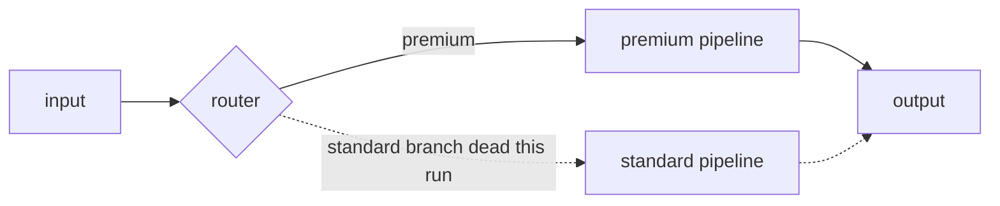
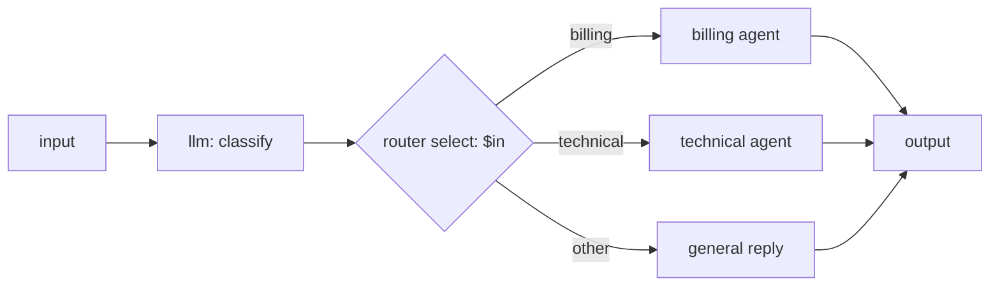

# Router node

The **router** node sends the run down exactly one of several named branches. It reads a value from its input, matches it to the name of one of its outgoing handles, and activates only that handle — every other branch, and everything downstream of it, is skipped for this run. It is a **control-flow** (`orchestration`) node.

Use it when an earlier node has already *decided* which path to take (a classifier's label, a field on the input, a guardrail's verdict) and you want the graph to follow that decision.

## Ports

| Port | Direction | Required | Description |
|---|---|---|---|
| `in` | in | yes | The value to route on. A router declares **exactly one** in-port; more than one is a run error. |
| `out` | out | — | The default outgoing branch. Add more out-ports (one per route) to actually branch — see [Adding branches](#adding-branches). |

## Configuration

| Field | Type | Default | Description |
|---|---|---|---|
| `select` | string (required) | `""` | An [input reference](../input-references.md) that must resolve to the **name of one of this node's out-ports**. This is handle-name routing, not an expression language — the value *is* the branch name. |

## How routing works

`select` is resolved against the in-port value the same way every other reference is:

- `$in` — the whole input value (use this when the input is already the branch name, e.g. a classifier that outputs just `"premium"`).
- `$in.in.<field>` — a field of the input object (use this when the input is an object like `{"tier": "premium"}` and you route on `tier`).

Whatever `select` resolves to must be a string that **equals one of the node's out-port names**. The router then:

1. activates that one out-handle,
2. forwards the in-port value **unchanged** along it, and
3. marks every other out-handle dead.

The router does not transform the value — it only chooses the path. To reshape the value on the way through, put a [transform node](transform.md) after it.

### Downstream edge-skipping

Only edges leaving the selected handle carry a value. A node is **skipped** when it has incoming data edges and *all* of them are dead — so an entire branch that the router did not choose never runs. This cascades: skip the first node of a branch and everything reachable only through it is skipped too.



Because branches are mutually exclusive, a router is the standard way to guarantee **at most one `output` node runs per run** — a rule the control plane enforces (two live outputs fail the run). Point each branch at its own output, and only the chosen one executes.

## Behavior notes

- **No fallback.** If `select` resolves to nothing, to a non-string, or to a name that is not one of the node's out-ports, the run fails with a clear `router_error` (HTTP 422) naming the value and the handles it declares. The router never guesses a default branch.
- **Exactly one in-port.** A router consumes a single value. Declaring more than one in-port is *not* caught by static validation — the graph passes and a run is created — but the router then fails that run with a `template_error` (HTTP 422) the moment it executes.
- **Add the branches yourself.** A freshly dropped router has only the `out` handle. Routing to two or more named branches means adding those out-ports (below).

### Adding branches

The wizard form edits `select` but does not add out-ports. To create named branches, select the router and switch the inspector to **Code**, then add the handles to `ports.out`:

```json
{
  "id": "n_route",
  "type": "router",
  "kind": "orchestration",
  "config": { "select": "$in.in.tier" },
  "ports": {
    "in":  [ { "id": "in" } ],
    "out": [ { "id": "premium" }, { "id": "standard" } ]
  }
}
```

Save the node, and the new `premium` / `standard` handles appear on the canvas ready to wire. For this example the input object must carry a `tier` field whose value is either `"premium"` or `"standard"`.

## Worked example

An upstream llm classifies a support message into `billing`, `technical`, or `other`, emitting just that word. The router forwards the original message down the matching branch.



The router's config is `{ "select": "$in" }`, and its out-ports are `billing`, `technical`, and `other`. Each branch ends at the same `output` node; only the taken branch reaches it, so exactly one answer is produced.

## Works well with

- [Guardrail node](guardrail.md) — the other way to branch: split `pass` vs `block` before expensive work.
- [Transform node](transform.md) — reshape a value once a branch is chosen.
- [Input references](../input-references.md) — the `$in` grammar `select` uses.
- [Nodes, ports, and edges](../../concepts/nodes-ports-edges.md) — how live and dead edges drive execution.
