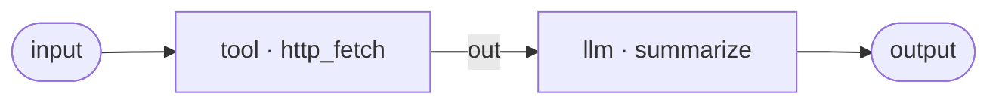
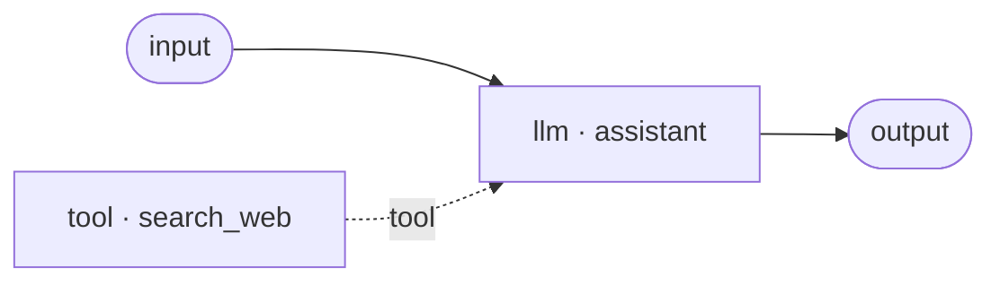

# Tool nodes

A **tool** node gives an agent an action beyond generating text: it runs a small built-in function or calls an HTTP API and passes the result on. It is an **activity** node — it has real side effects (network calls), so it is treated as non-deterministic work.

There is one Tool node with three flavours, chosen from the **Kind** picker in the inspector:

- **Builtin** — a small function TheYgent ships. Two are available: `echo` and `http_fetch`.
- **REST** — call any HTTP API, optionally authenticated through a saved connection.
- **MCP** — a tool exposed by a connected server. Picking MCP swaps the node to the `mcp_tool` type, which has its own page: [MCP tools](mcp.md).

This page covers **Builtin** and **REST**. Whichever flavour you pick, a tool node is used in one of two ways — as a step in the graph, or as a capability the model calls on its own.

## Two ways to use a tool

A single tool node can only be one of these at a time — it is **either** a capability **or** a step, never both. The editor and the validator enforce that; mixing capability wiring and data wiring on the same node is a validation error.

=== "As a step (you call it)"

    Wire a **data** edge into the tool's `in` port and read its result from `out`. The node runs at a fixed point in the graph, once per run. Its arguments come from the graph — you template them with [`$in` references](../input-references.md). Use this when *you* decide when the tool runs (fetch a page, then summarise it).

=== "As a capability (the model calls it)"

    Wire the tool's violet `use` handle into an [llm node's](llm.md) `tools` port with a **tool** edge. Now the model decides when — and whether — to call the tool during its reasoning loop, and it supplies the arguments itself. Use this to give an assistant abilities it invokes autonomously.

    Two rules make capability tools work:

    - **The node's id is the function name the model sees.** Rename the node (in the inspector's label row, which also renames its id) to give the model a clear, descriptive name like `search_web`.
    - **A capability tool must describe itself.** It needs a `description`, and a REST capability also needs a `parameterSchema` (see below). The two built-ins already self-describe, so they work as capabilities with no extra config. A capability tool is exempt from the "required in-port must be connected" rule — its `in` port is left unfed on purpose.

## Ports

Both Builtin and REST tool nodes share the same ports.

| Port | Direction | Required | Description |
|---|---|---|---|
| `in` | in | yes* | The node's input, used when the tool runs as a step. *Left unfed when the node is a capability (exempt from the required-port check). |
| `out` | out | — | The tool's return value on success. |
| `err` | out | — | The error message when the call fails. Its port type is `error`. |
| `use` | out | — | The violet capability handle. Wire it into an llm's `tools` port to expose the tool to the model. |

## Built-in tools

Built-ins are chosen with the **Builtin** kind. Set the `tool` field to the built-in's name and pass its arguments in `args`.

| Field | Type | Default | Description |
|---|---|---|---|
| `tool` | string | *(required)* | The built-in's name: `echo` or `http_fetch`. |
| `args` | object | `{}` | Arguments for the built-in. Values are literals or `$in` references. |

There are exactly two built-ins:

### `echo`

Returns the value it is given, unchanged. It touches no network — it exists to test that tool dispatch and argument templating work.

| Argument | Type | Default | Description |
|---|---|---|---|
| `value` | any | `null` | The value echoed back verbatim. |

```json
{
  "id": "echo_it",
  "type": "tool",
  "kind": "activity",
  "config": { "tool": "echo", "args": { "value": "$in" } }
}
```

### `http_fetch`

Performs an HTTP `GET` and returns the response as an object with three keys: `status` (the integer status code), `body` (the response text), and `headers` (an object). A non-200 status is a **normal return value**, not an error — only a transport failure (a timeout, an unreachable host, a refused connection) binds the node's `err` port.

| Argument | Type | Default | Description |
|---|---|---|---|
| `url` | string | *(required)* | The absolute `http(s)` URL to fetch. |
| `timeout_s` | number | `10` | Per-request timeout in seconds. |

```json
{
  "id": "fetch_page",
  "type": "tool",
  "kind": "activity",
  "config": { "tool": "http_fetch", "args": { "url": "$in", "timeout_s": 15 } }
}
```

!!! note "Argument names use `snake_case`"
    `http_fetch` takes `timeout_s`, not `timeoutSeconds`. Built-in argument names are the function's own parameter names. This is distinct from the REST tool's `timeoutSeconds` config field below.

## The REST (HTTP) tool

The **REST** kind calls any HTTP endpoint. In the inspector you configure the URL template, the method, an optional connection for authentication, and — for capability tools — a parameter schema. The remaining fields are edited in the node's **Code** view (the per-node JSON editor).

| Field | Type | Default | Description |
|---|---|---|---|
| `tool` | string | *(required)* | A logical name for the tool. |
| `urlTemplate` | string | `null` | The request URL. `$in` placeholders are filled in (from the wired input in step mode, or from the model's arguments in capability mode). |
| `method` | enum | `null` | One of `GET`, `POST`, `PUT`, `PATCH`, `DELETE`. |
| `connection` | string | `null` | The id of an `http_auth` connection that supplies authentication server-side. The IR stores the id, never the secret. |
| `headers` | object | `{}` | Extra request headers. |
| `bodyTemplate` | object | `null` | The request body for `POST`/`PUT`/`PATCH`. For GraphQL, a `{"query": …, "variables": {…}}` shape. |
| `parameterSchema` | object | `null` | A JSON Schema describing what the model fills in. Required when the tool is a capability. |
| `responseMap` | string | `null` | A mini-JSONPath (e.g. `$.data.items[0]`) that reshapes the response before it leaves the `out` port. |
| `idempotencyKey` | string | `null` | Sent as an `Idempotency-Key` header; `{runId}` and `{nodeId}` are expanded. |
| `timeoutSeconds` | number | `null` | Per-request timeout. Defaults to 30 seconds when unset. |
| `description` | string | `null` | One line telling the model when to call the tool (capability mode). |
| `args` | object | `{}` | Templated values for the URL/body placeholders in step mode. |

### Behavior of an HTTP call

- **A non-2xx status is a normal result.** The `out` port receives `{status, body, headers}` for any status the server returns. Only a transport failure (timeout, DNS failure, connection refused) or a failure while setting up authentication binds `err`.
- **Redirects are not followed.** A 3xx response comes back as an ordinary value on `out`. This protects your authentication headers from leaking to a redirect target.
- **`responseMap` never fails a 2xx.** If the JSONPath does not match anything, the unmapped response is returned instead of an error.
- A connection's `baseUrl` (if set) prefixes a relative `urlTemplate`, and a connection's static `headers` merge underneath the node's own headers.

## Authentication with connections and secrets

A REST tool never carries a credential in the agent document. Instead it references a **connection** by id, and the credential lives encrypted on your machine. When the tool runs, the connection is resolved server-side, inside the step — the secret is injected into the request there and never appears in the IR or in observability data.

### Create a connection

In the [editor](../editor.md), click empty canvas so nothing is selected. The inspector then shows a **Connections (tool / MCP auth)** panel. Choose **New connection**, then:

1. Give it a **Name**.
2. Set **Kind** to `http_auth`.
3. Put non-secret settings — the auth type, header names, base URL — in **Config (non-secret JSON)**.
4. Put the credential in the **Secret (write-only)** field. It is encrypted at rest and never shown again.

Back on the REST tool node, pick the connection from the **connection (http auth)** dropdown.

!!! tip "Rotating a secret does not change the agent version"
    A connection's secret is stored under a stable reference, so editing (rotating) the secret leaves every agent's content hash unchanged. See [Versioning](../../concepts/versioning.md) for why the hash matters.

### Auth types

Set `auth.type` in the connection's config. The secret you supply is used according to the type:

| `auth.type` | The secret is… | What the tool sends |
|---|---|---|
| `bearer` | the token | `Authorization: Bearer <secret>` |
| `api_key` | the key | The key in a header named by `auth.header` (default `X-API-Key`) |
| `basic` | the password | `Authorization: Basic base64(<auth.username>:<secret>)` |
| `oauth2_client_credentials` | the client secret | POSTs `auth.tokenUrl` (`grant_type=client_credentials`, `auth.clientId`, optional `auth.scope`), then sends the returned access token as a bearer |

If a connection has no auth type or no secret, the request proceeds without authentication.

A connection config for a bearer-token API looks like:

```json
{
  "auth": { "type": "bearer" },
  "baseUrl": "https://api.example.com"
}
```

…with the token itself supplied in the write-only Secret field.

!!! warning "Encryption key"
    Encrypted secrets are keyed by `THEYGENT_SECRET_KEY`. If you do not set it, an ephemeral key is generated with a loud warning and your stored secrets will not survive a restart. See the [environment reference](../../reference/environment.md).

## The success / error contract

On success, a tool binds its return value to `out` (and any other non-error handle). On failure it binds the error **message** to `err` and **the run keeps going** — a tool error is structured output, not a crashed run. Downstream nodes fed only by the un-taken branch are skipped. Wire the `err` port somewhere (an output node, a fallback branch) if you want to handle failures; leave it unwired to simply stop that branch.

## Worked example — a tool as a step

Fetch a URL, then summarise the page with an llm.



The `input` value (a URL string) flows into `http_fetch` via `$in`; the fetched `{status, body, headers}` object flows to the llm, whose message drills into it with `$in.in.body`. The tool's `err` handle is left unwired here, so a transport failure leaves the `out` branch dead and the run completes with an honest "upstream error" note instead of a value.

## Worked example — a tool as a capability

Give an assistant the ability to search, and let it decide when to call it.



The `search_web` node's `use` handle is wired into the llm's `tools` port (the dotted **tool** edge). Because it is a capability, its URL placeholders are filled by the model's function arguments, and its `parameterSchema` tells the model what to supply:

```json
{
  "id": "search_web",
  "type": "tool",
  "kind": "activity",
  "config": {
    "tool": "search_web",
    "urlTemplate": "https://api.example.com/search?q=$in.query",
    "method": "GET",
    "connection": "con_01hzy…",
    "description": "Search the web for a query and return the top results.",
    "parameterSchema": {
      "type": "object",
      "properties": { "query": { "type": "string", "description": "the search query" } },
      "required": ["query"]
    }
  }
}
```

The `$in.query` placeholder in the URL and the `query` property in the schema must line up: every placeholder needs a matching property, and every property needs a placeholder. A mismatch is a validation error caught before the agent runs.

## Works well with

- [The llm node](llm.md) — the `tools` port that turns a tool into a model capability.
- [MCP tools](mcp.md) — tools hosted by external servers, wired the same way.
- [Input references](../input-references.md) — the `$in` grammar for templating arguments and URLs.
- [Observability](../../running/observability.md) — inspect a tool node's input and output in the run waterfall.
