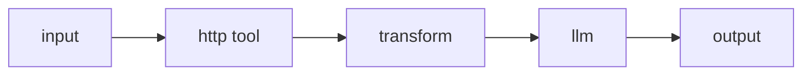

# Transform node

The **transform** node reshapes a value without an LLM. You give it a small JSON template; it copies the shape verbatim, and wherever a string leaf is an [input reference](../input-references.md) it substitutes the referenced value. It is a **control-flow** (`orchestration`) node — deterministic, with no model call and no I/O.

Reach for it to adapt one node's output to the next node's expected input: pick a field out of an object, rename keys, wrap a value in a new structure, or assemble an object from several inputs.

## Ports

| Port | Direction | Required | Description |
|---|---|---|---|
| `in` | in | yes | The value(s) to reshape. References in the template resolve against this node's in-ports. |
| `out` | out | — | The reshaped value. There is **no `err` port** — a bad template fails the run (see below). |

## Configuration

| Field | Type | Default | Description |
|---|---|---|---|
| `expr` | string (required) | `""` | A JSON document that is the output shape. String leaves that are exactly an input reference are replaced with the referenced value; everything else is kept literally. |

## The operations you can express

`expr` is parsed as JSON, then walked leaf by leaf:

- A string leaf that is **exactly** a reference — `$in`, `$in.<port>`, or `$in.<port>.<field>` — is replaced with that value, keeping its real type (a number stays a number, an object stays an object).
- **Every other string is a literal.** A string like `"Hello $in.in.name"` is *not* interpolated — it is stored as-is. References must stand alone as the whole leaf value. (This deliberately protects strings that contain a `$`, such as a GraphQL query.)
- Numbers, booleans, and `null` pass through unchanged.
- Objects and arrays are copied structurally, resolving each of their leaves the same way.

From those rules you can:

| Goal | `expr` |
|---|---|
| Take one field out of the input object | `"$in.in.city"` |
| Build a new object from input fields | `{ "q": "$in.in.query", "topK": 5 }` |
| Rename / reorder keys | `{ "userId": "$in.in.id", "name": "$in.in.fullName" }` |
| Wrap a value in a structure | `{ "messages": [ { "role": "user", "content": "$in" } ] }` |
| Combine several named in-ports | `{ "a": "$in.left", "b": "$in.right" }` |

!!! note "Not a code node"
    The transform node runs a fixed JSON template — it never executes user code, calls a network, or reads files. It is deterministic and replays identically on a durable resume. Richer expression languages are not part of it today; if the template form can't express your reshape, do it in an [llm node](llm.md) or an [http tool](tools.md).

## Behavior notes

- **Failures are loud.** If `expr` is not valid JSON, or a reference in it can't be resolved (an unknown port, or drilling into a field that isn't there), the run fails with a `transform_error` (HTTP 422). There is no `err` port and no silent pass-through — a broken reshape stops the run rather than emitting nonsense.
- **Typed substitution.** Because a whole-leaf reference keeps the value's type, `{ "n": "$in.in.count" }` yields a real number `{ "n": 3 }`, not the string `"3"`.
- **Multiple inputs.** If several data edges feed different named in-ports, reference each by its port name (`$in.<port>`). See [multi-input references](../input-references.md).

## Worked example

An http tool returns a large JSON body; you only want two fields to hand to the llm.



With the tool's result on the transform's default in-port, `expr` extracts and renames:

```json
{
  "temperature": "$in.in.current.temp_c",
  "summary": "$in.in.current.condition.text"
}
```

The llm node downstream then references `$in.in.temperature` and `$in.in.summary` in its message text.

## Works well with

- [Input references](../input-references.md) — the `$in` grammar every leaf uses.
- [Router node](router.md) — choose a branch; transform reshapes the value on it.
- [Tools](tools.md) — adapt a tool's raw response before the next step.
- [Nodes, ports, and edges](../../concepts/nodes-ports-edges.md) — how values flow between ports.
