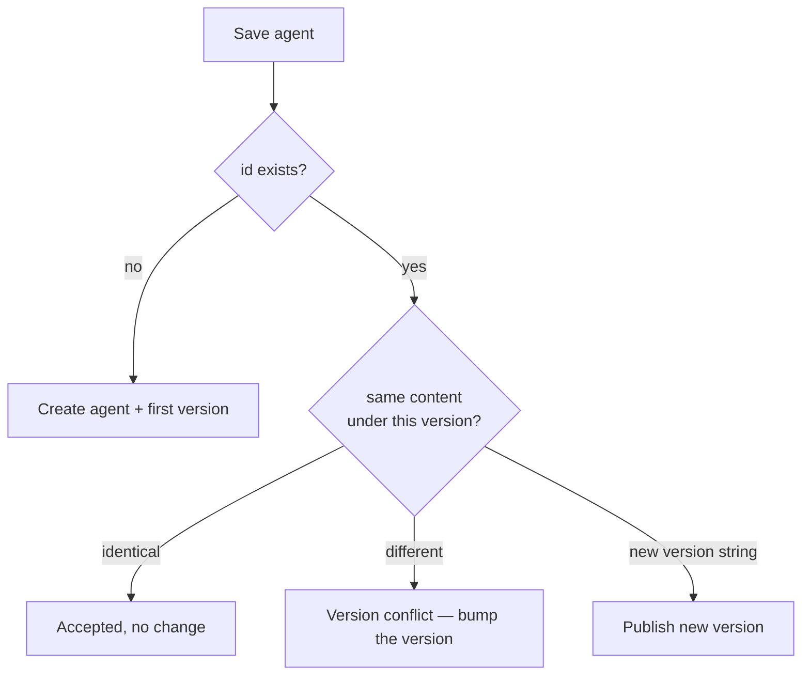

# Saving agents

Saving turns the graph on your canvas into a named, immutable agent version that you can run by reference, invoke over HTTP, or deploy behind a trigger. Saving is content-addressed: the server hashes the document, so two identical graphs are the same version and any real change is a new one. This page covers the id/name/version fields, the save flow, and where saved agents go.

## The id, name, and version fields

The editor toolbar carries three text fields that identify the agent:

| Field | What it is |
|---|---|
| **id** | The agent's stable identifier (for example `agent.triage`). It is the registry coordinate together with the version. Once the agent exists in the registry this field is locked — an id is permanent. |
| **name** | A human-readable display name. You can change it on any new version. |
| **version** | The version string you are saving, for example `0.1.0`. You bump this yourself. |

A brand-new blank graph starts as `agent.untitled`, *Untitled agent*, version `0.1.0`. Set a real id and name before your first save, because the id can't change afterward.

## Saving

1. **Make the graph valid.** Save is disabled while any [validation errors](editor.md#validation) exist; the button reads *Fix N validation error(s) before saving.* Warnings do not block saving.
2. **Set the id, name, and version** in the toolbar. (For an existing agent the id is already locked; just adjust the version.)
3. **Click Save agent** — or press ++cmd+s++ / ++ctrl+s++.

The server strips the canvas layout, computes the content hash over the rest, stores the version, and returns that hash — which the toolbar then displays. **Your browser never computes the hash;** the server is the single source of truth for it. After a successful save the URL re-points to the version you just saved, and the status badge flips to **saved**.

The status badge tracks where you stand: **not saved** for a graph that has never been saved, **modified** once the hashed content diverges from the last save, and **saved** when they match. **Revert** discards changes back to the last saved snapshot and is enabled only while modified.

!!! note "Layout is not content"
    Dragging nodes, zooming, collapsing a panel, or changing a node's icon all live in the layout block, which is *not* hashed. None of them mark the graph modified or create a new version — only a real change (a config value, a message, an edge) does.

## Versions are immutable

A saved version is frozen. You never edit a version in place; you publish a new one. Because the identity is a content hash, the registry enforces a few rules on save:

- **A new id** creates the agent and its first version.
- **A new version string on an existing agent** publishes a new version.
- **Re-saving the exact same content under the same (id, version)** is accepted as a no-op — saving twice does nothing new.
- **Different content under a version string that already exists** is rejected. You will see a *version conflict* toast; bump the **version** field and save again.

The editor smooths over one detail: if you build what looks like a new graph but its id already exists in the registry, the save is automatically redirected to "add a version" to that agent instead of failing.



For the deeper story on why the hash makes composition and history reliable, see [agent versioning](../concepts/versioning.md).

## Where saved agents appear

A saved agent shows up in several places:

- **The Agents page** (`/`) lists every saved agent, newest first, with its latest version and version count. This is the home for running and re-opening agents.
- **Re-open for editing** by clicking the agent's card — the editor loads its latest version. You can also open a specific version directly.
- **New Chat** lets you pick a saved agent as a conversation target, with a version picker. See [chat](../chat/index.md).
- **Subgraph, loop, and map** nodes compose *other* saved agents by id and pinned version — so once saved, an agent can become a building block inside another. See [subgraph, loop and map](nodes/orchestration.md).

## Running a saved agent

Running happens from the **Agents** page, not the editor. Each agent card has a **Run** button that opens a bench modal:

- **Run** streams the agent interactively — you type an input and watch the answer stream back.
- The caret next to it offers **Run durably**, which executes the agent on the durable runtime (checkpointed, crash-resumable). This requires the server's durable mode.
- An agent that contains a durable-only node (`human`, `subgraph`, `loop`, or `map`) shows a single **Run durably** button, because those nodes can't run on the interactive path.

See [running agents](../running/index.md) for run statuses and output rules, and [durable runs](../running/durable.md) for what durable mode buys you.

### Running from the API

Saved agents are also reachable over HTTP on the control plane (default `http://localhost:8080`). The interactive endpoint takes the agent id and an input:

```bash
curl http://localhost:8080/agents/agent.triage/runs \
  -H "Content-Type: application/json" \
  -d '{"input": "cancel my subscription", "stream": false}'
```

You can pin a specific version with `"version"` or a specific hash with `"content_hash"`; otherwise the latest published version runs. There is also a token-authed, non-interactive `POST /agents/{id}/invoke` for unattended callers, and a fire-and-poll `POST /agents/{id}/durable-runs` for durable execution. The full surface is in the [API reference](../reference/api.md).

!!! note "Agents are permanent"
    There is no delete for agents, agent versions, or runs — once published, a version stays in the registry. (Sessions, triggers, connections, and MCP servers can be deleted.) Publish a new version rather than trying to remove an old one.

## Related pages

- [The editor](editor.md) — building and validating before you save
- [Agent versioning](../concepts/versioning.md) — content hashing and immutability, in depth
- [Running agents](../running/index.md) — statuses, output, and the run list
- [Triggers and webhooks](../running/triggers.md) — deploying a saved agent behind a schedule or webhook
