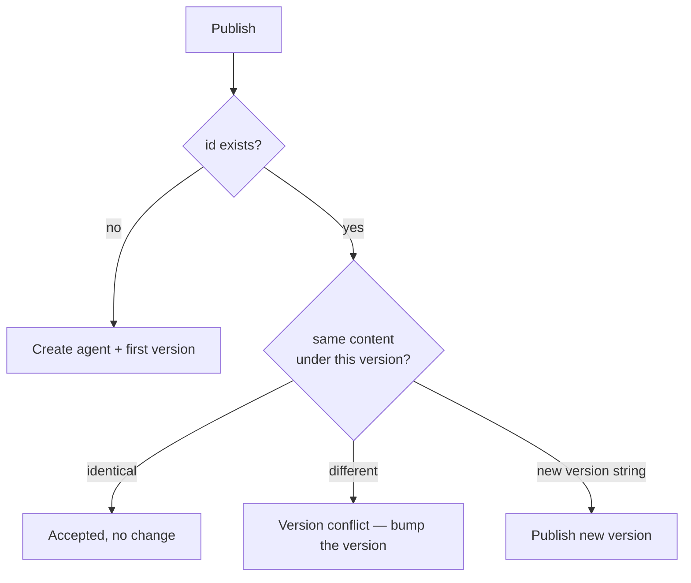

# Drafts & publishing

The editor keeps your work in two tiers, with two different verbs:

- **Drafts save themselves.** As you edit, the graph autosaves to a **draft** on the control plane — a mutable work-in-progress that survives a reload, a crash, or a week away. A draft may be half-wired or outright invalid; that is the point.
- **Publishing is deliberate.** **Publish** turns the graph into a named, **immutable agent version** that you can run by reference, invoke over HTTP, or deploy behind a trigger. Publishing is content-addressed: the server hashes the document, so two identical graphs are the same version and any real change is a new one.

This page covers both tiers: how drafts behave, the id/name/version fields, the publish flow, and where published agents go.

## Drafts: the automatic tier

You never click anything to save a draft. A couple of seconds after your first real edit, the editor creates one and keeps it updated as you work; the toolbar shows where you stand — *Saving draft…*, then *Draft saved just now*. Press ++cmd+s++ / ++ctrl+s++ to flush a save immediately. If a save ever fails, the toolbar shows **Draft save failed — retry**; click it to try again.

A few properties worth knowing:

- **Drafts are allowed to be broken.** Validation gates *publishing*, never the draft — a graph with unwired ports or half-configured nodes still autosaves, so you can stop mid-thought and come back.
- **Layout is saved too.** Unlike a published version's content hash, a draft keeps your node positions, so reopening it looks exactly like you left it.
- **The URL follows the draft.** Once a draft exists, the editor's URL carries `?draft=<id>` — reloading the tab reopens that exact session.
- **One draft per editing session.** Editing a published agent creates a draft *linked to that agent*; a brand-new graph creates a standalone one. Publishing removes the draft — the registry owns the content from then on.

### Where drafts live

The **Agents** page (`/agents`) shows a collapsible **Drafts** strip above the published grid, most recently edited first, with the draft's name, node count, and when it was last saved. **Open** resumes the editing session; **Discard** deletes the draft after a confirmation (published versions are never affected). A published agent that has draft edits also wears a small amber **draft** badge on its card.

If you open a published agent that has a lingering draft (from an earlier session, or another tab), the editor shows a banner — *A draft of this agent has unpublished changes* — with **Open draft** and **Discard it**, so you never unknowingly edit beside your own unfinished work.

!!! note "Drafts are not versions"
    A draft has no content hash, no version history, and no run-by-reference identity. Nothing can pin, invoke, or compose a draft — only published versions have those properties. Think of the draft as your workbench and the registry as the shelf.

## The id, name, and version fields

The editor toolbar carries three text fields that identify the agent:

| Field | What it is |
|---|---|
| **id** | The agent's stable identifier (for example `agent.triage`). It is the registry coordinate together with the version. Once the agent exists in the registry this field is locked — an id is never renamed (only [deleting the whole agent](#exporting-and-deleting-agents) frees it). |
| **name** | A human-readable display name. You can change it on any new version. |
| **version** | The version string you are publishing, for example `0.1.0`. You bump this yourself. |

A brand-new blank graph starts as `agent.untitled`, *Untitled agent*, version `0.1.0`. Set a real id and name before your first publish, because the id can't change afterward.

## Publishing

1. **Make the graph valid.** Publish is disabled while any [validation errors](editor.md#validation) exist; the button reads *Fix N validation error(s) before publishing.* Warnings do not block publishing.
2. **Set the id, name, and version** in the toolbar. (For an existing agent the id is already locked; just adjust the version.)
3. **Click Publish** and confirm. The confirmation spells out what you are about to do: create an immutable version of this id at this version, visible to everyone who can reach this control plane.

The server strips the canvas layout, computes the content hash over the rest, stores the version, and returns that hash — which the toolbar then displays. **Your browser never computes the hash;** the server is the single source of truth for it. After a successful publish the URL re-points to the version you just published, the working draft is removed, and the status badge flips to **published**.

The status area tracks where you stand: **not published** for a graph that has never been published, the draft-save state while you are editing, and **published** (green) when the canvas matches the registry. **Revert** discards changes back to the last published snapshot and is enabled only while the content has diverged from it.

!!! note "Layout is not content"
    Dragging nodes, zooming, collapsing a panel, or changing a node's icon all live in the layout block, which is *not* hashed. None of them mark the graph modified or create a new version — only a real change (a config value, a message, an edge) does. (The draft still records layout, so your arrangement is never lost — it just never mints a version.)

## Versions are immutable

A published version is frozen. You never edit a version in place; you publish a new one. Because the identity is a content hash, the registry enforces a few rules on publish:

- **A new id** creates the agent and its first version.
- **A new version string on an existing agent** publishes a new version.
- **Re-publishing the exact same content under the same (id, version)** is accepted as a no-op — publishing twice does nothing new.
- **Different content under a version string that already exists** is rejected. You will see a *version conflict* toast; bump the **version** field and publish again.

The editor smooths over one detail: if you build what looks like a new graph but its id already exists in the registry, the publish is automatically redirected to "add a version" to that agent instead of failing.



For the deeper story on why the hash makes composition and history reliable, see [agent versioning](../concepts/versioning.md).

## Where published agents appear

A published agent shows up in several places:

- **The Agents page** (`/agents`) lists every published agent, newest first, with its latest version and version count — with your drafts in the strip above them. This is the home for running and re-opening agents.
- **Re-open for editing** by clicking the agent's card — the editor loads its latest version. You can also open a specific version directly.
- **New Chat** lets you pick a published agent as a conversation target, with a version picker. See [chat](../chat/index.md).
- **Subgraph, loop, and map** nodes compose *other* published agents by id and pinned version — so once published, an agent can become a building block inside another. See [subgraph, loop and map](nodes/orchestration.md).

## Testing before you publish

You don't need to publish anything just to try a graph: the editor's **Test** panel runs the document exactly as it sits on the canvas — draft, unpublished, whatever — streaming the output and lighting each node as it executes. See [the editor's testing section](editor.md#testing-on-the-canvas).

## Running a published agent

Beyond the in-editor test panel, published agents run from the **Agents** page: each card has a **Run** button that opens a bench modal:

- **Run** streams the agent interactively — you type an input and watch the answer stream back.
- The caret next to it offers **Run durably**, which executes the agent on the durable runtime (checkpointed, crash-resumable). This requires the server's durable mode.
- An agent that contains a durable-only node (`human`, `subgraph`, `loop`, or `map`) shows a single **Run durably** button, because those nodes can't run on the interactive path.

See [running agents](../running/index.md) for run statuses and output rules, and [durable runs](../running/durable.md) for what durable mode buys you.

### Running from the API

Published agents are also reachable over HTTP on the control plane (default `http://localhost:8080`). The interactive endpoint takes the agent id and an input:

```bash
curl http://localhost:8080/agents/agent.triage/runs \
  -H "Authorization: Bearer tyk_your-api-key" \
  -H "Content-Type: application/json" \
  -d '{"input": "cancel my subscription", "stream": false}'
```

You can pin a specific version with `"version"` or a specific hash with `"content_hash"`; otherwise the latest published version runs. There is also a token-authed, non-interactive `POST /agents/{id}/invoke` for unattended callers, and a fire-and-poll `POST /agents/{id}/durable-runs` for durable execution. Drafts have their own small CRUD surface (`/drafts`) that the editor drives. The full surface is in the [API reference](../reference/api.md).

You don't have to assemble any of this by hand: every agent on the Agents page carries an **API access** action (the `</>` icon in the card footer, or the **API** button in list view) that opens a per-agent dialog with these endpoints pre-filled — the exact URLs for *this* agent, which credential opens each one, a copy-able curl for each (the example body is derived from the agent's input fields), and any [triggers](../running/triggers.md) already deployed for it. An agent built around a durable-only node shows the durable-run recipe instead of the interactive one. Authentication is the platform's own and is the same for every agent: interactive runs accept a signed-in session or a personal [API key](../running/users.md#personal-api-keys), while the unattended invoke endpoint takes an API key or the deploy-wide `THEYGENT_INVOKE_TOKEN` (sessions deliberately don't open it). The only narrower credential is a webhook trigger's per-trigger signing secret.

## Exporting and deleting agents

Beyond Run and API access, every agent on the Agents page carries two more actions — a download icon and a trash icon in the card footer (grid view), or **Export** / **Delete** buttons in the Actions column (list view).

### Export an agent as JSON

**Export** downloads the agent's **latest version** as a single JSON file, named like `theygent-agent-agent.triage-v0.2.0.json` — the full graph with its canvas layout embedded. The file is self-contained: hand it to someone else (or your other machine) and import it through **Settings → Import / Export**, where it lands as a published agent again. The content hash in the file is informational only — the receiving server validates the document and recomputes the hash itself, exactly like a publish.

### Delete an agent

**Delete** asks for a typed confirmation: the dialog names the agent, and the **Delete** button stays disabled until you type the agent's name exactly. Confirming removes the agent and **all** its versions and triggers in one step (a deployed schedule stops firing). Past runs and chats are kept — they still show the agent id and content hash they ran against — and any draft that was editing the agent survives in the Drafts strip. Deletion cannot be undone; the only way back is re-importing or re-publishing the agent.

### Select mode: bulk export and delete

The **Select** button in the page header switches the page into selection mode: each card (or row) gains a checkbox, with **Select all** over the currently filtered set. The bulk bar then offers:

- **Export selected** — one zip containing the selected agents with **every** version of each (not just the latest), importable through **Settings → Import / Export** like any bundle.
- **Delete selected** — one typed confirmation (type the number of selected agents to arm the button), then the agents are deleted one at a time with a running progress count; a failure on one never stops the rest.

!!! note "Versions are immutable — the agent is deletable"
    While an agent exists, its history is append-only: you can never edit or remove a *single* published version, so anything pinned to one keeps behaving identically. What you can do is delete the **whole agent**, versions and all. Runs are never deletable; sessions, triggers, connections, MCP servers, and **drafts** can be deleted individually as before. To retire one version, publish a new one instead.

## Related pages

- [The editor](editor.md) — building, validating, and testing before you publish
- [Agent versioning](../concepts/versioning.md) — content hashing and immutability, in depth
- [Import & export](../import-export/index.md) — moving whole installs (or agent bundles) between machines
- [Running agents](../running/index.md) — statuses, output, and the run list
- [Triggers and webhooks](../running/triggers.md) — deploying a published agent behind a schedule or webhook
