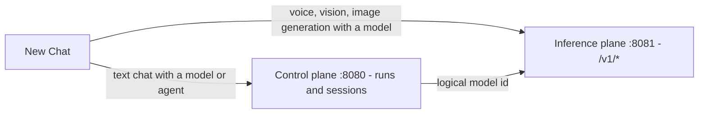

# Chat

**New Chat** is the one conversation surface for everything you have registered: talk to any model in your inference plane or to any published agent, with streaming answers, a separate display for a reasoning model's thinking, and automatic session recording. If you have not installed a model yet, start with [your first chat](../getting-started/first-chat.md).

## Starting a conversation

1. Open **New Chat** in the sidebar (the `/chat` page).
2. Pick the target kind with the **Model / Agent** toggle.
3. Pick the target in the searchable select ("Select a model…" or "Select an agent…"). For an agent there is also a **Version** picker — it defaults to the latest version, labeled `v<version> · latest · <hash>`.
4. Type your message and press ++enter++. ++shift+enter++ inserts a newline, and pressing Enter mid-composition with an input method editor never sends.

If the pickers are empty you will see "No models registered yet — install one under Registries first" or "No published agents yet — build one on the canvas first" — see [installing models](../models/installing.md) and [building your first agent](../getting-started/first-agent.md).

Once the conversation starts, the model — or the agent and its version — is **pinned**: the picker locks so every turn goes to the same target. The **New chat** button starts a fresh conversation (and a fresh session) when you want to switch.

## Model or agent?

| Target | What each turn is | Notes |
|---|---|---|
| **Model** | A direct conversation with one model, addressed by its logical id | Text chats run through the control plane so history is replayed server-side; requests default to `max_tokens: 2048` |
| **Agent** | A run of the published agent's graph, with your message as the input | The agent's whole pipeline executes — tools, routing, guardrails and all |

Badges next to the picker tell you what you selected:

- A model with a non-chat modality shows a violet modality badge (for example `audio.transcription` or `images.generation`).
- An agent whose graph takes or produces media gets a **voice**/**audio**, **vision**, or **image** badge, read from its input and output nodes.
- Embeddings models refuse to chat: "Embeddings models don't chat — bench them from Registries." Test them on [the Bench](../running/bench.md) instead.

## Where your messages go

- **Text conversations** (a chat model, or any agent) are streamed **control-plane runs**: each turn creates a run, the server replays the session history, and the reply is appended to the session.
- **Media conversations with a model** — a transcription, speech, vision, or image-generation model — go **directly to your inference plane's data endpoints**. Raw audio and images never transit the control plane; only a readable text record of the turn is written to the session afterwards. See [voice](voice.md) and [vision and images](vision-and-images.md).

Everything stays on the machines *you* configured: the inference plane is yours, and hosted APIs are only involved if you [registered one](../models/remote.md).

## Streaming

Answers stream token by token with a pulsing cursor. The transcript follows the live edge; scroll up and it stops following, with a jump-to-latest button to catch up again.

While a reply streams, the **Send** button becomes **Stop generating**. Stopping keeps the partial answer, marked as stopped — it is not treated as a failure. Navigating away mid-stream also aborts the request, and the server cancels the underlying run so nothing keeps generating in the background.

## Thinking (reasoning models)

A reasoning model "thinks" before it answers. TheYgent keeps that thinking apart from the answer everywhere:

- The thinking renders in a collapsible **"Thinking…"** block above the answer. It is open and follows its live edge while streaming (scroll up to unpin), auto-collapses once the answer starts, and can be reopened at any time.
- Both wire shapes are handled — a separate reasoning stream and inline `<think>…</think>` tags — so it works the same across engines.
- Thinking never becomes part of the run output or the session transcript. It is captured alongside the run's trace (subject to the capture policy) and is inspectable per node in the [run waterfall](../running/observability.md).

New Chat itself has no parameter form. To turn thinking on or off for a model that supports it, use the **Reasoning** parameter (`chat_template_kwargs` → `{"enable_thinking": true|false}`) where parameters are editable: on [the Bench](../running/bench.md) per exchange, or on an agent's [llm node](../building/nodes/llm.md) model binding.

!!! note "An answer that never arrives"
    If a turn finishes with no visible content, the chat shows a note instead of an empty bubble: a reasoning model may have spent the whole token budget thinking. The run still counts as `completed`, with the note shown in amber. Raise the max-tokens budget (on the llm node for agents, or bench the model to find a workable value).

## Per-message details

Your turns sit on the right; the assistant's on the left, rendered as markdown, with image thumbnails and playable audio where the turn carried media.

- Each control-plane turn header carries a **"run \<shortid\>"** link straight to the [run detail page](../running/index.md).
- Under every run-backed answer a collapsed **Trace** disclosure embeds the run waterfall — timings per node, token usage, gaps. It loads nothing until you open it. See [observability](../running/observability.md).
- Per-turn problems show as amber notes on the turn rather than breaking the conversation.

## Sessions and Recents

Every conversation is recorded as a **session** — the stored unit of chat history, with ids like `ses_1f0c…`. All chat surfaces record into sessions: New Chat, a model bench conversation, and an agent bench chat alike, so everything you said lands in one place. Recording is best-effort: if writing a turn fails, the chat itself is never interrupted.

- **Recents** (bottom of the sidebar) lists your latest sessions, labeled by title, preview text, or the agent/model name. It is hidden while the sidebar is collapsed to icons.
- **Chats** (`/sessions`) is the full list: columns **Session / Target / Messages / First message / Last activity**, with search over id, preview, and target, and infinite scroll.
- Opening a session shows the stored transcript and lets you **continue the conversation with the same target**: text targets continue through control-plane runs, a voice session continues through the direct transport. A session recorded before targets were stored is readable but not continuable.
- **Delete** removes the session but keeps its runs — they only lose the session link. The confirm dialog says exactly that.

Once a session exists, a **"session \<shortid\>"** link at the top right of New Chat jumps to its detail page. For how sessions relate to runs and memory, see [runs and sessions](../concepts/runs-and-sessions.md).

## Composer reference

| Control | Appears for | What it does |
|---|---|---|
| **Send** / **Stop generating** | always | Sends the message; aborts the in-flight reply while streaming |
| **Attach image** / **Capture from camera** | vision targets | Stages an image chip above the input — see [vision and images](vision-and-images.md) |
| **Record from microphone** / **Attach audio file** | transcription targets and voice agents | Stages an audio chip (with an inline player); for pure transcription targets the text input is hidden and audio is required — see [voice](voice.md) |

Staged attachments are removable chips above the input; nothing is sent until you press Send.

## Related pages

- [Voice in chat](voice.md) — microphone input, speech output, voice agents
- [Vision and images](vision-and-images.md) — chatting about images and generating them
- [Runs and sessions](../concepts/runs-and-sessions.md) — the data model behind the transcript
- [The Bench](../running/bench.md) — test a model with full parameter control before you chat with it
