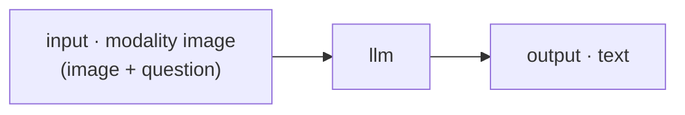
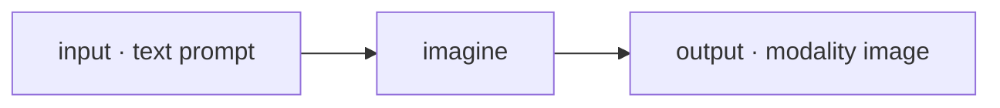

# Vision and images

[Chat](index.md) handles two visual jobs: **showing an image** to a model or agent and asking about it (vision), and **generating an image** from a text prompt. Both run directly against your inference plane — images never transit the control plane as raw payloads — and both work with a plain model or with a published agent.

## Chatting about an image (vision)

### Attaching or capturing an image

When the target can see, the composer grows two image controls:

- **Attach image** — pick an image file from disk.
- **Capture from camera** — opens a live-preview modal (it prefers a rear-facing camera). **Capture** snapshots a single JPEG frame; the camera stream is released when you close the modal.

The image stages as a removable chip above the input. Nothing is sent until you press **Send**.

### Vision models

Pick **Model** in New Chat and select a model that advertises the `vision` capability. Image attach turns on automatically. Your image travels as an OpenAI `image_url` content block (a data URI) on the **same** `POST /v1/chat/completions` request as your text — there is no separate vision endpoint — and the answer streams back like any chat reply.

Two local engines serve vision:

| Engine | Program | How the image side works |
|---|---|---|
| `(llamacpp, vision)` | `llama-server` with a multimodal projector | The projector is taken from `params.mmproj`, else an `*mmproj*.gguf` next to the weights, else an automatic projector. |
| `(mlx, vision)` | `mlx_vlm.server` (Apple Silicon) | A different program from the MLX chat server. |

Installing a vision model is automatic: when you [install](../models/installing.md) an image-text-to-text model from the catalog, it registers with `vision` modality and spawns the vision server on first use. A hosted, OpenAI-compatible vision model works too — [register it](../models/remote.md) with `modality: vision`.

!!! tip "Grounding models draw boxes"
    On [the Bench](../running/bench.md), when a vision model answers with structured JSON detections, the boxes are drawn over the image you sent. The same overlay renders detections from computer-vision tools in the MCP tool tester.

### Vision agents

A **vision agent** is a published agent whose input node declares `modality: image`. Select it in New Chat and it gets a **vision** badge and a composer that takes an image *and* a question ("Attach an image and ask about it…"). The run travels through the control plane, and its [llm node](../building/nodes/llm.md) folds the image and text into one multimodal message:

The run input is `{image, text}`; the llm node references `$in.in.image` and `$in.in.text` and turns them into an `image_url` content part. An llm message's content can be a plain string or a list of text and `image_url` parts, and both work identically whether the agent runs interactively or [durably](../running/durable.md).

## Generating an image (text → image)

### With a model directly

First [install](../models/installing.md) a text-to-image model from the catalog — its `images.generation` modality is derived automatically from the model's task tag. Then pick it in New Chat (**Model**); the composer prompt becomes "Describe an image to generate…". Sending calls `POST /v1/images/generations`, which returns the image bytes inline (`response_format: "b64_json"`, so no cross-machine URL), and the reply is an image bubble. The only metric is total latency.

A few behaviors worth knowing:

- **Size, count, steps.** `size` is `WxH`, snapped to multiples of 64 (default `512x512`); `n` is clamped to 1–4; `steps` passes through.
- **Generation is serialized** — one render at a time, so concurrent requests queue — and weights load per request, so every image pays the model-load cost. A slow render is kept alive with periodic keepalives so a long, delta-free generation is not mistaken for a dead connection.

### With an imagine-backed agent

In a graph, the [`imagine` node](../building/nodes/media.md) does the generating: text in → an image **artifact reference** out, feeding an `output` node whose `modality` is `image`.

Its config is `{model, params}`, where `size`, `n`, and `steps` ride through the params. In chat, such an agent gets an **image** badge; the answer downloads the artifact into an image bubble and records the label "🖼 image" to the session. If a run finishes without an image, you see "The agent produced no image for this turn."

### Image engines

Both image engines are command-line generators wrapped by a small bundled OpenAI-compatible server:

| Engine | Backed by | Binary | Defaults |
|---|---|---|---|
| `(llamacpp, images.generation)` | stable-diffusion.cpp's `sd-cli` | `THEYGENT_SDCPP_BIN` or on `PATH` | 20 steps |
| `(mlx, images.generation)` | `mflux-generate` (FLUX, Apple Silicon) | `THEYGENT_MFLUX_BIN` (e.g. `uv tool install mflux`) | 3 steps |

`sd-cli` runs anywhere its binary exists; the FLUX path is Apple Silicon only. If the underlying CLI is missing, the model shows as not-ready on `GET /readyz` with an install hint rather than failing with a 500. See [the engines page](../models/engines.md) for the full matrix.

## Artifact storage

Images (and audio) produced by **agents** are stored as local artifacts on the machine running the control plane, under `THEYGENT_ARTIFACT_DIR` (default: a `theygent-artifacts` folder in the system temp directory). Artifact ids look like `art_<ULID>`, and `GET /artifacts/{ref}` serves only stored `art_…` ids — passing anything else returns `400 invalid_artifact_ref`, and an unknown id returns `404 artifact_not_found`, so the route cannot read arbitrary files. The bytes are never journaled into run history or exported with telemetry, which is why a resumed durable run replays the reference instead of the image.

Direct image-**model** generation creates no artifact: the bytes come back inline and the reply renders straight from them.

## Related pages

- [Chat](index.md) — the shared conversation surface and its composer
- [Voice](voice.md) — the audio counterpart: microphone input and spoken output
- [Audio & image nodes](../building/nodes/media.md) — building `transcribe`, `speak`, and `imagine` into a graph
- [Installing local models](../models/installing.md) — adding vision and image-generation models
- [Remote models](../models/remote.md) — registering a hosted, OpenAI-compatible vision model
