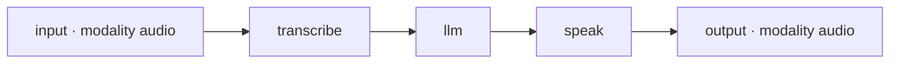

# Voice

Voice shows up in [chat](index.md) two ways: you can talk to a voice **model** directly — record speech and get a transcript, or type text and get spoken audio back — or you can chat with a **voice agent** that listens, thinks, and answers out loud. This page covers both, and the speech-to-text and text-to-speech engines you need to install for them.

Raw audio always goes **directly to your inference plane**, never through the control plane. Only a short readable record of the turn ("🎤 voice message", "🔊 audio") is written to the session afterwards.

<figure class="video">
  <iframe src="https://www.youtube-nocookie.com/embed/leoPQLaWMeU" title="Voice In, Voice Out — a no-code AI agent pipeline" loading="lazy" referrerpolicy="strict-origin-when-cross-origin" allow="accelerometer; autoplay; clipboard-write; encrypted-media; gyroscope; picture-in-picture; web-share" allowfullscreen></iframe>
  <figcaption>Voice In, Voice Out (5:54) — building the transcribe → llm → speak pipeline described below, then talking to it.</figcaption>
</figure>

## Recording and attaching audio

The composer grows two audio controls whenever the target speaks or listens:

- **Record from microphone** — press it to start recording (the icon becomes a stop square); press again to stop. Recording uses your browser's media recorder, preferring `audio/webm;codecs=opus` (falling back to `audio/webm`, then `audio/mp4`).
- **Attach audio file** — pick an existing clip from disk instead.

Either way the clip stages as a removable chip above the input, with an inline player and its duration. Nothing is sent until you press **Send**.

For a **pure transcription target** (a speech-to-text model, or a voice agent), the text box is hidden entirely and replaced with the prompt "Record or attach audio, then send." — audio is required before Send activates.

## Talking to a voice model directly

Pick **Model** in New Chat and select a model whose modality is `audio.transcription` or `audio.speech`. A violet modality badge appears next to the picker, and the turn goes straight to the inference data plane.

- **Speech-to-text** (`audio.transcription`) — record or attach a clip and send. The transcript comes back as the assistant's reply. Under the hood this is a multipart `POST /v1/audio/transcriptions` with your logical model id.
- **Text-to-speech** (`audio.speech`) — type text and send. The reply is a playable audio bubble, produced by `POST /v1/audio/speech`. The whole clip comes back as one response and plays once it has fully arrived.

This is the same transport [the Bench](../running/bench.md) uses to test these models, so what you hear in chat is exactly what the model produces.

!!! note "Voice names are engine-specific"
    Text-to-speech engines have their own voice names. If you do not pass a `voice`, the inference plane invents none — the engine speaks in its own default. Set a voice your engine actually supports (an OpenAI voice name like `alloy` will not exist on a local engine).

## Voice agents

A **voice agent** is a published agent whose graph starts with an audio input and ends with audio output. A typical pipeline transcribes the speech, sends the text to a language model, and speaks the answer:

To use one, pick **Agent** in New Chat and select it. TheYgent reads the agent's input and output nodes and gives it a **voice**/**audio** badge and the voice composer (mic and attach, text disabled). Then:

1. You record or attach a clip and send.
2. The clip is uploaded to the control plane as an **artifact** (`POST /artifacts`) and passed to the run as a reference — the raw bytes are handed straight to the inference plane, never journaled into run history.
3. The graph's **transcribe** node streams the audio to `POST /v1/audio/transcriptions` and produces text.
4. The **llm** node answers.
5. The **speak** node calls `POST /v1/audio/speech`, stores the produced audio as a new artifact, and returns its reference.
6. The run's output is that artifact reference; the chat downloads it (`GET /artifacts/{ref}`) into a playable audio bubble.

Voice-agent runs are deliberately session-less on the server — the client records readable labels ("🎤 voice message" for your turn, "🔊 audio" for the answer) so the session shows the exchange without storing blobs. If a run finishes with no audio, you see "The agent produced no playable audio for this turn."

### The transcribe and speak nodes

If you are building the agent yourself, these two [media nodes](../building/nodes/media.md) carry the voice work:

| Node | Config | Notes |
|---|---|---|
| `transcribe` | `model`, `params` (`language`, `prompt`, …) | Audio in → text out. `model` is a logical id bound to a speech-to-text model. |
| `speak` | `model`, `params` (`voice`, `format`, `speed`) | Text in → an audio artifact reference out. |

The `speak` node defaults `format` to `mp3` when its params omit it; `format` maps to the wire's `response_format`. **`voice` has no default** — omit it and none is sent, so the engine speaks in its own. Because voice names are engine-specific, name one only when your text-to-speech engine actually offers it; see [the speak node](../building/nodes/media.md#speak-text-to-speech) for what an unknown voice looks like when it fails.

## What models you need

Voice needs two kinds of engine, and TheYgent forces a specific split for each:

| Job | Engine | Binary | Notes |
|---|---|---|---|
| Speech-to-text (`audio.transcription`) | whisper.cpp's `whisper-server`, under the `(llamacpp, audio.transcription)` slot | `THEYGENT_WHISPERCPP_BIN` or on `PATH` (`brew install whisper-cpp`) | Needs whisper's native `ggml-*.bin` weights — a llama-style GGUF conversion will not load. With `ffmpeg` installed it transcodes browser webm/opus recordings; without it, only WAV works. |
| Text-to-speech (`audio.speech`) | `mlx_audio.server`, under `(mlx, audio.speech)` | `THEYGENT_MLX_AUDIO_BIN` | Apple Silicon only; loads the voice model per request. |

There is **no** MLX transcription slot and **no** llama.cpp speech slot: transcription is whisper.cpp only, and speech is Apple-Silicon MLX only. Install both local servers with `make engines`, or point the env vars at binaries you already have. See [the engines page](../models/engines.md) for the full engine matrix, and [installing models](../models/installing.md) to add the actual weights.

If a required engine binary is missing, the model returns a clear `503 engine_unavailable` and the inference plane's `GET /readyz` lists the slot as not ready with an install hint — never a surprise crash on your first message.

## Where the audio lives

Audio from **voice agents** — both your recorded input and the spoken output — is stored as local artifacts on the machine running the control plane, under `THEYGENT_ARTIFACT_DIR` (default: a `theygent-artifacts` folder in the system temp directory). Artifact ids look like `art_<ULID>`. The `GET /artifacts/{ref}` route serves only stored `art_…` ids, so it cannot be used to read arbitrary files. The bytes are never written into run history or exported with telemetry, which is why a durable run that resumes after a crash simply replays the reference.

Direct voice **model** chats create no artifacts: a transcript is plain text, and text-to-speech audio plays from the bytes the request returned.

## Continuing a voice session

Reopen a voice conversation from **Chats** and the composer keeps talking to the same voice target, so you can pick up where you left off — a voice **model** through the direct data-plane transport it was recorded on, and a voice **agent** by re-reading the boundary from the version the conversation started on, so the microphone comes back rather than a text box. If that version has since been deleted, the conversation continues on the agent's latest. See [runs and sessions](../concepts/runs-and-sessions.md) for how sessions store and replay a conversation.

## Related pages

- [Chat](index.md) — the shared conversation surface and its composer
- [Vision and images](vision-and-images.md) — the visual counterpart: image input and image generation
- [Audio & image nodes](../building/nodes/media.md) — building `transcribe`, `speak`, and `imagine` into a graph
- [Engines](../models/engines.md) — llama.cpp, MLX, whisper.cpp and where each runs
