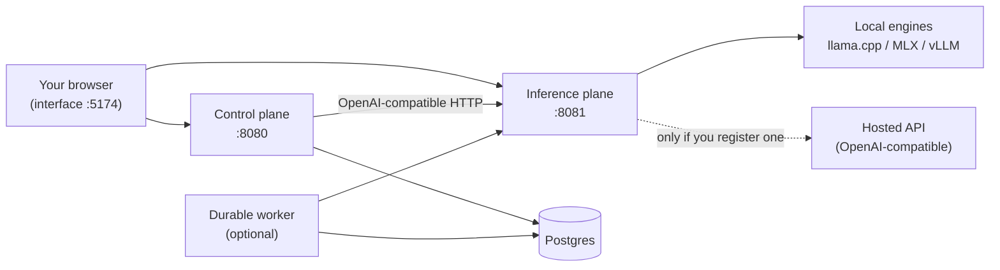

# Architecture

TheYgent is split into a small number of cooperating processes, each with a clear job and a clear home for its data. Understanding the split — the interface, the control plane, the inference plane, and the optional durable worker — tells you where your agents live, where your models run, and exactly when (if ever) anything leaves your machine.

## The pieces

| Piece | Default address | What it does |
|---|---|---|
| Interface | `http://localhost:5174` | The browser UI: build agents, chat, browse runs, manage models. |
| Control plane | `http://localhost:8080` | Owns agents, runs, sessions, triggers, connections, and observability. Stores everything in Postgres. |
| Inference plane | `http://localhost:8081` | Your models and engines, exposed behind one OpenAI-compatible API. |
| Durable worker | — (optional) | Runs long-lived, crash-resumable workflows. Not needed for everyday local use. |

The interface, control plane, and inference plane are started together by `make up`; the durable worker is optional and started separately — see [Running the services](../getting-started/running.md).



### The interface

The interface is a single-page web app served at `http://localhost:5174`. Its sidebar pages are **Agents**, **Runs**, **New Chat**, **Chats**, **Registries**, **MCP**, and **Settings**, plus the visual [editor](../building/editor.md). It talks to both planes directly from your browser: the control plane for agents, runs, and sessions, and the inference plane for the model registry and catalog.

### The control plane

The control plane is the orchestration layer. It:

- stores saved agents as immutable, content-addressed versions (see [Versioning](versioning.md)),
- executes agent graphs and persists every run (see [Runs and sessions](runs-and-sessions.md)),
- keeps chat sessions, [triggers](../running/triggers.md) (schedules, webhooks, token invocation), tool/MCP connections with encrypted secrets, and per-run [observability](../running/observability.md) data.

It needs two things to be healthy: a reachable Postgres (`DATABASE_URL`) and the inference plane. Crucially, the control plane **never runs a model itself** — every model call is an HTTP request to the inference plane's OpenAI-compatible API. That seam is what lets you swap where inference happens without touching a single agent.

### The inference plane

The inference plane is where models actually run. It manages the lifecycle of local engines — llama.cpp, MLX (Apple Silicon), and vLLM (CUDA GPUs) — and can also reach any OpenAI-compatible server or hosted API you register. Two rules define it:

- **Callers use logical model ids.** An agent says `"triage-fast"`, never an engine name. Which engine or endpoint serves that id is a registration detail you can change at any time — see [Models and engines](models-and-engines.md).
- **Its state is local files, never the control-plane database.** The model registry lives at `~/.theygent/inference/registry.json` and downloaded weights under `~/.theygent/inference/models/`.

### The durable worker (optional)

Durable execution makes unattended runs survive a crash and resume from the last completed step, and it unlocks the durable-only node types (`human`, `subgraph`, `loop`, `map`). You get it in one of two ways:

- **Embedded** — set `THEYGENT_DURABLE=1` and the control plane runs the durable runtime in-process. This is the normal desktop setup.
- **Separate worker process** — `theygent-worker`, for server deployments. It consumes the durable queue and recovers crashed workflows.

Either way, durable checkpoints live in a separate `dbos` schema of the same Postgres. Details in [Durable runs](../running/durable.md).

## Where your data lives

| Data | Where it lives |
|---|---|
| Agents, versions, runs, sessions, triggers, connections and encrypted secrets, observability spans | Postgres, at `DATABASE_URL` |
| Durable run checkpoints | The `dbos` schema of that same Postgres |
| The logical model registry | `~/.theygent/inference/registry.json` |
| Downloaded model weights | `~/.theygent/inference/models/` |
| Generated audio and images (artifacts) | `THEYGENT_ARTIFACT_DIR` (default: a `theygent-artifacts` folder in the system temp directory) |

The storage locations and listen addresses are all configurable — see the [environment variable reference](../reference/environment.md).

## The sovereignty story, honestly

TheYgent's promise is not "no data ever leaves your machine". The honest version is: **everything runs where you point it, and you own every hop.**

- All four processes run locally by default, listening on `127.0.0.1`. Your prompts travel from your browser to the control plane to the inference plane over local HTTP.
- Local models run on your hardware; weights download to your disk.
- A hosted API is contacted **only when you register one** — as an `openai-compatible` model with a base URL you supply — and then only for calls routed to that model. Nothing is ever proxied through a vendor server. See [Remote models](../models/remote.md).
- Because agents reference logical model ids, the local-versus-hosted choice is per model and per agent, and reversible: re-register the id, and every call site follows.
- Credentials live in two separate stores, both on your machine and never written into agent documents. **Hosted-API keys** are inference-plane credentials, referenced as `secret://NAME` and never sent to the control plane (see [Remote models](../models/remote.md)). **Tool and MCP connection secrets** live in the control-plane store, encrypted with `THEYGENT_SECRET_KEY`.
- Nothing is exported for telemetry unless you opt in by setting `OTEL_EXPORTER_OTLP_ENDPOINT`; otherwise all trace data stays in your Postgres.

!!! warning "Local, single-user by default"
    The control plane's interactive API currently performs no authentication — it is designed for a single user on localhost. Only two surfaces carry real auth: token invocation (`POST /agents/{id}/invoke`, gated by `THEYGENT_INVOKE_TOKEN` and closed when the token is unset) and webhooks (per-webhook HMAC signatures). Do not expose ports 8080/8081 to untrusted networks.

## Checking that everything is up

Both planes expose `GET /healthz` (liveness) and `GET /readyz` (readiness):

```bash
curl http://localhost:8080/readyz   # control plane: checks Postgres and the inference plane
curl http://localhost:8081/readyz   # inference plane: reports which engine/modality slots this host can run
```

A missing engine binary shows up in the inference plane's `/readyz` report — never as a surprise failure on your first model call.

## Related pages

- [Agents and graphs](agents-and-graphs.md) — what an agent document contains
- [Nodes, ports, and edges](nodes-ports-edges.md) — the building blocks of a graph
- [Models and engines](models-and-engines.md) — logical ids, bindings, sources, modalities
- [Runs and sessions](runs-and-sessions.md) — run lifecycle and conversational memory
- [Running the services](../getting-started/running.md) — start, stop, status, ports
