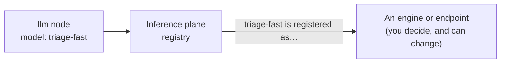
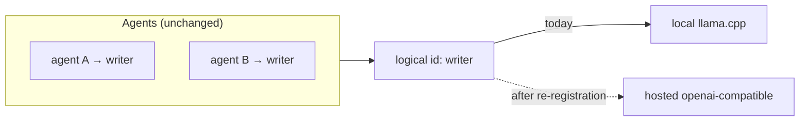

# Models and engines

TheYgent separates *what an agent calls* from *what actually runs*. An agent always names a model by a **logical id** — a label you choose, like `triage-fast` — and never an engine. Behind that id, the inference plane holds a registration that says which engine (or hosted endpoint) serves the id, where its weights come from, and what task it performs. This page explains that split and the vocabulary around it: bindings, sources, and modalities.

## Logical model ids

A logical id is the name your agents use to reach a model. You register a model once under an id of your choosing, and from then on every agent, chat, and node refers to that id — for example an `llm` node whose model is `triage-fast`.

The rule is strict: the id is a logical name, never an engine name. If an agent tried to call `mlx`, `llamacpp`, or `vllm` as if it were a model, the run is rejected up front with a clear error (`engine_name_not_allowed`) before anything executes. Engine names live only in the *registration* for an id, never at a call site.

This indirection is the whole point. Because the agent only knows the id, you can change what the id points at — a different engine, different weights, a hosted API — without editing a single agent.

## Bindings: which engine backs an id

The **binding** says what kind of thing serves a logical id. There are exactly four values, and they never change meaning:

| Binding | What backs the id | How TheYgent treats it |
|---|---|---|
| `llamacpp` | A llama.cpp server running GGUF weights. Runs anywhere the binary is installed. | Managed — spawned and supervised for you. |
| `mlx` | The MLX family of servers on Apple Silicon. | Managed. |
| `vllm` | A vLLM server on an NVIDIA/CUDA GPU host. | Managed. |
| `openai-compatible` | Any OpenAI-compatible HTTP server or hosted API you point at with a base URL. | Reached, not managed — no process is started or stopped for you. |

The first three are **managed engines**: TheYgent starts the server on first use, health-checks it, and stops it when it is idle. The fourth, `openai-compatible`, is a **reachable endpoint**: TheYgent just forwards calls to a URL you supply — whether that URL is a hosted API or another local server. For details on each engine and its platform, see [The engines](../models/engines.md); to register a hosted endpoint, see [Remote models](../models/remote.md).

!!! note "vLLM is experimental in this build"
    The `vllm` binding exists and targets CUDA GPU hosts, but it has not yet been verified on the maintainers' hardware. llama.cpp and MLX are the proven local paths. Treat vLLM as experimental until you have confirmed it on your own GPU.

## Sources: where the weights come from

For a managed engine, the **source** is orthogonal to the binding — it says where the model's weights come from, not how they run:

| Source | Meaning |
|---|---|
| `hf` | A Hugging Face repo id; the weights are downloaded to your machine. |
| `local-path` | A file or directory of weights already on your disk. |
| `url` | A location the engine loads weights from. |

Binding and source are independent: the same GGUF file on disk (`source: local-path`) or pulled from Hugging Face (`source: hf`) both run under `binding: llamacpp`. A `url` source is not the same as the `openai-compatible` binding — a source points at *weights an engine loads*, while `openai-compatible` points at *a server that already runs the model*. Reachable (`openai-compatible`) registrations have no source at all; they carry a base URL instead.

Weights downloaded from Hugging Face land under `~/.theygent/inference/models/` on your machine. See [Installing models](../models/installing.md) for the browse-and-install flow.

## Modalities: what a model does

A model's **modality** is the task it performs. It is a third axis, independent of binding and source — a llama.cpp binding can serve chat, embeddings, or vision depending on how it is registered.

| Modality | Wire value | Model does |
|---|---|---|
| Chat | `chat` | Text in, text out — the default. |
| Vision | `vision` | Image (plus text) in, text out. |
| Embeddings | `embeddings` | Text in, numeric vectors out. |
| Transcription | `audio.transcription` | Audio in, text out (speech to text). |
| Speech | `audio.speech` | Text in, audio out (text to speech). |
| Image generation | `images.generation` | A text prompt in, an image out. |

When you register a model, its modality decides which server the engine manager spawns and which data-plane endpoint accepts it. A chat-only model called at the embeddings endpoint returns a clear `modality_not_supported` error rather than a wrong answer. Not every engine supports every modality — transcription, for example, is served by whisper.cpp under the `llamacpp` binding; MLX handles chat, vision, and text-to-speech. The [engines page](../models/engines.md) lists what each one covers.

The modality here describes a *model*. It is separate from the `modality` field on an agent's `input`/`output` boundary nodes, which is a declaration about a node's data type — see [Nodes, ports, and edges](nodes-ports-edges.md).

## How engines run

Managed engines are started **lazily** — the first call to a logical id spawns its server, and TheYgent waits for it to become healthy before forwarding the request. Only a limited number of engines stay resident at once (two by default). When that ceiling is reached, the least-important, least-recently-used engine is stopped to make room; an engine that is in the middle of a request is never evicted. Idle engines are also reaped after a timeout. You do not manage any of this by hand — but it is why the very first call to a large model can take a moment while it loads. The full lifecycle and its knobs are covered in [The engines](../models/engines.md).

A reachable (`openai-compatible`) id has no lifecycle: nothing is spawned or evicted, and calls are proxied straight to your URL.

## Swapping a model without touching agents

Because agents route by logical id, changing what an id points at is a re-registration, not an edit to any agent.

Suppose ten of your agents call `writer`, registered today as a local llama.cpp model. Later you want `writer` to run on a hosted API instead. You re-register the id `writer` as an `openai-compatible` binding with the provider's base URL and your credential. That is the only change. Every agent, chat, and trigger that used `writer` now routes to the hosted endpoint on its next run — no agent is opened, re-saved, or re-versioned.

This works because, at run time, TheYgent forwards only the logical id to the inference plane; the inference plane's current registration for that id decides the engine, source, and endpoint.

??? note "What the agent document actually stores"
    When you pick a model in the editor, TheYgent records the logical id on the model binding and copies in the binding value it was registered under at that moment (so the editor knows the model family). That stored binding value is a snapshot — it is not consulted when the run executes. The run resolves purely by logical id, so re-registering the id under a different engine takes effect on the next run without re-saving the agent. Generation parameters (temperature, max tokens, and so on) are the exception: those live on the agent's model binding and travel with each call, so they are part of the agent, not the registration.

## Related pages

- [Registries](../models/index.md) — where you register, browse, and install models
- [The engines](../models/engines.md) — llama.cpp, MLX, and vLLM in detail
- [Remote models](../models/remote.md) — registering a hosted or remote OpenAI-compatible endpoint
- [The llm node](../building/nodes/llm.md) — picking a model and setting its parameters in an agent
- [Runs and sessions](runs-and-sessions.md) — what happens when an agent calls a model
