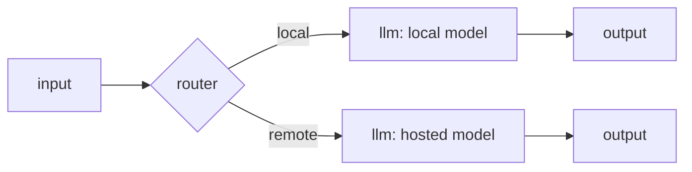

# Nodes, ports, and edges

An agent is a graph of **nodes** wired together by **edges**, and each connection joins two named **ports**. This page explains the three kinds of node, what ports are for, and how values travel along edges — including why some nodes don't run at all on a given pass.

## Nodes come in three kinds

Every node has a **type** (what it does — `llm`, `router`, `output`, …) and a **kind** (its broad role in the graph). There are three kinds:

| Kind | In plain words | Node types |
|---|---|---|
| **boundary** | Where data enters or leaves the graph, or where a run pauses. | `input`, `output`, `human`, `subgraph` |
| **activity** | A step that does real work — a model call, a tool call, or another outside effect. Results can vary from run to run. | `llm`, `tool`, `mcp_tool`, `transcribe`, `speak`, `imagine`, `ratelimit`, `quota` |
| **orchestration** | Deterministic control flow and reshaping — no call to the outside world. | `router`, `transform`, `loop`, `map` |

The kind is not decoration: every type has exactly one correct kind, and the editor sets it for you. One type is the exception — a `guardrail` takes its kind from how you configure it. A rule check (a plain, inline check) is orchestration; a model-judge check is an activity, because it makes a real inference call. You never set this by hand; choosing the check type in the inspector picks the kind.

!!! note "A few types are durable-only"
    `human`, `subgraph`, `loop`, and `map` run only on the durable runtime. The ordinary interactive run path refuses them and tells you to run the agent durably. See [Durable runs](../running/durable.md), the [human approval node](../building/nodes/human.md), and the [orchestration nodes](../building/nodes/orchestration.md).

The full catalogue of node types, with each one's configuration, is the [node reference](../building/nodes/index.md).

## Ports

Nodes connect to each other through **ports**: named connection points, in-ports on one side and out-ports on the other. A node's ports depend on its type — an `llm` has an `in` port and an `out` port (and a special `tools` port); a `guardrail` sends its result out of either a `pass` or a `block` port. Two properties of a port matter when you wire a graph:

- **Required vs. optional.** A *required* in-port must be fed by exactly one edge, or the graph fails validation (`required in-port 'x' is not connected`). An *optional* in-port can be left unwired — at run time it simply resolves to nothing (`null`).
- **Role.** Most ports carry data. Two roles are special: **control** ports carry pure sequencing, and **tool** ports carry a capability. The editor only lets you connect a port to another port of the same role.

Downstream nodes read the value that arrives on their in-ports using the [`$in` reference language](../building/input-references.md) — `$in` for the default `in` port, `$in.<port>` for a named one.

## Edges and their three channels

An **edge** connects one node's out-port to another's in-port. The editor derives an edge's **channel** from the ports it joins, and only lets you connect like to like:

| Channel | Carries | The rule to remember |
|---|---|---|
| **data** | A value passed from one node to the next. | At most **one** data edge may feed a given in-port — a second is rejected as an ambiguous multi-input. |
| **control** | Nothing — pure sequencing, "run this after that". | Any number allowed. Shown as an animated line on the canvas. |
| **tool** | A *capability*, not a value — it tells a model it may call a tool. | Wired from a tool node's `use` handle into an `llm` node's `tools` port. |

### The tool channel: capability wiring

By default a `tool` or `mcp_tool` node is a step in the pipeline: a value flows into its `in` port, the tool runs, and a result flows out of `out` (or an error out of `err`). But you can instead wire its `use` handle into an `llm` node's `tools` port. That connection passes no value — it hands the model the tool as something it may call on its own, deciding when to call it and with what arguments. The model can then call it, read the result, and keep going, in a loop, until it has an answer.

A tool node is one or the other — a pipeline step **or** a capability offered to a model — never both at once. When you wire it as a capability, the node's own id becomes the function name the model sees. See the [tools node](../building/nodes/tools.md) and the [llm node](../building/nodes/llm.md) for the full story.

## How values flow

When a node finishes, the value it produces travels along its outgoing **data** edges to the nodes downstream. But not every edge carries a value on every run. An edge is **live** only if its source node actually ran *and* activated that particular out-handle:

- Some nodes activate exactly **one** of several out-handles. A `router` activates the single handle its `select` resolves to. A `guardrail` activates either `pass` or `block`. `ratelimit` and `quota` activate either `allow` or `deny`. The un-taken handle's edges are **dead**.
- A node whose incoming data edges are **all dead** is **skipped** — it doesn't run at all, and any downstream port fed only by that dead branch resolves as absent (`null`).
- The `input` node has no incoming edges, so it is never skipped — it is where every run begins.

This is exactly how you build branches. A `router`, for instance, sends a request down one branch or another by name:

Here the router's `select` resolves to either `local` or `remote`. Only that branch's edges are live; the other branch — including its `output` node — is skipped entirely.

Notice each branch ends in **its own** `output` node. That is deliberate: at most one output node may execute per run, and if two were live at once the run would fail loudly rather than silently pick one. Because the branches are mutually exclusive, exactly one output runs and the run has a single, unambiguous result. (A single output node fed by two edges wouldn't work either — that is the "one data edge per in-port" rule.) See [Runs and sessions](runs-and-sessions.md) for how a run turns into its final output.

## Related pages

- [Agents and graphs](agents-and-graphs.md) — the document a graph lives in
- [Referencing inputs](../building/input-references.md) — the `$in` language nodes use to read values
- [The router node](../building/nodes/router.md) — building branches by handle name
- [The tools node](../building/nodes/tools.md) — steps versus capabilities
- [Node reference](../building/nodes/index.md) — every node type in detail
