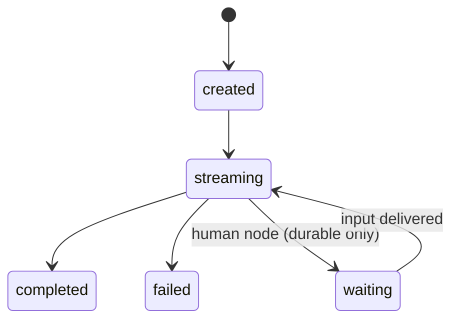
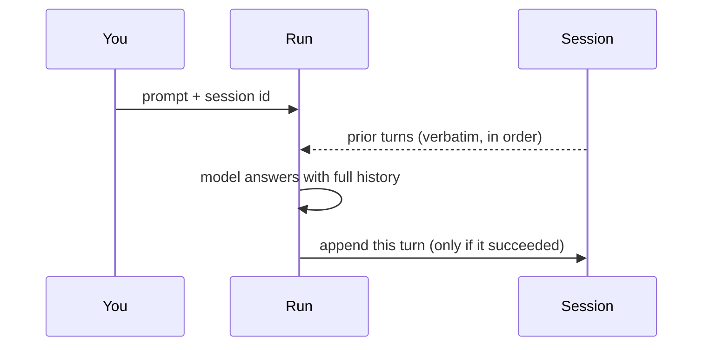

# Runs and sessions

A **run** is one execution — of a plain prompt against a model, or of a whole agent graph. Every run is recorded in the control plane's Postgres database, so it survives restarts and you can inspect it long after the answer has scrolled away. A **session** is optional conversation memory you can attach to runs so a model remembers earlier turns. This page explains the run lifecycle, where a run's output comes from, and how sessions carry memory.

## What a run is

Whenever an agent produces an answer, that is a run. Runs start from a few places:

- **A plain prompt** — you send a string and a logical model id, and the model completes it. This is the simplest run.
- **An agent graph** — the control plane walks the graph node by node, calling models, tools, and MCP servers as the edges dictate, and returns the graph's output.
- **A published agent** — the same as above, but the graph comes from an immutable [published version](versioning.md) rather than being pasted in.

However it starts, a run gets a row in the database the moment it is accepted. That row holds the status, the resolved model, the final output, any error, timing, and — for a published agent — which version ran. You can read a run at any time, including while it is still producing output. The chat surface, the [Runs list](../running/index.md), and the [run waterfall](../running/observability.md) are all views onto these rows.

## The run lifecycle

A run moves through a small set of statuses:

| Status | Meaning |
|---|---|
| `created` | The run row exists and is about to execute. |
| `streaming` | The run is executing and producing output. Answer tokens stream out as they are generated. |
| `waiting` | The run has paused at a human-approval step and is waiting for input. Only durable runs reach this state. |
| `completed` | The run finished. Its output is persisted. |
| `failed` | The run errored, or was interrupted. |

A few behaviors are worth knowing:

- **Reasoning is separate from the answer.** When a model "thinks" out loud, those reasoning tokens stream on their own channel and are shown as a collapsible thinking view in [chat](../chat/index.md) — they are never folded into the run's output.
- **Interruptions are honest.** If the control plane restarts while an ordinary run is in flight, that run is marked `failed` with a plain reason ("interrupted: control-plane restarted while run was in-flight") rather than left looking alive. Closing the browser mid-stream likewise ends the run as `failed` ("client disconnected mid-stream").
- **Durable runs survive crashes.** A run on the [durable runtime](../running/durable.md) resumes from its last completed step instead of failing, and a `waiting` run can pause indefinitely — across restarts — until you [resume it](../running/human-in-the-loop.md).

## Where the output comes from

For a **plain prompt run**, the output is exactly the model's completion.

For an **agent graph**, the output is the value that reached the executed `output` node, coerced to a string (structured values are serialized to JSON). The `output` node performs no side effect of its own; it simply marks what the run returns.

Two rules keep this unambiguous:

- **At most one `output` node may execute per run.** A graph may *contain* several output nodes — for instance, one on a guardrail's allow branch and one on its block branch — but only one can be live in any single run. If a second one executes, the run fails loudly rather than silently picking a winner. Route mutually exclusive branches (with a [router](../building/nodes/router.md) or [guardrail](../building/nodes/guardrail.md)) so at most one output is ever reached.
- **Empty output is explained, not hidden.** If the run reaches no output node, or the branch that ran produced nothing, or the model spent its whole token budget thinking, the run still completes but carries an honest note explaining why the output is empty (for example "the graph declares no output node" or "hit the token limit … raise maxTokens"). The interface styles such a run amber rather than pretending it succeeded.

See [Runs](../running/index.md) for how these rules surface in the Runs list and detail views.

## Sessions: conversation memory

By default a run is one-shot: the model sees only the current prompt, and nothing about the exchange is remembered for next time. (The run itself is still recorded — "one-shot" refers to memory, not persistence.)

A **session** turns a series of runs into a conversation. You attach a session to a run by giving it a session id; every run that shares that id becomes part of the same conversation, and the model sees what came before.

How the memory works:

- **Full replay, verbatim.** Before the current prompt, every prior turn in the session — each user message and each assistant reply — is prepended in order, exactly as it was. There is no summarization and no truncation; the conversation is replayed in full each time. Inside an agent, an `llm` node reads the same prior turns.
- **Only real exchanges are stored.** A run appends its user-and-assistant turn pair to the session only when it succeeds with non-empty output. A failed run stores nothing (no dangling half-turn), and an empty-output run adds no blank reply.
- **Unknown ids are created for you.** Attaching a session id that does not exist yet simply creates that session — you do not have to set one up in advance.

Sessions are what power the **Recents** list in chat: each ongoing conversation is a session. Deleting a session removes the conversation and its messages but *detaches* — never deletes — the runs that happened in it, so your run history outlives any conversation you clear.

!!! tip "Memory is opt-in and per run"
    Because a session is attached run by run, you decide exactly which runs share memory. Two agents can even share one conversation by using the same session id, and a single agent can hold many independent conversations by using different ids.

## Related pages

- [Runs](../running/index.md) — the Runs list, run detail, and output rules in the UI
- [Durable runs](../running/durable.md) — crash-resumable runs and the `waiting` state
- [Human in the loop](../running/human-in-the-loop.md) — pausing a run for approval and resuming it
- [Chat](../chat/index.md) — conversations, sessions, and the thinking view
- [Versioning](versioning.md) — the immutable agent versions runs execute against
