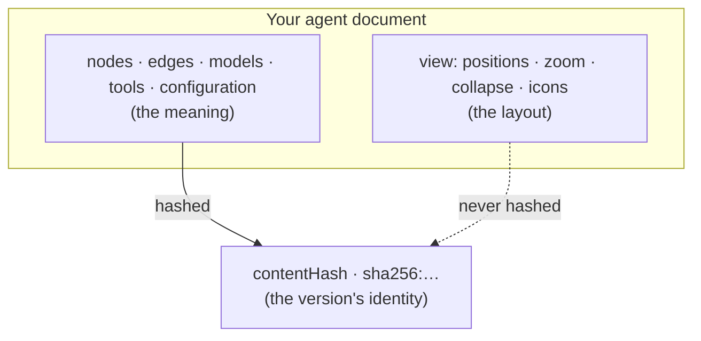

# Versioning

When you save an agent, TheYgent stores it as an **immutable, content-addressed version**. "Content-addressed" means the version's identity is a fingerprint of what the agent *means* — its nodes, edges, models, tools, and configuration — and nothing else. Rearranging the canvas never creates a new version; changing what the agent does always does. This page explains that fingerprint, what counts as a change, and how versions are pinned and resolved.

## Immutable versions

A saved agent has a stable id and a series of versions. Each version, once published, never changes — TheYgent will not overwrite it. When you want to change an agent, you publish a new version alongside the old ones; the earlier versions remain exactly as they were, so anything pinned to them keeps behaving identically.

This immutability is what makes an agent safe to deploy. A [trigger](../running/triggers.md), a [durable run](../running/durable.md), or a parent agent that composes this one can pin a specific version and trust that it will never shift under them.

Agents and their versions are permanent once created — there is no delete for a saved agent or an individual version. (Sessions, triggers, connections, and registered models can be deleted; agent history cannot.)

## The content hash: meaning, not layout

Every version carries a `contentHash` of the form `sha256:…`. It is computed by taking the full agent document, filling in every default, sorting the keys, stripping out the layout, and hashing the result. Two things are deliberately left out of the hash:

- the `contentHash` field itself, and
- the **`view` block** — the canvas layout: node positions, zoom level, whether a node is collapsed, and any custom node icons.

Because the layout is never hashed, everything you do to *arrange* the canvas leaves the version untouched:

- Dragging nodes to new positions.
- Zooming or panning.
- Collapsing or expanding a node.
- Changing a node's display icon.

None of these mint a new version. Neither does reformatting the underlying document — key order and whitespace never matter, and omitting a field that has a default produces the same hash as writing that default out explicitly. Two agents that mean the same thing always have the same hash, and so are the same version.

## What creates a new version

Any change to what the agent *does* changes the hash, and you publish that as a new version. That includes:

- Editing a node's configuration — a prompt message, a temperature, a router's selection, a guardrail rule.
- Adding, removing, or rewiring a node or an edge.
- Changing which model an `llm` node uses, or the generation parameters stored on a model binding.
- Adding, renaming, or removing a port.
- Changing a pinned child agent in a [subgraph, loop, or map](../building/nodes/orchestration.md) node.

If the hash is different, it is a different version.

### Publishing rules

When you save, the outcome depends on whether the content and the version label already exist:

| You publish… | Result |
|---|---|
| The **same content** under an **existing** version label | Idempotent — nothing new is stored; you get the version you already have. |
| **Different content** under an **existing** version label | Rejected (`version_conflict`) — a published version is immutable. Bump the version label. |
| A **new** version label with any content | A new version is created. |

The idempotent case matters in practice: re-saving an agent you have not actually changed, or redeploying the same agent in a script, is a harmless no-op rather than an error. The rejection case is the immutability guard — you cannot quietly rewrite version `1.0` to mean something new; you publish `1.1` instead. See [Saving agents](../building/saving-agents.md) for the save flow in the editor.

## Pinning and resolving a version

Anything that runs a saved agent can pin which version it means, in one of two ways: by its exact `content_hash`, or by its version label. If neither is pinned, TheYgent uses the **latest** version.

The resolution order is always:

1. a pinned content hash, then
2. a pinned version label, then
3. latest.

"Latest" means the **most recently published** version — the last one you saved — not the highest-numbered label. If you publish a fix to an older line *after* releasing a newer one, that fix is now the latest, because latest tracks publication order, not version numbering. For unattended runs, prefer an explicit pin so "latest" can never surprise you: triggers, in fact, *require* you to pin exactly one of a version or a content hash.

A pin that no longer resolves — a mistyped hash or a version that does not exist — fails cleanly with a not-found error, never a crash or a silent fallback to something else.

## Composition is frozen in

When one agent composes another — through a [subgraph, loop, or map](../building/nodes/orchestration.md) node — the child is referenced by id plus exactly one pin (a version or a content hash). That pin lives in the parent's configuration, so it becomes part of the parent's content hash. The consequence: the parent's version fully determines which child version runs. If the child later publishes a new version, the parent does not change and does not pick it up — you would publish a new parent version to adopt the newer child. Composition is immutable, all the way down.

## Related pages

- [Agents and graphs](agents-and-graphs.md) — what the agent document contains
- [Saving agents](../building/saving-agents.md) — saving named agents and publishing versions
- [Runs and sessions](runs-and-sessions.md) — the runs that execute against a version
- [Triggers](../running/triggers.md) — deploying a pinned version behind a schedule, webhook, or token
- [Orchestration nodes](../building/nodes/orchestration.md) — composing pinned child agents
