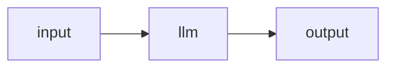

# Your first agent

An agent is a small graph of connected nodes. The simplest useful one takes an input, sends it to a model, and returns the answer:

In this walkthrough you'll build exactly that on the canvas, test-run it, and save it as a named, versioned agent.

**Before you start:** you need at least one registered model. If you don't have one yet, follow [Your first chat](first-chat.md) through step 2.

## 1. Open the editor

In the sidebar, open **Agents** (the home page), then click **New agent**. The editor opens with a fresh, blank graph: an **input** node already wired straight to an **output** node. It is valid and would run as-is — echoing whatever you give it — but we'll put a model in the middle.

The editor has three columns: the **palette** (node types, left), the **canvas** (middle), and the **inspector** (settings for the selected node, right). Along the top is a toolbar with **id**, **name**, and **version** fields and a validation indicator.

## 2. Add an llm node

In the palette, under the **Compute & Tools** group, find **llm**. Drag it onto the canvas (or click it to drop at a default spot). The new node arrives pre-seeded with one **user** message containing `$in` — the placeholder that stands for whatever input the node receives.

## 3. Wire input → llm → output

Nodes connect through **ports** — the small round handles on a node's sides (inputs on the left, outputs on the right). To insert the llm between input and output:

1. **Delete the existing edge** from input to output: click it and press **Delete** (or right-click it and choose **Delete edge**).
2. Drag from the **input** node's `out` handle to the **llm** node's `in` handle.
3. Drag from the **llm** node's `out` handle to the **output** node's `in` handle.

You now have `input → llm → output`, joined by solid data edges.

!!! tip "Tidy up"
    The **Tidy layout** button in the canvas controls (bottom-left) auto-arranges the nodes if the wiring gets messy.

## 4. Configure the model and prompt

Click the llm node to select it; its settings appear in the inspector.

- **model** — open the picker (*"pick a binding or inference model…"*) and choose your installed model by its logical id. Picking a model from your inference plane **automatically declares it** as a model binding on the graph, so there's nothing else to set up.
- **Messages** — the seeded user turn already contains `$in`, which forwards the agent's input to the model. Optionally add a **system** turn: click **Add message**, change its role to *system*, and type an instruction such as *"You are a concise assistant."* System turns automatically float to the top.

`$in` is the input-referencing syntax: `$in` is the node's default input, and `$in.<port>` / `$in.<port>.<field>` reach named ports and fields. See [Referencing inputs](../building/input-references.md) for the full grammar.

## 5. Confirm it's valid

The toolbar's validation indicator turns green (**valid**) when the graph is sound. If it shows red errors or amber warnings, click it to open the **Issues** panel — hovering an issue flashes the node or edge it points at. The usual first-agent fixes are: pick a model, and make sure every required input port is connected.

## 6. Save it as a named agent

1. In the toolbar, set the **id** (for example `first-agent`), a **name**, and a **version** (it starts at `0.1.0`).
2. Click **Save agent** (or press **⌘/Ctrl+S**).

The server strips the visual layout, computes a **content hash**, and stores this as an **immutable version**. A few consequences worth knowing:

- The **id becomes read-only** after the first save — to "rename", save under a new id.
- To change the agent later, edit and **Save** again with a bumped **version**. Re-saving identical content under the same version does nothing; saving *different* content under the same version is rejected, so bump the version yourself.

See [Saving agents](../building/saving-agents.md) and [Agent versioning](../concepts/versioning.md) for more.

## 7. Run it

There is **no run button inside the editor** — you run saved agents from the Agents page.

1. Go to **Agents** in the sidebar.
2. On your agent's card, click **Run**. A **Run · &lt;name&gt;** modal (the Agent Bench) opens.
3. Pick a **Version** (defaults to the latest), enter an **Input** in Text or JSON mode, and click **Run**.

The answer streams back just like chat, followed by a **run waterfall** showing each node's timing and its inputs and outputs. The caret next to **Run** offers **Run durably** (checkpointed), which you don't need for a simple agent like this — a plain `input → llm → output` graph runs on the normal interactive path. Agents that use `human`, `subgraph`, `loop`, or `map` nodes are durable-only and need [durable mode](../running/durable.md).

## Where to next

| You want to… | Go to |
|---|---|
| A full tour of the editor — palette, canvas, inspector, code view | [The editor](../building/editor.md) |
| Everything the llm node can do — tools, parameters, sessions | [LLM node](../building/nodes/llm.md) |
| The full list of node types | [Node reference](../building/nodes/index.md) |
| Test and benchmark agents in depth | [The Bench](../running/bench.md) |
