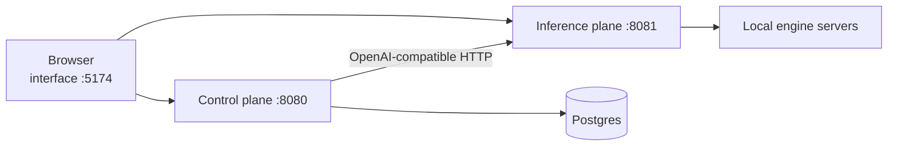

# Getting started

TheYgent is a local-first platform for building and running AI agents: three small services run on your own machine, and everything — models, agents, runs, chat history — lives where you put it. This section takes you from a fresh clone to your first working agent in about ten minutes.

## What you need

| Requirement | Why |
|---|---|
| **Python 3.12** | Runs the two backend services. The repo pins the version, and `uv` manages it for you. |
| **uv** on `PATH` | The Python package manager. Installs dependencies and the MLX engine servers. |
| **pnpm** on `PATH` (with Node.js) | Runs the visual interface. The repo pins pnpm `11.8.0`; TheYgent is developed against Node 22. |
| **PostgreSQL** | The control plane stores agents, runs, and sessions in Postgres. You supply a running server — TheYgent does not provision one. |
| **Homebrew** (macOS) | `make engines` uses it to install llama.cpp, whisper.cpp, and ffmpeg. |

!!! note "Bring your own Postgres"
    Any way you already run Postgres works — a native install, a container, a managed instance. All TheYgent needs is a database it can reach at the `DATABASE_URL` connection string you set during [installation](installation.md).

### Hardware and platform notes

Which local model engines you can run depends on your machine:

- **Apple Silicon Mac** — the best-covered platform. `make engines` installs everything: llama.cpp (chat, embeddings, vision), whisper.cpp (speech-to-text), and the MLX servers (chat, vision, text-to-speech). MLX only runs on Apple Silicon.
- **Linux, or a Mac without Apple Silicon** — llama.cpp and whisper.cpp run anywhere the binaries exist, including CPU-only machines. Install `llama-server`, `whisper-server`, and `ffmpeg` with your package manager; the MLX servers are unavailable.
- **A machine with an NVIDIA GPU** — vLLM is the engine for CUDA hosts. It is deliberately not part of `make engines`; install it on the GPU host with `pip install vllm`.
- **No local model at all** — that works too. You can register any OpenAI-compatible server or hosted API as a [remote model](../models/remote.md) and build agents against it.

Missing engines are never fatal: the inference plane reports exactly which engine/modality slots your machine can run, and the model catalog only offers models you can actually execute. See [Models and engines](../concepts/models-and-engines.md) for the full picture.

## The three services

`make up` starts three local processes:

| Service | Port | What it does |
|---|---|---|
| Inference plane | `8081` | Runs your local model engines and proxies remote APIs. Owns the model registry and the model catalog. |
| Control plane | `8080` | Agents, runs, sessions, triggers, MCP servers, observability. Backed by Postgres. |
| Interface | `5174` | The web UI you work in. Your browser talks to both planes directly. |

Everything runs where *you* point it: model weights download to `~/.theygent/inference/models/` on your machine, the model registry stays in a local file, and the control plane's data sits in your own Postgres. Nothing reaches a hosted API unless you explicitly register one — you own every hop. All services bind to localhost by default; TheYgent is a single-user local install with no account or sign-up. Once they are up, you work entirely in your browser at `http://localhost:5174`. Read more in [Architecture](../concepts/index.md).

## The ten-minute path

1. **[Installation](installation.md)** — clone the repo, create `.env`, install the engines and dependencies.
2. **[Running TheYgent](running.md)** — `make up`, then confirm everything is healthy with `make status` and `/readyz`.
3. **[Your first chat](first-chat.md)** — install a small model from the Registries page and talk to it in New Chat.
4. **[Your first agent](first-agent.md)** — build input → llm → output on the canvas, test it right there, and publish it as a named agent.
