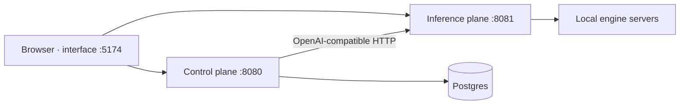

# Running TheYgent

With the code [installed](installation.md), a single command brings up all three services. This page covers starting them, checking they're healthy, stopping them, and the one optional process — the durable worker — you'll only need for certain agents.

## Start everything: `make up`

From the repository root:

```bash
make up
```

`make up` runs three phases in order:

1. **install** — `uv sync` (Python dependencies) and `pnpm install` (interface dependencies).
2. **migrate** — apply the control-plane database schema to your `DATABASE_URL`.
3. **start** — launch the three services as background processes.

From a fresh clone with `.env` set and `make engines` done, this is the only command you need. Once it finishes, open the interface in your browser:

**[http://localhost:5174](http://localhost:5174)**

On a fresh install the interface greets you with a **first-run wizard**: pick a username and password to create the install's admin account, and you land in the app signed in. Everything about accounts, roles, and single sign-on is covered in [Users, roles & sign-in](../running/users.md).

## The three services

| Service | URL | What it does |
|---|---|---|
| Inference plane | `http://127.0.0.1:8081` | Runs your local model engines and proxies any remote APIs you register. Owns the model registry and the Hugging Face model catalog. |
| Control plane | `http://127.0.0.1:8080` | Agents, runs, sessions, triggers, MCP servers, observability. Backed by your Postgres. |
| Interface | `http://localhost:5174` | The web app you work in. Your browser talks to both planes directly. |

If a port is already taken, `make up` skips that service loudly rather than clobbering it — you'll see a message like `already on :8080 — skipping (use 'make restart')`. Process ids and logs land under `.run/` (`.run/inference-plane.log`, `.run/control-plane.log`, `.run/interface.log`).



## Check status and logs

```bash
make status   # which services are up
make logs     # tail all three service logs
```

## Health checks

Both planes expose two endpoints:

- **`GET /healthz`** — a plain liveness check (is the process up?).
- **`GET /readyz`** — a readiness check.

```bash
curl http://localhost:8081/readyz   # inference plane
curl http://localhost:8080/readyz   # control plane
```

The **inference plane's** `/readyz` reports which `(engine, modality)` slots this machine can actually run — for example `llamacpp`, `mlx`, `mlx:vision`. A missing binary shows up here as not-ready with an install hint, so you learn about it now rather than as a surprise error on your first model call. The service stays ready as long as *any* engine is available.

The **control plane's** `/readyz` checks both your Postgres and the inference plane; it fails if either is unreachable.

## Restart and stop

```bash
make restart   # stop, then start — use this to pick up backend code changes
make down      # stop all three services
```

## When you need the worker (durable runs)

Most agents run on the normal interactive path and need nothing beyond the three services above. **Durable execution** — runs that checkpoint each step so they survive a crash and can pause for human input — is required for the `human`, `subgraph`, `loop`, and `map` node types, and for durable runs launched from the Bench (the `POST /agents/{id}/durable-runs` path).

There are two ways to enable it:

- **On your own machine:** set `THEYGENT_DURABLE=1` in your `.env` and restart. The control plane then runs the durable runtime in-process — no separate program.
- **In a server or air-gapped deployment:** run the standalone worker, `uv run --package theygent-worker theygent-worker`. It is **not** started by `make up`.

The durable runtime keeps its bookkeeping in a separate `dbos` schema inside the same Postgres, and migrates it automatically — there is no extra migration step to remember.

Without durable mode, running a durable-only agent returns a `durable_required` error (the interface shows a note telling you to set `THEYGENT_DURABLE=1`). See [Durable runs](../running/durable.md) for the full story.

## Make targets at a glance

| Target | Does |
|---|---|
| `make up` | install + migrate + start (the golden path) |
| `make start` | start the three services (no install/migrate) |
| `make restart` | stop, then start |
| `make down` | stop all three services |
| `make status` | show which services are up |
| `make logs` | tail all three service logs |
| `make install` | install Python + interface dependencies |
| `make engines` | install the local model engines (macOS) |
| `make migrate` | apply the database schema |

## Next

Everything is up — now [install a model and have your first chat](first-chat.md). If something isn't healthy, see [Troubleshooting](../reference/troubleshooting.md).
