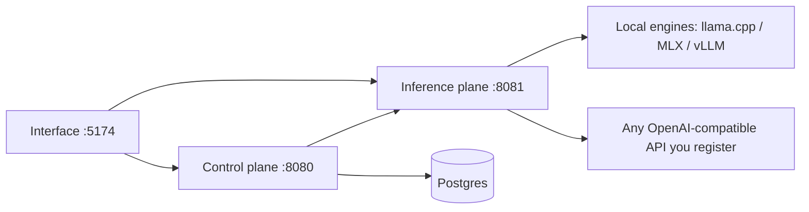

# TheYgent

TheYgent is a no-code, local-first platform for building and running AI agents. You compose agents visually on a canvas, chat with them or wire them to triggers, and run them against models on your own machine — or against any OpenAI-compatible API you choose to register.

## Your models, your machines, your choice

TheYgent's promise is honest and specific: **everything runs where you point it, and you own every hop.**

- **Local by default.** Models download to your machine and run on local engines — llama.cpp anywhere, MLX on Apple Silicon, vLLM on CUDA GPUs. Weights, the model registry, and credentials live in local files under `~/.theygent/inference`; agents, runs, and conversations live in a Postgres database you control.
- **Hosted APIs only when you add them.** Any OpenAI-compatible server or hosted API can be registered as a model, with its API key stored on your machine as a local credential that is never sent anywhere else.
- **The choice is per agent and per call.** Every model gets a logical id (for example `triage-fast`), and agents reference that id — never an engine. You can point one node at a small local model and the next at a hosted one, or swap a model's backing engine later without touching a single agent.

There is no vendor in the middle: TheYgent never proxies your prompts, payloads, or weights through anyone's servers.

## What you can do

- **Build agents visually** — drag nodes onto a canvas, connect them with edges, configure them in an inspector, and run them without writing code. See the [editor tour](building/editor.md) and the [node reference](building/nodes/index.md).
- **Chat** — a unified chat surface for talking to any registered model or saved agent, with streaming answers, a collapsible "thinking" view for reasoning models, voice and image input, and automatic session history. See [chat](chat/index.md).
- **Run models locally or remotely** — browse and install models from Hugging Face with fit-to-your-RAM badges, or register a hosted API; engines start lazily and are managed for you. See [models](models/index.md) and [models and engines](concepts/models-and-engines.md).
- **Extend agents with tools** — built-in tools, HTTP calls, and any MCP (Model Context Protocol) server, connected over stdio or HTTP and running in your own trust domain. See [MCP tools](building/nodes/mcp.md).
- **Give agents your documents** — upload files or crawl a docs site into a retrieval source; agents search it with hybrid (semantic + keyword) retrieval, embedded by a model on your own inference plane and stored in your own Postgres. See [RAG sources](rag/index.md).
- **Automate** — deploy saved agents behind token-authenticated invoke endpoints, HMAC-signed webhooks, and cron schedules. See [triggers](running/triggers.md).
- **Run durably** — opt a run onto the durable runtime so it checkpoints each step, survives a crash, and can pause for human approval. See [durable runs](running/durable.md) and [human in the loop](running/human-in-the-loop.md).
- **Observe everything** — every run gets a zoomable span waterfall with per-node inputs, outputs, and timing, plus optional OTLP export. See [observability](running/observability.md).
- **Benchmark** — test any model or agent from the Bench: per-turn latency and token metrics, saved results, side-by-side comparisons. See [the Bench](running/bench.md).

## How it fits together

TheYgent runs as three local services, brought up together with `make up`:

- The **interface** is the web app where you build, chat, and observe.
- The **control plane** orchestrates agents: it stores agent versions, executes graphs, records runs and sessions, and handles triggers. It talks to models only over HTTP.
- The **inference plane** is yours alone: it holds the model registry, downloads weights, spawns and supervises local engine servers, and proxies to any remote API you register. When you chat directly with a model, raw media (voice recordings, images) goes to it straight from your browser; in an agent run — which the control plane orchestrates — that media is uploaded to the control plane as an artifact and handed to nodes by reference.

The [architecture page](concepts/index.md) explains the split and exactly where each kind of data lives.

## Where to next

| If you want to… | Go to |
|---|---|
| Install TheYgent and get it running | [Getting started](getting-started/index.md) |
| Install a model and have your first conversation | [First chat](getting-started/first-chat.md) |
| Build, run, and save your first agent | [First agent](getting-started/first-agent.md) |
| Understand agents, graphs, runs, and versioning | [Concepts](concepts/index.md) |
| Look up what every node does | [Node reference](building/nodes/index.md) |
