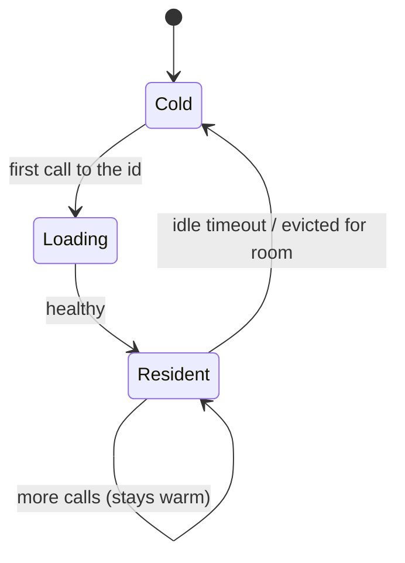

# The engines

An **engine** is the program that actually runs a local model. TheYgent manages three of them — **llama.cpp**, **MLX**, and **vLLM** — plus a fourth binding, `openai-compatible`, for endpoints it merely reaches. This page explains what each engine is for, where it runs, how the managed ones start and share memory, and which modalities (chat, vision, embeddings, speech, images) each covers.

If you only need to *use* models, you don't have to think about engines much — a catalog install picks the right one for you. Read on when you're choosing hardware, registering weights by hand, or wondering why a first call is slow. For the vocabulary of bindings, sources, and modalities, see [Models and engines](../concepts/models-and-engines.md).

## The four bindings

Every registered model has a **binding** that says what runs it. There are exactly four values, and their meaning never changes:

| Binding | What it runs | Managed? |
|---|---|---|
| `llamacpp` | A llama.cpp server on GGUF weights. Runs on any platform where the binary is installed. | Yes — spawned and supervised. |
| `mlx` | The MLX family of servers, on Apple Silicon. | Yes. |
| `vllm` | A vLLM server on an NVIDIA/CUDA GPU host. | Yes (experimental). |
| `openai-compatible` | Any OpenAI-compatible server or hosted API at a base URL you supply. | No — reached, never managed. |

The first three are **managed**: TheYgent starts the server on first use, health-checks it, and stops it when idle. `openai-compatible` is **reached** — nothing is spawned or stopped; see [Remote models](remote.md).

## llama.cpp

**llama.cpp** runs models in the **GGUF** format and is the broadest, most portable local engine — it runs anywhere its `llama-server` binary is installed (macOS, Linux, with or without a GPU). It's the default choice when you want a model to run on the same machine regardless of platform. GGUF models come in **quantizations** (labels like `Q4_K_M`), and the catalog lists each quant as a separate variant with its own fit badge.

Under the `llamacpp` binding, TheYgent covers several modalities by spawning the right server for the registered modality:

- **Chat** and **embeddings** — the `llama-server` binary (embeddings use mean pooling).
- **Vision** — the same `llama-server` with a multimodal projector; TheYgent finds the projector file next to the weights or falls back to auto-detection.
- **Speech-to-text** — served by **whisper.cpp**'s `whisper-server`, registered under `binding: llamacpp` with `modality: audio.transcription`. With `ffmpeg` installed it also transcodes browser microphone recordings (webm/opus); without it, only WAV works. Whisper needs its own native `ggml-*.bin` weights — a chat-style GGUF won't work, and an ambiguous weights path raises a clear error telling you which file to point at.
- **Image generation** — a bundled wrapper around stable-diffusion.cpp's `sd-cli` (see the note under [Installing the engine binaries](#installing-the-engine-binaries)).

## MLX

**MLX** is Apple's array framework, and TheYgent's MLX engines run **only on Apple Silicon** (M-series Macs). On that hardware they're fast and memory-efficient because the CPU and GPU share one pool of unified memory. When you're on an Apple Silicon Mac, MLX is usually the best local option for chat and vision; the same model repo often ships both a GGUF (for llama.cpp) and an MLX variant, and the catalog shows whichever your ready engines can run.

Under the `mlx` binding, the modalities map to distinct server programs:

- **Chat** — `mlx_lm.server`.
- **Vision** — `mlx_vlm.server` (a separate program).
- **Text-to-speech** — `mlx_audio.server`.
- **Image generation** — a wrapper around `mflux-generate` (see the binaries note below).

MLX does **not** serve embeddings or speech-to-text — use llama.cpp (embeddings) and whisper.cpp (transcription) for those, on the same machine.

## vLLM

**vLLM** targets **NVIDIA/CUDA GPU hosts** and is built for high-throughput serving. In this build it is **experimental and unverified**: the `vllm` binding exists and targets chat, but it has not been confirmed on the maintainers' hardware, and it is deliberately left out of the automatic engine install.

!!! warning "Treat vLLM as experimental"
    Only the `chat` modality is wired for vLLM, and none of it is verified in this codebase. If you have a CUDA GPU, you can try it — install vLLM yourself and register a model under the `vllm` binding — but validate it on your own hardware before relying on it. llama.cpp and MLX are the proven local paths.

## Modality support matrix

Which engine covers which modality:

| Modality | llama.cpp | MLX | vLLM |
|---|---|---|---|
| **Chat** (`chat`) | ✅ | ✅ | ⚠️ experimental |
| **Vision** (`vision`) | ✅ | ✅ | — |
| **Embeddings** (`embeddings`) | ✅ | — | — |
| **Speech-to-text** (`audio.transcription`) | ✅ (whisper.cpp) | — | — |
| **Text-to-speech** (`audio.speech`) | — | ✅ | — |
| **Image generation** (`images.generation`) | ✅ (sd-cli) | ✅ (mflux) | — |

A registered model whose exact (engine, modality) combination has no server is refused with a clear error rather than being served wrong. `openai-compatible` endpoints aren't in this table — they serve whatever the upstream serves, and you declare the modality when you register them.

!!! note "Image generation needs extra setup"
    The image-generation engines (stable-diffusion.cpp's `sd-cli` and `mflux`) are the newest and least-exercised paths, and their binaries are **not** installed by the standard engine install. You must build/install them yourself and point TheYgent at them (`THEYGENT_SDCPP_BIN`, `THEYGENT_MFLUX_BIN`) before an image-generation model will run. See [Image generation in chat](../chat/vision-and-images.md).

## How managed engines run

You never start or stop a managed engine by hand. TheYgent handles the whole lifecycle, and understanding it explains a few things you'll notice.

**Lazy start.** An engine spawns on the **first call** to one of its logical ids, on a free local port, and TheYgent waits for it to become healthy before forwarding your request. This is why the very first call to a model is slower than the ones after it — the model is loading. Large models take longer; startup waits allow a few minutes for llama.cpp and MLX, and up to ten for vLLM. Once loaded, the engine stays **warm** for subsequent calls.

**A resident ceiling.** Only a limited number of engines stay loaded at once — **two by default** (`THEYGENT_MAX_RESIDENT`). When a new engine is needed and the ceiling is full, TheYgent **evicts** one to make room, choosing the lowest-priority, least-recently-used engine. An engine with a request in flight is **never** evicted; if nothing can be freed, the new call is refused with a `no_capacity` error rather than thrashing.

**Idle reaping.** An engine left idle longer than its idle timeout (**900 seconds** by default) is torn down automatically by a background sweep, freeing its memory. Mark a model **Keep warm** to exempt it from reaping.

**Manual control.** From a model's row in [Registries](index.md), **Warm** preloads an engine (so the next call skips the cold start) and **Evict** frees it now. Both are safe no-ops for reachable endpoints and models that aren't loaded.

**Missing binaries fail cleanly.** If a model's engine binary isn't installed on the machine, the call returns `engine_unavailable` — a clear, up-front error — never a mysterious crash on first inference.



## Installing the engine binaries

The engines are separate programs. On macOS, one target installs the managed set:

```bash
make engines
```

=== "Apple Silicon Mac"
    `make engines` installs the full set: `llama.cpp`, `whisper.cpp`, and `ffmpeg` via Homebrew, plus the MLX chat, vision, and text-to-speech servers via `uv tool install`. This gives you local chat, vision, embeddings, speech-to-text, and text-to-speech.

=== "Linux / other"
    `make engines` prints guidance instead of installing. Install `llama-server` (llama.cpp), `whisper-server` (whisper.cpp), and `ffmpeg` with your package manager. The MLX servers are Apple-Silicon-only and won't run here.

=== "NVIDIA GPU host"
    Install vLLM yourself with `pip install vllm`. It is deliberately not part of `make engines`. Remember it is experimental in this build.

TheYgent finds each binary by checking an explicit environment override first, then your `PATH`, then (for Python-module servers) `python -m …`. To point at a binary in a non-standard location, set its override — `THEYGENT_LLAMACPP_BIN`, `THEYGENT_MLX_BIN`, `THEYGENT_MLX_VLM_BIN`, `THEYGENT_MLX_AUDIO_BIN`, `THEYGENT_WHISPERCPP_BIN`, `THEYGENT_VLLM_BIN`, `THEYGENT_SDCPP_BIN`, or `THEYGENT_MFLUX_BIN`. The full list is in the [environment reference](../reference/environment.md).

TheYgent launches and supervises these binaries but never builds or downloads them — that part is on you (or on `make engines`).

## Checking what's ready

Which engines and modalities your machine can actually run is reported by the inference plane's readiness endpoint. Every (engine, modality) **slot** shows separately — a chat slot as the bare engine name (`llamacpp`, `mlx`), a non-chat slot as `engine:modality` (`mlx:vision`, `llamacpp:audio.transcription`) — and a not-ready slot carries a reason with an install hint:

```bash
curl http://localhost:8081/readyz
```

The service stays "ready" as long as **any** engine is available, so a Mac without CUDA still serves llama.cpp and MLX happily. The catalog's engine filters mirror this — it only offers models for slots that are ready.

## Related pages

- [Models and engines](../concepts/models-and-engines.md) — bindings, sources, modalities, and logical ids
- [Registries](index.md) — the models page, Warm/Evict, and resident count
- [Installing local models](installing.md) — installing weights for these engines
- [Remote models](remote.md) — the `openai-compatible` binding
- [Installation](../getting-started/installation.md) — running `make engines`
- [Environment variables](../reference/environment.md) — `THEYGENT_MAX_RESIDENT`, binary overrides, and more
