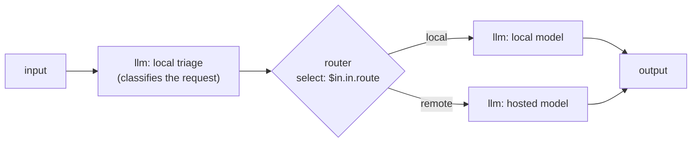

# Remote models

Not every model has to run on your machine. You can register **any OpenAI-compatible server or hosted API** under a logical id and call it exactly like a local model — the same `llm` node, the same chat surface, the same agents. This page covers registering one, the credential store that keeps your API key on your machine, the quirks worth knowing, and how to mix local and remote models in a single agent.

Remote models use the **`openai-compatible`** binding. Unlike the managed engines, TheYgent never starts, stops, or supervises a remote endpoint — it simply forwards your calls to the base URL you give it. For the binding vocabulary, see [Models and engines](../concepts/models-and-engines.md).

!!! note "The honest boundary"
    A remote model means your prompts go to whatever endpoint you register — a hosted provider, or a server on your own network. That is your choice and your hop: TheYgent forwards the call and relays the answer, and never inserts itself as a required middleman. Local models keep everything on your machine; remote models go exactly where you point them.

## 1. Store the API key as a local credential

Most hosted APIs need an API key. Rather than pasting it into the model registration, you store it once as a **local credential** and reference it by name.

1. Open **Settings** from the sidebar, and find **Endpoints & credentials → Local credentials**.
2. Add a credential: a **Name** (must be environment-variable shaped, e.g. `OPENAI_API_KEY`) and its **Value** (your key).

Credentials are **write-only** — the list shows the name and "•••••• set", and the value can never be read back through the UI. They are stored on your inference plane, on this machine, and are **never sent to the control plane**. A model registration refers to a credential by the scheme `secret://NAME` (for example `secret://OPENAI_API_KEY`).

!!! tip "You can also use an environment variable"
    When a registration references `secret://NAME`, the inference plane resolves it by looking first in the local credential store, then at a process environment variable of the same `NAME`. So a key already exported into the inference plane's environment works without adding it to the store.

## 2. Register the remote model

1. In **Registries**, click **Add model → Hosted / local**.
2. Enter a **Logical id** (e.g. `writer` or `triage-fast`) — the name your agents will use.
3. Leave **Binding** on **openai-compatible** (the default for this tab).
4. In **Model**, enter the **provider's** model name — whatever id that endpoint expects in its `model` field.
5. Enter the **Base URL**, including the API path (see the quirk below).
6. Pick a **Credential** — a stored `secret://NAME`, "— no credential —", or a custom ref.
7. Save.

The equivalent registration over the management API (the inference plane on `http://localhost:8081`, camelCase wire format):

```bash
curl -X PUT http://localhost:8081/admin/models/writer \
  -H 'Content-Type: application/json' \
  -d '{
    "binding": "openai-compatible",
    "baseUrl": "https://api.your-provider.example/v1",
    "model": "provider-model-id",
    "credentialRef": "secret://OPENAI_API_KEY",
    "modality": "chat"
  }'
```

For a non-chat upstream (an embeddings or speech endpoint, say), set `modality` accordingly. A reachable endpoint is a pure declaration — TheYgent doesn't probe it — so the modality you declare is the one it's routed as.

If the endpoint needs no authentication (a local server, for instance), leave the credential empty; TheYgent sends a placeholder key that unauthenticated servers ignore.

## Quirks worth knowing

### The base URL must include the API prefix

The base URL is the **root the endpoint's `/chat/completions`, `/embeddings`, etc. hang off** — for hosted OpenAI-compatible APIs that almost always ends in `/v1`. If you drop the prefix, calls fail with a `modality_not_supported` error whose message says the path looks wrong. When in doubt, use the same base URL the provider documents for its OpenAI-compatible endpoint, trailing `/v1` included.

### Some hosts reject parameters others accept

Hosted models don't all take the same parameters — one may reject `temperature`, another may not support a particular sampling knob. TheYgent doesn't second-guess this: it relays the request as you built it, and if the provider rejects a parameter, **the provider's own error message and status come straight back to you**, before the answer starts streaming. If a call fails with an "unexpected parameter" style error, remove that parameter from the model's or node's params. A failure that happens partway through a stream ends the stream with a structured error rather than a torn connection.

### Remote models have no lifecycle

There is nothing to warm, evict, or wait for. A remote id never counts against your resident-engine ceiling, its **State** stays effectively cold, and **Warm** / **Evict** are no-ops. Capability probing is also skipped — the model advertises only the modality you declared, so the fit and capability badges you see for local models don't apply.

## Mixing local and remote in one agent

<figure class="video">
  <iframe src="https://www.youtube-nocookie.com/embed/eHIHABKbwVg" title="Run Local + Remote AI Models in One Agent" loading="lazy" referrerpolicy="strict-origin-when-cross-origin" allow="accelerometer; autoplay; clipboard-write; encrypted-media; gyroscope; picture-in-picture; web-share" allowfullscreen></iframe>
  <figcaption>Run Local + Remote AI Models in One Agent (7:01) — the routed hybrid below, built and run: the local model answers the easy request, the hosted one takes the hard question.</figcaption>
</figure>

Because both local and remote models are just logical ids, a single agent can use both — routing simple work to a fast local model and hard work to a stronger hosted one. The usual shape is a small local classifier that decides, feeding a [router node](../building/nodes/router.md) that sends each request down the matching branch:



Each `llm` node names its own logical id, so one node runs on a local engine and another calls a hosted API — in the same run. This "hybrid" pattern keeps cheap, private traffic on your machine and reserves the paid hosted call for the requests that need it. To build it, see the [router node](../building/nodes/router.md) and [Referencing inputs](../building/input-references.md) for the `$in.<port>.<field>` selector the router reads.

Nothing about the agent changes when you swap a local id for a remote one later — re-register the id and every agent that uses it routes to the new endpoint on its next run. See [Swapping a model without touching agents](../concepts/models-and-engines.md#swapping-a-model-without-touching-agents).

## Related pages

- [Registries](index.md) — the models page and its Installed table
- [Installing local models](installing.md) — the local counterpart to this page
- [Models and engines](../concepts/models-and-engines.md) — bindings, sources, and logical ids
- [The llm node](../building/nodes/llm.md) — using a model id in an agent
- [Router node](../building/nodes/router.md) — the branching node for hybrid local/remote agents
