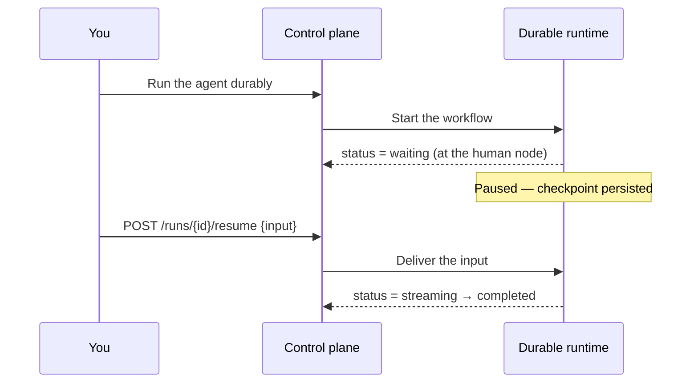

# Human-in-the-loop

Some agents shouldn't run to completion on their own. A **human approval** node pauses a run at a chosen point, waits for a person to review and supply input, and only then continues. This is how you build approval gates, manual review steps, and "ask me before you act" checkpoints.

Human approval is built on [durable runs](durable.md): a paused run persists as `waiting` and can wait indefinitely — minutes or days — surviving restarts until someone answers.

## Before you start

The human node **only runs in durable mode**. If durable mode is off, the interactive path rejects it with `durable_required`, and `POST /runs/{id}/resume` returns `400`. Turn it on first — see [Durable runs](durable.md).

## The flow end to end



### 1. Build: add a human node

On the canvas, drop a **human approval** node into the path where you want the pause, wiring the value to review into its input and its output onward to the next step. See the [human node reference](../building/nodes/human.md) for ports and wiring.

Its configuration controls what the pause expects:

| Field | Type | Default | Description |
|---|---|---|---|
| `prompt` | string | — | An advisory description of what input you expect, shown to the reviewer. |
| `inputSchema` | object | — | Advisory shape of the expected input; on resume its **required** keys are enforced. |
| `timeout` | number \| null | `null` | Seconds to wait. `null` means wait forever. |
| `onTimeout` | `fail` \| `default` | `fail` | On timeout, either fail the run or bind `default` and continue. |
| `default` | any | — | The value used when `onTimeout` is `default`. |

Publish the agent (see [Drafts & publishing](../building/saving-agents.md)) so it can be run durably.

### 2. Run it durably

Run the saved agent on the durable runtime — from the Bench's **Run durably** button, via `POST /agents/{id}/durable-runs`, or from a [trigger](triggers.md) in durable mode. See [Durable runs](durable.md) for each path.

When execution reaches the human node, the run **pauses**: its status becomes `waiting` and it records which node it is waiting at (`awaiting_node`). It is now excluded from the restart sweep — it will sit patiently until you answer.

### 3. See that it's waiting

On the [Runs page](index.md) the run shows a `waiting` chip. Open it and the detail page shows a **Resume panel**: *"Paused — awaiting input at `<node>`"*.

### 4. Resume it

#### From the interface

In the Resume panel, choose **Text** or **JSON** input mode, type the value, and click **Resume**. JSON is parsed on the spot and validated loudly; an empty JSON box means a `null` input. The panel appears both on the run detail page and inside the Bench modal for a run started there.

A run may pause **more than once** — an agent can have several human gates. After each resume it flips back to `streaming` and continues until the next gate or the end.

#### Over the API

`POST /runs/{id}/resume` delivers the awaited input:

```bash
curl -X POST http://localhost:8080/runs/RUN_ID/resume \
  -H "Content-Type: application/json" \
  -d '{"input": {"approved": true, "note": "looks good"}}'
```

The `input` can be any JSON value — a string, an object, whatever the node expects. On success the endpoint returns **`202`**:

```json
{ "runId": "…", "status": "resuming", "awaitingNode": "…" }
```

The delivered value flows out of the human node's success output, and the run resumes.

The resume endpoint's other responses tell you exactly what went wrong:

| Status | Code | Meaning |
|---|---|---|
| 400 | `durable_required` | The deployment isn't in durable mode. |
| 404 | `run_not_found` | No such run. |
| 409 | `run_not_waiting` | The run isn't paused (it already finished, failed, or is still running). |
| 409 | `awaiting_node_missing` | The run is waiting but records no target node. |
| 422 | `resume_schema_mismatch` | The node's `inputSchema` requires keys your input is missing. |
| 410 | `workflow_gone` | The durable workflow no longer exists; the run is marked `failed`. |

!!! note "Double-clicking Approve is safe"
    Each human node is delivered on its own dedicated channel. A duplicate resume — a double-clicked **Resume**, a client retry racing the status flip — is buffered inertly against the already-answered gate and can never accidentally satisfy the run's *next* human gate.

## What happens on timeout

If the node has a `timeout` and no one answers in time, the outcome follows `onTimeout`:

- `fail` (the default) — the run fails with a clear reason naming the node and the timeout.
- `default` — the node's configured `default` value is bound and the run continues as if that were the answer.

## Related pages

- [Human node reference](../building/nodes/human.md) — ports, configuration, and worked example.
- [Durable runs](durable.md) — the runtime that makes waiting possible.
- [Runs](index.md) — statuses, the `waiting` state, and the run detail page.
