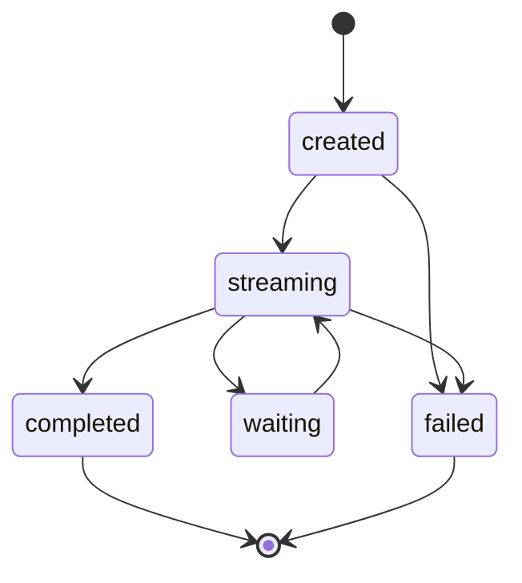

# Runs

A **run** is one execution of an agent or a model — the record of a single request from start to finish. Every chat message, every agent invocation, and every trigger fire creates a run. The **Runs** page is where you find them all, watch them stream live, read their output, and diagnose failures.

For the conceptual model of runs and how they relate to sessions and memory, see [Runs & sessions](../concepts/runs-and-sessions.md). This page is the operational reference: the Runs page, the run lifecycle, the rules that decide a run's output, and what happens when a run is cancelled or fails.

## Where runs come from

Runs are never created by hand — they are the by-product of doing something:

- **Chats** — every turn in [New Chat](../chat/index.md) or an agent's Chat panel is a run.
- **Agent invocations** — running a published agent from the [Bench](bench.md), or over the API.
- **Triggers** — a [webhook, cron schedule, or token invoke](triggers.md) firing a published agent unattended.

## The Runs page

Open **Runs** from the left sidebar. It lists every run, **newest first**, and **auto-refreshes every 3 seconds** (the refresh pauses while the browser tab is hidden). The list loads older runs as you scroll — there is no "load more" button.

Each row shows six columns:

| Column | What it shows |
|---|---|
| Run | The run id (shown in full) |
| Status | A colour-coded status chip |
| Model | The logical model id, for a plain model run |
| Graph | For a saved-agent run, `<graph id>@<version>` |
| Session | The [session](../concepts/runs-and-sessions.md) the run belongs to, if any |
| Created | When the run started (hover for the exact time) |

The status chips double as **filters**: click `completed` to show only completed runs, click it again to clear. The search box filters by run id, model, graph, or session. If you have no runs yet, the page reads *"Runs come from chats, agent invocations, and triggers — start a chat."*

## Run statuses and lifecycle

A run moves through a small set of statuses:

| Status | Meaning |
|---|---|
| `created` | The run row exists; work is about to begin. |
| `streaming` | The run is executing — tokens or step results are flowing. |
| `waiting` | A [durable run](durable.md) is paused at a [human approval](human-in-the-loop.md) node, awaiting input. |
| `completed` | The run finished and its output is persisted. |
| `failed` | The run ended with an error. |

The `waiting` state only appears in durable mode — it is how a run pauses for a person to approve or supply input, and it can wait indefinitely, even across a restart. When you resume it, the run flips back to `streaming`. See [Human-in-the-loop](human-in-the-loop.md).

## The run detail page

Click any run to open its detail. The header shows a breadcrumb back to the list plus the current status. Below it:

- A **metadata card** — Model, Graph (`id @ version`), Session (a link), Created, Updated, and the agent's **Content hash** (the immutable fingerprint of the exact graph version that ran — see [Agent versioning](../concepts/versioning.md)).
- The **output** — while the run is live it streams with a pulsing cursor and a *"streaming…"* label; once finished, the page shows the persisted output. A reasoning model's thinking renders in a collapsible **Thinking** block above the answer.
- A **Trace** — a zoomable waterfall of every step, its timing, and (subject to your capture policy) its inputs and outputs. This is covered in full on [Observability](observability.md).
- For a **waiting** run, a **Resume** panel appears so you can supply the awaited input — see [Human-in-the-loop](human-in-the-loop.md).

!!! note "Runs are permanent"
    Runs cannot be deleted — they are your execution history. Deleting a session [detaches](../concepts/runs-and-sessions.md) its runs (they lose the session link) rather than removing them.

## Run output rules

The output you see on a completed run is decided by a few firm rules:

- **The output is the value of the graph's `output` node**, coerced to a string (a non-string value is JSON-serialised). For a plain model run it is simply the model's answer. See the [input & output nodes](../building/nodes/input-output.md).
- **At most one `output` node may execute per run.** Multiple `output` nodes in a graph are allowed, but if two of them go live in the same run, the run fails loudly (*"a second output node executed — the run output would be ambiguous"*) rather than silently picking one. Route exclusive branches with a [router](../building/nodes/router.md) or [guardrail](../building/nodes/guardrail.md) so only one output node is reachable.
- **An `output` (or `router`) node consumes exactly one input port.** These are single-value consumers, so if such a node is wired with more than one input port the run fails loudly at execution time (`template_error`) — the run reports *which* value would be ambiguous rather than silently picking one. Wire exactly one input port, or compose multiple upstreams in a value-producing node (LLM/tool/MCP tool) instead.

### Honest empty output

Sometimes a run completes but produces no answer. Rather than reporting a green success with a blank result, the run stays `completed` but carries an explanatory **note** in its `error` field, which the interface styles amber (not red). You will see reasons such as:

- *"hit the token limit (finish_reason=length) … raise maxTokens"* — the model spent its whole budget (often a reasoning model thinking); raise `maxTokens` on the [LLM node](../building/nodes/llm.md).
- *"output empty: upstream error on node 'x': …"* — a node upstream of the output errored and its success path was skipped.
- *"the graph declares no output node"* / *"no output node executed this run"* — the taken branch reached no output node.

## Cancelling a run

- In a chat, the **Send** button becomes **Stop generating** while a run streams. In the [Bench](bench.md), a separate **Stop** button appears next to the **Run** / **Run durably** button while a run streams. Either way, clicking it aborts the run and keeps the partial answer, marked *"stopped"*.
- **Leaving a chat mid-stream** aborts the request; the server cancels the run on disconnect and terminalises it to `failed` with *"interrupted: client disconnected mid-stream"*.

## Errors

Errors are reported honestly and never as a broken success:

- **Before streaming starts**, a problem surfaces as a clean HTTP error with a machine-readable code — you never get a `200` followed by a broken stream.
- **Mid-stream**, a failure emits a final status frame marking the run `failed`, then closes the stream.
- **Inference errors are relayed faithfully.** If the model can't be found you get `model_not_found`; if the engine is busy or down, `engine_unavailable`; if the inference plane is unreachable at all, `inference_unreachable`.
- **Graph-shaped errors** carry a specific code: `router_error` (a [router](../building/nodes/router.md) selected a handle that doesn't exist), `template_error` (an unresolved [input reference](../building/input-references.md)), or `transform_error` (a bad [transform](../building/nodes/transform.md) expression).

!!! note "A tool error is not a run failure"
    When a [tool](../building/nodes/tools.md) or [MCP tool](../building/nodes/mcp.md) node raises, the error message is bound to that node's error output and **the run continues** — the node's bar shows red in the trace while the run stays green. A tool error is structured output, not a crash.

### After a restart

If the control plane restarts while a run is mid-flight, that run is swept to `failed` with the reason *"interrupted: control-plane restarted while run was in-flight"* — no zombie run that lies about being live. **`waiting` runs and durable runs are excluded** from this sweep: a paused run is not a zombie, and a durable run [resumes from its last completed step](durable.md) instead.

## Related pages

- [Durable runs](durable.md) — crash-safe execution and the durable-only node types.
- [Human-in-the-loop](human-in-the-loop.md) — pausing a run for approval and resuming it.
- [Observability](observability.md) — the trace waterfall and per-node I/O.
- [Runs & sessions](../concepts/runs-and-sessions.md) — the underlying concepts.
