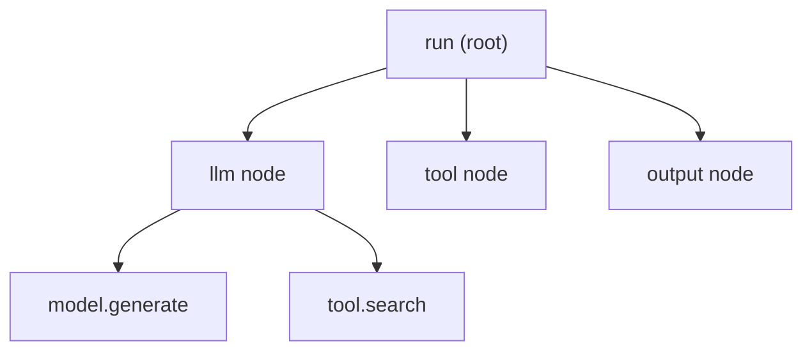

# Observability

Every run is traced. TheYgent records a timing tree for each execution into its own database and renders it as a zoomable **run waterfall** — one bar per graph node, with timings, token usage, and a click-through into each node's input and output. Nothing is sent to an external tracing service unless you opt in. This page explains how to read the waterfall, what gets captured and how to change it, and how to export traces to your own tools.

## Where the waterfall appears

The same waterfall shows up in three places, so you rarely have to go looking for it:

- On the **Runs** detail page — open any run from the [Runs list](index.md) to see its full trace below the output.
- Inside the **agent bench** modal — every run you launch from [the Bench](bench.md) shows its waterfall as it executes.
- Folded under each answer in [chat](../chat/index.md) — expand the collapsed **Trace** block on a run-backed turn (it loads only when you open it).

## Anatomy of a trace

A trace is a tree of **spans** — timed segments of work. Three levels nest inside each other:

- A **run-root** span covers the whole run.
- One **node** span per graph node that executed (the LLM call, a tool, a router, and so on). A plain prompt run — one with no graph — is traced as a single synthetic node.
- Child **phase** spans record the fine-grained steps inside a node. The phases that actually appear are:
    - `model.generate` — one per model generation, under an LLM node.
    - `tool.<name>` — one per tool call an LLM makes autonomously inside a tool-calling loop; its bar is annotated with a check or cross for success or failure.
    - `queue.wait` — the gap between enqueue and pickup, on [durable runs](durable.md) only.

Phase spans carry timing only — never payloads.



Loop and map iterations each get their own span, named `<node_id>#<i>` for the *i*-th branch. Nodes on a branch that was never taken (a dead router or guardrail branch) appear as thin grey **skipped** spans, in place, so the shape of the graph stays legible.

Each span carries a status: `ok`, `err`, `skipped`, or `running` (still in flight).

## Reading the bars

Bars share one time axis: a bar's position is when it started and its width is how long it took, so a glance shows you what ran when and where the time went. The tree nests under collapse chevrons, so you can fold a busy node away.

Colors encode status:

| Color | Meaning |
|---|---|
| Pulsing amber | In flight right now |
| Violet | An instrumented phase (`model.generate`, `tool.*`, `queue.wait`) |
| Green | A node that finished `ok` |
| Red | A node that finished `err` |
| Grey | A skipped node (a dead branch) |

Hatched bands between bars mark **gaps** — time when nothing was on the timeline. Hovering one tells you what kind of gap it was: queue wait, an engine or MCP server spawning, or a transition between nodes.

Rows carry inline annotations where they help: the duration, a check or cross for a tool phase, and — on a `model.generate` row — the model id and the generation rate in tokens per second.

**Zooming.** Roll the mouse wheel over the timeline to zoom in, from 1× up to 32×, anchored at the cursor so you can drill into a busy stretch without losing your place. The current factor shows in the header (for example `2.0×`); a **Fit** button resets to the whole run.

## Inspecting a span

Click any bar to open its inspector — a side pane when the window is wide, stacked below when it is narrow. It shows a compact stat line for that span: status, how long it `took`, the `model`, `ttft` (time to the first answer token), tokens in and out, the generation `rate`, the `finish` reason, the I/O byte sizes, and — when the work ran off the main process — which `worker` handled it.

Below the stats are up to four payload sections for the node: **Input**, **Reasoning**, **Tool calls**, and **Output**. These are fetched lazily when you open the row, and whether they show anything depends on the capture policy (below). Selecting the run-root row instead shows the whole-run token totals.

The **Reasoning** section (rendered in violet, between Input and Output) holds a reasoning model's thinking for that node. Thinking is kept out of the run's output and out of session memory — it is recorded here for inspection only, never folded into the answer.

The **Tool calls** section (rendered in amber) appears on a model node that called tools on its own. It lists each call the model made with its arguments and — the useful part — the **result** the tool returned, which otherwise lives only in the model's private conversation. Selecting a single `tool.…` phase row narrows the section to just that one call's result. Like reasoning, this is recorded for inspection only; it never becomes a wire between nodes.

## Node input and output capture

The waterfall's timing and status are always recorded. The **payloads** — the actual input and output values on each node's ports — are governed by a capture policy, because raw payloads can be large and can contain sensitive data.

### Capture levels

There are three ordered levels:

| Level | What is stored |
|---|---|
| `full` | The per-port input and output payloads, plus their byte sizes. |
| `metadata` | Byte sizes only — no payloads. |
| `off` | Nothing — not even byte sizes reach the span. |

`off` is a hard stop: at `off` nothing about the payload is written locally and nothing rides an [OTLP export](#exporting-traces-to-external-tools). The inspector's Input/Output sections then show a plain reason instead of content — for example "I/O capture is disabled for this agent" or "Sizes only — full I/O capture is off for this agent". These states are never errors; the timeline stays fully readable.

### What is captured by default

The effective level for a run is the **minimum** of three things: a deployment ceiling, a topology default (used when an agent has set no policy of its own), and any per-agent policy.

- **The deployment ceiling** is the environment variable `THEYGENT_IO_CAPTURE` (`off`, `metadata`, or `full`). It defaults to **`full`** — the sensible default for a local daily driver — and no agent can capture above it.
- **The topology default** is `THEYGENT_TOPOLOGY` (`local` or `hosted`), default `local`. A `local` topology defaults to `full`; a `hosted` topology defaults to `metadata`, so raw payloads never land in a hosted database by default (an agent can still opt back up to `full`, capped by the ceiling).

So out of the box, on a local install, full input/output capture is on and the inspector shows everything.

### Changing capture for one agent

You can set a capture policy per saved agent. There is no screen for this today — it is an API call to the control plane. Read the current policy:

```bash
curl http://localhost:8080/agents/agent.triage/io-policy \
  -H "Authorization: Bearer dev-local"
```

Set it — for example, to store sizes only for one agent:

```bash
curl -X PUT http://localhost:8080/agents/agent.triage/io-policy \
  -H "Authorization: Bearer dev-local" \
  -H "Content-Type: application/json" \
  -d '{"io_capture": "metadata"}'
```

The response reports both what you asked for and what actually happens, so you can see when a deployment limit is overriding you:

```json
{
  "agent_id": "agent.triage",
  "io_capture": "metadata",
  "effective": "metadata",
  "capped": false,
  "ceiling": "full",
  "topology_default": "full",
  "has_explicit_policy": true
}
```

`effective` is the level that will apply; `capped` is `true` when the deployment ceiling or topology has pinned you below what you requested.

!!! note "Changing capture does not change the agent"
    Setting a capture policy does **not** mint a new agent version — the policy lives beside the agent, not inside its hashed graph, so the [content hash](../concepts/versioning.md) is unchanged. The level is resolved once per run, not per node. An inline graph run with no saved agent uses the topology default.

### The size cap

Individual payloads are capped so a single huge value can't bloat the store. The cap is `THEYGENT_IO_CAPTURE_MAX_BYTES`, default `262144` (256 KiB). An over-cap value is not dropped — it is stored as a preview plus its true byte size, and the inspector shows an amber note: "Payload truncated to the capture cap (the byte counts are the true sizes)."

## Token usage on model spans

When a model reports usage, it lands on that model's `model.generate` phase span as three attributes: `gen_ai.usage.input_tokens`, `gen_ai.usage.output_tokens`, and `gen_ai.usage.total_tokens`. Per-node and per-run totals shown in the inspector are summed over these — so a multi-turn tool-calling loop accumulates all its turns onto the one LLM node, and the run-root row shows the whole-run total.

Two things worth knowing:

- **There is no cost figure on spans.** A USD cost appears only in [the Bench](bench.md), and only when the gateway prices the call (hosted APIs that report a cost). Local engines have no price, so no cost is shown.
- **Usage also feeds the quota gate.** A [quota node](../building/nodes/ratelimit-quota.md) meters spend by reading `gen_ai.usage.total_tokens` off the agent's spans over a window. Turning payload capture off does not affect it — spans always flow; only the payloads are gated.

## The live trace

While a run is streaming, the waterfall is live. It polls the persisted trace roughly once a second and overlays a live event stream, so in-flight bars keep growing (pulsing amber) and settle to green or red as each step closes. In the agent bench, hovering a node row also flashes the matching node on the read-only mini canvas beside the waterfall.

Under the hood this is two endpoints:

- `GET /runs/{run_id}/trace` — the persisted span tree, `{runId, status, spans}`, with no payloads.
- `GET /runs/{run_id}/trace/stream` — a live Server-Sent Events overlay emitting `span.open` and `span.close` events and a final `done`, with a `: keepalive` comment every 15 seconds of silence. A run paused at a human gate keeps the stream open.

The click-through payloads come from `GET /runs/{run_id}/nodes/{node_id}/io`, which returns the node's `inputs`, `outputs`, byte counts, `capture_level`, and — when payloads are gated — a `reason`.

## Exporting traces to external tools

By default traces stay entirely local — the in-app waterfall reads TheYgent's own store and there is no external tracing backend to run. If you already use an OpenTelemetry-compatible collector, you can opt in to export.

Set the standard OTLP endpoint and export turns on:

```bash
export OTEL_EXPORTER_OTLP_ENDPOINT=http://localhost:4318
```

With the endpoint unset, export is off. When it is set, spans are pushed over OTLP/HTTP as they close. The OpenTelemetry SDK is an optional dependency — if the endpoint is set but the SDK isn't installed, TheYgent logs a clear warning and simply leaves export off; a run never fails because of tracing.

What crosses, and what does not:

- **Only span scalars are exported** — timing, status, model id, token usage, byte sizes, worker attribution. The captured input/output **payloads never leave the machine** via OTLP; they stay in the local store.
- Exported spans carry `service.name = theygent-control-plane` plus `theygent.run_id`, `theygent.node_id`, `theygent.status`, `theygent.executor_id`, and `theygent.worker_host`. The ids are deterministic, so the exported trace nests exactly like the in-app waterfall — including when a durable run resumes on a different worker after a crash.
- To scrub an attribute on the exported copy, list its names in `THEYGENT_OTEL_REDACT_ATTRS` (comma-separated). Those values are replaced with `[redacted]` on the way out while the local span keeps them intact.

## When the trace is empty

If observability is off or a run recorded no spans, the waterfall shows a plain note — "Trace unavailable — observability may be off, or no spans were recorded for this run." — rather than hammering the server. Telemetry is also fail-safe by design: a capture or write failure degrades with a warning and never fails the run it was observing.

## Works well with

- [Runs](index.md) — the list and detail views the waterfall lives in.
- [The Bench](bench.md) — where you compare runs and read token usage and cost.
- [Runs and sessions](../concepts/runs-and-sessions.md) — the run lifecycle and where output comes from.
- [Rate limit & quota nodes](../building/nodes/ratelimit-quota.md) — the quota gate that meters the same token usage.
- [Environment variables](../reference/environment.md) — the full list of `THEYGENT_*` and OTLP settings.
